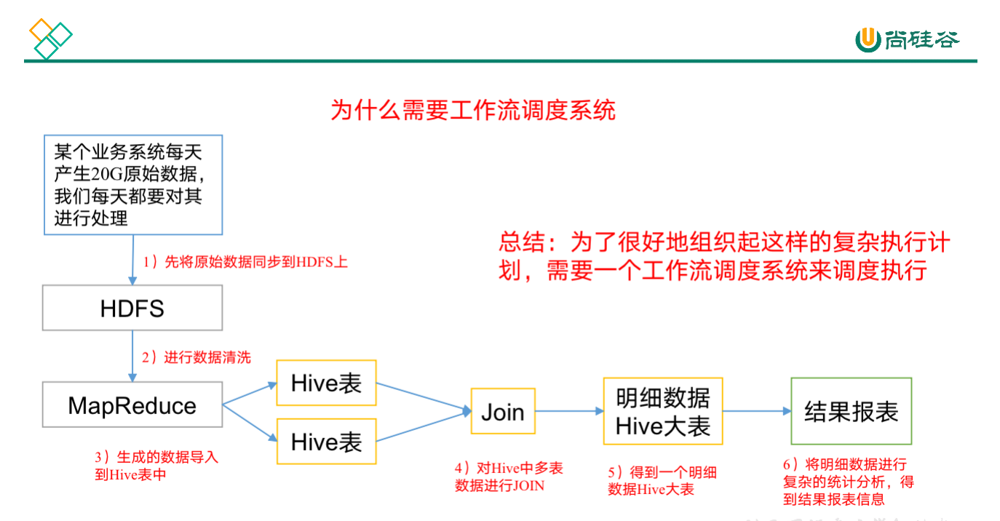

尚硅谷大数据技术之Azkaban

 

官网：www.atguigu.com

# **一 概述**

## **1.1 为什么需要工作流调度系统**

1）一个完整的数据分析系统通常都是由大量任务单元组成：

​	shell脚本程序，java程序，mapreduce程序、hive脚本等

2）各任务单元之间存在时间先后及前后依赖关系

3）为了很好地组织起这样的复杂执行计划，需要一个工作流调度系统来调度执行；

例如，我们可能有这样一个需求，某个业务系统每天产生20G原始数据，我们每天都要对其进行处理，处理步骤如下所示：

1) 通过Hadoop先将原始数据上传到HDFS上（HDFS的操作）；

2) 使用MapReduce对原始数据进行清洗（MapReduce的操作）；

3) 将清洗后的数据导入到hive表中（hive的导入操作）；

4) 对Hive中多个表的数据进行JOIN处理，得到一张hive的明细表（创建中间表）；

5) 通过对明细表的统计和分析，得到结果报表信息（hive的查询操作）；

## 1.2	 **Azkaban的适用场景**

根据以上业务场景： （2）任务依赖（1）任务的结果，（3）任务依赖（2）任务的结果，（4）任务依赖（3）任务的结果，（5）任务依赖（4）任务的结果。一般的做法是，先执行完（1）再执行（2），再一次执行（3）（4）（5）。

这样的话，整个的执行过程都需要人工参加，并且得盯着各任务的进度。但是我们的很多任务都是在深更半夜执行的，通过写脚本设置crontab执行。其实，整个过程类似于一个有向无环图（DAG）。每个子任务相当于大任务中的一个节点，也就是，我们需要的就是一个工作流的调度器，而Azkaban就是能解决上述问题的一个调度器。

## **1.3** **什么是azkaban**

Azkaban是由Linkedin公司推出的一个批量工作流任务调度器，主要用于在一个工作流内以一个特定的顺序运行一组工作和流程，它的配置是通过简单的key:value对的方式，通过配置中的dependencies 来设置依赖关系。Azkaban使用job配置文件建立任务之间的依赖关系，并提供一个易于使用的web用户界面维护和跟踪你的工作流。

## **1****.****4** **Azkaban特点**

1) 兼容任何版本的hadoop

2) 易于使用的Web用户界面

3) 简单的工作流的上传

4) 方便设置任务之间的关系

5) 调度工作流

6) 模块化和可插拔的插件机制

7) 认证/授权(权限的工作)

8) 能够杀死并重新启动工作流

9) 有关失败和成功的电子邮件提醒

## **1.5 常见工作流调度系统**

1）简单的任务调度：直接使用crontab实现；

2）复杂的任务调度：开发调度平台或使用现成的开源调度系统，比如ooize、azkaban等

## **1.6** **ooize和azkaban****特性对比**

下面的表格对上述四种hadoop工作流调度器的关键特性进行了比较，尽管这些工作流调度器能够解决的需求场景基本一致，但在设计理念，目标用户，应用场景等方面还是存在显著的区别，在做技术选型的时候，可以提供参考

| 特性               | Oozie             | Azkaban                        |
| ------------------ | ----------------- | ------------------------------ |
| 工作流描述语言     | XML               | text file with key/value pairs |
| 是否要web容器      | Yes               | Yes                            |
| 进度跟踪           | web page          | web page                       |
| Hadoop job调度支持 | yes               | yes                            |
| 运行模式           | daemon            | daemon                         |
| 事件通知           | no                | Yes                            |
| 需要安装           | yes               | yes                            |
| 支持的hadoop版本   | 0.20+             | currently unknown              |
| 重试支持           | workflownode evel | yes                            |
| 运行任意命令       | yes               | yes                            |

## **1.7** **Azkaban的架构**

Azkaban由三个关键组件构成：

 

1) AzkabanWebServer：AzkabanWebServer是整个Azkaban工作流系统的主要管理者，它用户登录认证、负责project管理、定时执行工作流、跟踪工作流执行进度等一系列任务。

2) AzkabanExecutorServer：负责具体的工作流的提交、执行，它们通过mysql数据库来协调任务的执行。

3) 关系型数据库（MySQL）：存储大部分执行流状态，AzkabanWebServer和AzkabanExecutorServer都需要访问数据库。

 

## **1****.****8** **Azkaban下载地址**

下载地址:http://azkaban.github.io/downloads.html

# **二 Azkaban安装部署**

## **2**.1 安装前准备

1) 将Azkaban Web服务器、Azkaban执行服务器、Azkaban的sql执行脚本及MySQL安装包拷贝到hadoop102虚拟机/opt/software目录下

a) azkaban-web-server-2.5.0.tar.gz

b) azkaban-executor-server-2.5.0.tar.gz

c) azkaban-sql-script-2.5.0.tar.gz

d) mysql-libs.zip

2) 选择**Mysql**作为Azkaban数据库，因为Azkaban建立了一些Mysql连接增强功能，以方便Azkaban设置，并增强服务可靠性。**（参见hive文档2.4）**

## 2.2 安装Azkaban

1) 在/opt/module/目录下创建azkaban目录

[atguigu@hadoop102 module]$ mkdir azkaban

2) 解压azkaban-web-server-2.5.0.tar.gz、azkaban-executor-server-2.5.0.tar.gz、azkaban-sql-script-2.5.0.tar.gz到/opt/module/azkaban目录下

[atguigu@hadoop102 software]$ tar -zxvf azkaban-web-server-2.5.0.tar.gz -C /opt/module/azkaban/

[atguigu@hadoop102 software]$ tar -zxvf azkaban-executor-server-2.5.0.tar.gz -C /opt/module/azkaban/

[atguigu@hadoop102 software]$ tar -zxvf azkaban-sql-script-2.5.0.tar.gz -C /opt/module/azkaban/

3) 对解压后的文件重新命名

[atguigu@hadoop102 azkaban]$ mv azkaban-web-2.5.0/ server

[atguigu@hadoop102 azkaban]$ mv azkaban-executor-2.5.0/ executor

4) azkaban脚本导入

​	进入mysql，创建azkaban数据库，并将解压的脚本导入到azkaban数据库。

[atguigu@hadoop102 azkaban]$ mysql -uroot -p000000

mysql> create database azkaban;

mysql> use azkaban;

mysql> source /opt/module/azkaban/azkaban-2.5.0/create-all-sql-2.5.0.sql

注：source后跟.sql文件，用于批量处理.sql文件中的sql语句。

## 2.3 **生成密钥库**

Keytool是java数据证书的管理工具，使用户能够管理自己的公/私钥对及相关证书。

-keystore    指定密钥库的名称及位置(产生的各类信息将不在.keystore文件中)

-genkey      在用户主目录中创建一个默认文件".keystore" 

-alias  对我们生成的.keystore 进行指认别名；如果没有默认是mykey

-keyalg  指定密钥的算法 RSA/DSA 默认是DSA

1）生成 keystore的密码及相应信息的密钥库

[atguigu@hadoop102 azkaban]$ keytool -keystore keystore -alias jetty -genkey -keyalg RSA

输入密钥库口令:  

再次输入新口令: 

您的名字与姓氏是什么?

  [Unknown]:  

您的组织单位名称是什么?

  [Unknown]:  

您的组织名称是什么?

  [Unknown]:  

您所在的城市或区域名称是什么?

  [Unknown]:  

您所在的省/市/自治区名称是什么?

  [Unknown]:  

该单位的双字母国家/地区代码是什么?

  [Unknown]:  

CN=Unknown, OU=Unknown, O=Unknown, L=Unknown, ST=Unknown, C=Unknown是否正确?

[否]: y

 

输入 <jetty> 的密钥口令

​        (如果和密钥库口令相同, 按回车):  

再次输入新口令:

注意：

密钥库的密码至少必须6个字符，可以是纯数字或者字母或者数字和字母的组合等等

密钥库的密码最好和<jetty> 的密钥相同，方便记忆

2）将keystore 拷贝到 azkaban web服务器根目录中

[atguigu@hadoop102 azkaban]$ mv keystore /opt/module/azkaban/server/

## 2.4 时间同步配置

先配置好服务器节点上的时区

1） 如果在/usr/share/zoneinfo/这个目录下不存在时区配置文件Asia/Shanghai，就要用 tzselect 生成。

[atguigu@hadoop102 azkaban]$ tzselect

Please identify a location so that time zone rules can be set correctly.

Please select a continent or ocean.

 1) Africa

 2) Americas

 3) Antarctica

 4) Arctic Ocean

 5) **Asia**

 6) Atlantic Ocean

 7) Australia

 8) Europe

 9) Indian Ocean

10) Pacific Ocean

11) none - I want to specify the time zone using the Posix TZ format.

\#? **5**

Please select a country.

 1) Afghanistan           18) Israel                35) Palestine

 2) Armenia               19) Japan                 36) Philippines

 3) Azerbaijan            20) Jordan                37) Qatar

 4) Bahrain               21) Kazakhstan            38) Russia

 5) Bangladesh            22) Korea (North)         39) Saudi Arabia

 6) Bhutan                23) Korea (South)         40) Singapore

 7) Brunei                24) Kuwait                41) Sri Lanka

 8) Cambodia              25) Kyrgyzstan            42) Syria

 9) **China**                 26) Laos                  43) Taiwan

10) Cyprus                27) Lebanon               44) Tajikistan

11) East Timor            28) Macau                 45) Thailand

12) Georgia               29) Malaysia              46) Turkmenistan

13) Hong Kong             30) Mongolia              47) United Arab Emirates

14) India                 31) Myanmar (Burma)       48) Uzbekistan

15) Indonesia             32) Nepal                 49) Vietnam

16) Iran                  33) Oman                  50) Yemen

17) Iraq                  34) Pakistan

\#? **9**

Please select one of the following time zone regions.

1) **Beijing Time**

2) Xinjiang Time

\#? **1**

 

The following information has been given:

 

​        China

​        Beijing Time

 

Therefore TZ='Asia/Shanghai' will be used.

Local time is now:      Thu Oct 18 16:24:23 CST 2018.

Universal Time is now:  Thu Oct 18 08:24:23 UTC 2018.

Is the above information OK?

1) **Yes**

2) No

\#? **1**

 

You can make this change permanent for yourself by appending the line

​        TZ='Asia/Shanghai'; export TZ

to the file '.profile' in your home directory; then log out and log in again.

 

Here is that TZ value again, this time on standard output so that you

can use the /usr/bin/tzselect command in shell scripts:

Asia/Shanghai

2）拷贝该时区文件，覆盖系统本地时区配置

[atguigu@hadoop102 azkaban]$ cp /usr/share/zoneinfo/Asia/Shanghai /etc/localtime  

3）集群时间同步（同时发给三个窗口）

[atguigu@hadoop102 azkaban]$ sudo date -s '2018-10-18 16:39:30'

## **2****.****5** **配置文件**

### **2****.****5****.1** **Web****服务器配置**

1）进入azkaban web服务器安装目录 conf目录，打开azkaban.properties文件

[atguigu@hadoop102 conf]$ pwd

/opt/module/azkaban/server/conf

[atguigu@hadoop102 conf]$ vim azkaban.properties

2）按照如下配置修改azkaban.properties文件。

\#Azkaban Personalization Settings

\#服务器UI名称,用于服务器上方显示的名字

azkaban.name=Test

\#描述

azkaban.label=My Local Azkaban

\#UI颜色

azkaban.color=#FF3601

azkaban.default.servlet.path=/index

\#默认web server存放web文件的目录

web.resource.dir=/opt/module/azkaban/server/web/

\#默认时区,已改为亚洲/上海 默认为美国

default.timezone.id=Asia/Shanghai

 

\#Azkaban UserManager class

user.manager.class=azkaban.user.XmlUserManager

\#用户权限管理默认类（绝对路径）

user.manager.xml.file=/opt/module/azkaban/server/conf/azkaban-users.xml

 

\#Loader for projects

\#global配置文件所在位置（绝对路径）

executor.global.properties=/opt/module/azkaban/executor/conf/global.properties

azkaban.project.dir=projects

 

\#数据库类型

database.type=mysql

\#端口号

mysql.port=3306

\#数据库连接IP

mysql.host=hadoop102

\#数据库实例名

mysql.database=azkaban

\#数据库用户名

mysql.user=root

\#数据库密码

mysql.password=000000

\#最大连接数

mysql.numconnections=100

 

\# Velocity dev mode

velocity.dev.mode=false

 

\# Azkaban Jetty server properties.

\# Jetty服务器属性.

\#最大线程数

jetty.maxThreads=25

\#Jetty SSL端口

jetty.ssl.port=8443

\#Jetty端口

jetty.port=8081

\#SSL文件名（绝对路径）

jetty.keystore=/opt/module/azkaban/server/keystore

\#SSL文件密码

jetty.password=000000

\#Jetty主密码与keystore文件相同

jetty.keypassword=000000

\#SSL文件名（绝对路径）

jetty.truststore=/opt/module/azkaban/server/keystore

\#SSL文件密码

jetty.trustpassword=000000

 

\# Azkaban Executor settings

executor.port=12321

 

\# mail settings

mail.sender=

mail.host=

job.failure.email=

job.success.email=

 

lockdown.create.projects=false

 

cache.directory=cache

 3）web服务器用户配置

在azkaban web服务器安装目录 conf目录，按照如下配置修改azkaban-users.xml 文件，增加管理员用户。

[atguigu@hadoop102 conf]$ vim azkaban-users.xml

<azkaban-users>

​	<user username="azkaban" password="azkaban" roles="admin" groups="azkaban" />

​	<user username="metrics" password="metrics" roles="metrics"/>

​	<user username="admin" password="admin" roles="admin,metrics" />

​	<role name="admin" permissions="ADMIN" />

​	<role name="metrics" permissions="METRICS"/>

</azkaban-users>

### **2****.****5****.****2** **执行服务器配置**

1）进入执行服务器安装目录conf，打开azkaban.properties

[atguigu@hadoop102 conf]$ pwd

/opt/module/azkaban/executor/conf

[atguigu@hadoop102 conf]$ vim azkaban.properties

2） 按照如下配置修改azkaban.properties文件。

\#Azkaban

\#时区

default.timezone.id=Asia/Shanghai

 

\# Azkaban JobTypes Plugins

\#jobtype 插件所在位置

azkaban.jobtype.plugin.dir=plugins/jobtypes

 

\#Loader for projects

executor.global.properties=/opt/module/azkaban/executor/conf/global.properties

azkaban.project.dir=projects

 

database.type=mysql

mysql.port=3306

mysql.host=hadoop102

mysql.database=azkaban

mysql.user=root

mysql.password=000000

mysql.numconnections=100

 

\# Azkaban Executor settings

\#最大线程数

executor.maxThreads=50

\#端口号(如修改,请与web服务中一致)

executor.port=12321

\#线程数

executor.flow.threads=30

## **2****.****6** **启动****executor****服务器**

在executor服务器目录下执行启动命令

[atguigu@hadoop102 executor]$ pwd

/opt/module/azkaban/executor

[atguigu@hadoop102 executor]$ bin/azkaban-executor-start.sh

## **2****.****7** **启动web服务器**

在azkaban web服务器目录下执行启动命令

[atguigu@hadoop102 server]$ pwd

/opt/module/azkaban/server

[atguigu@hadoop102 server]$ bin/azkaban-web-start.sh

注意：

先执行executor，再执行web，避免Web Server会因为找不到执行器启动失败。

jps查看进程

[atguigu@hadoop102 server]$ jps

3601 AzkabanExecutorServer

5880 Jps

3661 AzkabanWebServer

启动完成后，在浏览器(建议使用谷歌浏览器)中输入**https://服务器IP地址:8443**，即可访问azkaban服务了。

在登录中输入刚才在azkaban-users.xml文件中新添加的户用名及密码，点击 login。

 

 

# **三 Azkaban实战**

Azkaba内置的任务类型支持command、java

## **3.1****单一job案例**

1）创建job描述文件

[atguigu@hadoop102 jobs]$ vim first.job

\#first.job

type=command

command=echo 'this is my first job'

2) 将job资源文件打包成zip文件

[atguigu@hadoop102 jobs]$ **zip first.zip first.job** 

  adding: first.job (deflated 15%)

[atguigu@hadoop102 jobs]$ ll

总用量 8

-rw-rw-r--. 1 atguigu atguigu  60 10月 18 17:42 first.job

-rw-rw-r--. 1 atguigu atguigu 219 10月 18 17:43 **first.zip**

注意：

目前，Azkaban上传的工作流文件只支持xxx.zip文件。zip应包含xxx.job运行作业所需的文件和任何文件（文件名后缀必须以.job结尾，否则无法识别）。作业名称在项目中必须是唯一的。

3）通过azkaban的web管理平台创建project并上传job的zip包

首先创建project

 

上传zip包

 

4）启动执行该job

 

点击执行工作流

 

点击继续

 

5）Job执行成功

 

6）点击查看job日志

 

## **3.2****多job工作流案例**

1）创建有依赖关系的多个job描述

第一个job：start.job

[atguigu@hadoop102 jobs]$ vim start.job

\#start.job

type=command

command=touch /opt/module/kangkang.txt

第二个job：step1.job依赖start.job

[atguigu@hadoop102 jobs]$ vim step1.job

\#step1.job

type=command

dependencies=start

command=echo "this is step1 job"

第三个job：step2.job依赖start.job

[atguigu@hadoop102 jobs]$ vim step2.job

\#step2.job

type=command

dependencies=start

command=echo "this is step2 job"

第四个job：finish.job依赖step1.job和step2.job

[atguigu@hadoop102 jobs]$ vim finish.job

\#finish.job

type=command

dependencies=step1,step2

command=echo "this is finish job"

2）将所有job资源文件打到一个zip包中

[atguigu@hadoop102 jobs]$ zip jobs.zip start.job step1.job step2.job finish.job

updating: start.job (deflated 16%)

  adding: step1.job (deflated 12%)

  adding: step2.job (deflated 12%)

  adding: finish.job (deflated 14%) 

3）在azkaban的web管理界面创建工程并上传zip包

 

5）启动工作流flow

 

6）查看结果

 

思考：

将student.txt文件上传到hdfs，根据所传文件创建外部表，再将表中查询到的结果写入到本地文件

## **3.3** **java操作任务**

使用Azkaban调度java程序

1）编写java程序

import java.io.IOException;

 

public class AzkabanTest {

​	public void run() throws IOException {

​        // 根据需求编写具体代码

​		FileOutputStream fos = new FileOutputStream("/opt/module/azkaban/output.txt");

​		fos.write("this is a java progress".getBytes());

​		fos.close();

​    }

 

​	public static void main(String[] args) throws IOException {

​		AzkabanTest azkabanTest = new AzkabanTest();

​		azkabanTest.run();

​	}

}

2）将java程序打成jar包，创建lib目录，将jar放入lib内

[atguigu@hadoop102 azkaban]$ mkdir lib

[atguigu@hadoop102 azkaban]$ cd lib/

[atguigu@hadoop102 lib]$ ll

总用量 4

-rw-rw-r--. 1 atguigu atguigu 3355 10月 18 20:55 azkaban-0.0.1-SNAPSHOT.jar

3）编写job文件

[atguigu@hadoop102 jobs]$ vim azkabanJava.job

\#azkabanJava.job

type=javaprocess

java.class=com.atguigu.azkaban.AzkabanTest

classpath=/opt/module/azkaban/lib/*

4）将job文件打成zip包

[atguigu@hadoop102 jobs]$ zip azkabanJava.zip azkabanJava.job 

  adding: azkabanJava.job (deflated 19%)

5）通过azkaban的web管理平台创建project并上传job压缩包，启动执行该job

 

[atguigu@hadoop102 azkaban]$ pwd

/opt/module/azkaban

[atguigu@hadoop102 azkaban]$ ll

总用量 24

drwxrwxr-x.  2 atguigu atguigu 4096 10月 17 17:14 azkaban-2.5.0

drwxrwxr-x. 10 atguigu atguigu 4096 10月 18 17:17 executor

drwxrwxr-x.  2 atguigu atguigu 4096 10月 18 20:35 jobs

drwxrwxr-x.  2 atguigu atguigu 4096 10月 18 20:54 lib

-rw-rw-r--.  1 atguigu atguigu   23 10月 18 20:55 output

drwxrwxr-x.  9 atguigu atguigu 4096 10月 18 17:17 server

[atguigu@hadoop102 azkaban]$ cat output 

this is a java progress

## **3.3** **HDFS操作任务**

1）创建job描述文件

[atguigu@hadoop102 jobs]$ vim fs.job

\#hdfs job

type=command

command=/opt/module/hadoop-2.7.2/bin/hadoop fs -mkdir /azkaban

2）将job资源文件打包成zip文件

[atguigu@hadoop102 jobs]$ zip fs.zip fs.job 

  adding: fs.job (deflated 12%)

3）通过azkaban的web管理平台创建project并上传job压缩包

4）启动执行该job

5）查看结果

 

 

## **3.4** **mapreduce任务**

mapreduce任务依然可以使用azkaban进行调度

1） 创建job描述文件，及mr程序jar包

[atguigu@hadoop102 jobs]$ vim mapreduce.job

\#mapreduce job

type=command

command=/opt/module/hadoop-2.7.2/bin/hadoop jar /opt/module/hadoop-2.7.2/share/hadoop/mapreduce/hadoop-mapreduce-examples-2.7.2.jar wordcount /wordcount/input /wordcount/output

2） 将所有job资源文件打到一个zip包中

[atguigu@hadoop102 jobs]$ zip mapreduce.zip mapreduce.job 

  adding: mapreduce.job (deflated 43%)

3）在azkaban的web管理界面创建工程并上传zip包

4）启动job

5）查看结果

 

 

## **3.5** **H****ive****脚本任务**

1）创建job描述文件和hive脚本

（1）Hive脚本：student.sql

[atguigu@hadoop102 jobs]$ vim student.sql

use default;

drop table student;

create table student(id int, name string)

row format delimited fields terminated by '\t';

load data local inpath '/opt/module/datas/student.txt' into table student;

insert overwrite local directory '/opt/module/datas/student'

row format delimited fields terminated by '\t'

select * from student;

（2）Job描述文件：hive.job

[atguigu@hadoop102 jobs]$ vim hive.job

\#hive job

type=command

command=/opt/module/hive/bin/hive -f /opt/module/azkaban/jobs/student.sql

2） 将所有job资源文件打到一个zip包中

[atguigu@hadoop102 jobs]$ zip hive.zip hive.job 

  adding: hive.job (deflated 21%)

3）在azkaban的web管理界面创建工程并上传zip包

4）启动job

5）查看结果

[atguigu@hadoop102 student]$ cat /opt/module/datas/student/000000_0 

1001    yangyang

1002    bobo

1003    banzhang

1004    pengpeng

 

 

 

 