Checkpoint 机制和 Two Phase Commit

Flink Kafa Connector 是 Flink 内置的 Kafka 连接器，它包含了从 Kafka Topic 读入数据的`Flink Kafka Consumer`以及向 Kafka Topic 写出数据的`Flink Kafka Producer`，除此之外 Flink Kafa Connector 基于 Flink Checkpoint 机制提供了完善的容错能力。本文从 Flink Kafka Connector 的基本使用到 Kafka 在 Flink 中端到端的容错原理展开讨论。

## 1 Flink Kafka 的使用

在 Flink 中使用 Kafka Connector 时需要依赖 Kafka 的版本，Flink 针对不同的 Kafka 版本提供了对应的 Connector 实现。

### 01 版本依赖

既然 Flink 对不同版本的 Kafka 有不同实现，在使用时需要注意区分，根据使用环境引入正确的依赖关系。

```xml
<dependency>
  <groupId>org.apache.flink</groupId>
  <artifactId>${flink_kafka_connector_version}</artifactId>
  <version>${flink_version}</version>
</dependency>
```

在上面的依赖配置中 ${flink_version}指使用 Flink 的版本，`${flink_connector_kafka_version}`指依赖的 Kafka connector 版本对应的 artifactId。下表描述了截止目前为止 Kafka 服务版本与 Flink Connector 之间的对应关系。

Flink 官网内容 Apache Kafka Connector（https://ci.apache.org/projects/flink/flink-docs-release-1.7/dev/connectors/kafka.html）中也有详细的说明。


从 Flink 1.7 版本开始为 Kafka 1.0.0 及以上版本提供了全新的的 Kafka Connector 支持，如果使用的 Kafka 版本在 1.0.0 及以上可以忽略因 Kafka 版本差异带来的依赖变化。

### 02 基本使用

明确了使用的 Kafka 版本后就可以编写一个基于 Flink Kafka 读 / 写的应用程序「本文讨论内容全部基于 Flink 1.7 版本和 Kafka 1.1.0 版本」。根据上面描述的对应关系在工程中添加 Kafka Connector 依赖。

```xml
<dependency>
  <groupId>org.apache.flink</groupId>
  <artifactId>flink-connector-kafka_2.11</artifactId>
  <version>1.7.0</version>
</dependency>
```

下面的代码片段是从 Kafka Topic「flink_kafka_poc_input」中消费数据，再写入 Kafka Topic「flink_kafka_poc_output」的简单示例。示例中除了读 / 写 Kafka Topic 外，没有做其他的逻辑处理。

```scala
public static void main(String[] args) {
  StreamExecutionEnvironment env = StreamExecutionEnvironment.getExecutionEnvironment();

  /** 初始化 Consumer 配置 */
  Properties consumerConfig = new Properties();
  consumerConfig.setProperty("bootstrap.servers", "127.0.0.1:9091");
  consumerConfig.setProperty("group.id", "flink_poc_k110_consumer");

  /** 初始化 Kafka Consumer */
  FlinkKafkaConsumer<String> flinkKafkaConsumer =
    new FlinkKafkaConsumer<String>(
      "flink_kafka_poc_input",
      new SimpleStringSchema(),
      consumerConfig
    );
  /** 将 Kafka Consumer 加入到流处理 */
  DataStream<String> stream = env.addSource(flinkKafkaConsumer);

  /** 初始化 Producer 配置 */
  Properties producerConfig = new Properties();
  producerConfig.setProperty("bootstrap.servers", "127.0.0.1:9091");

  /** 初始化 Kafka Producer */
  FlinkKafkaProducer<String> myProducer =
    new FlinkKafkaProducer<String>(
      "flink_kafka_poc_output",
      new MapSerialization(),
      producerConfig
    );
  /** 将 Kafka Producer 加入到流处理 */
  stream.addSink(myProducer);

  /** 执行 */
  env.execute();
}

class MapSerialization implements SerializationSchema<String> {
  public byte[] serialize(String element) {
    return element.getBytes();
  }
}
```

Flink API 使用起来确实非常简单，调用`addSource`方法和`addSink`方法就可以将初始化好的`FlinkKafkaConsumer`和`FlinkKafkaProducer`加入到流处理中。`execute`执行后，KafkaConsumer 和 KafkaProducer 就可以开始正常工作了。

## 2 Flink Kafka 的容错

众所周知，Flink 支持 Exactly-once semantics。什么意思呢？翻译过来就是「恰好一次语义」。流处理系统中，数据源源不断的流入到系统、被处理、最后输出结果。我们都不希望系统因人为或外部因素产生任何意想不到的结果。对于 Exactly-once 语义达到的目的是指`即使系统被人为停止、因故障 shutdown、无故关机等任何因素停止运行状态时，对于系统中的每条数据不会被重复处理也不会少处理。`

### 01 Flink Exactly-once

Flink 宣称支持 Exactly-once 其针对的是 Flink 应用内部的数据流处理。但 Flink 应用内部要想处理数据首先要有数据流入到 Flink 应用，其次 Flink 应用对数据处理完毕后也理应对数据做后续的输出。在 Flink 中数据的流入称为 Source，数据的后续输出称为 Sink，对于 Source 和 Sink 完全依靠外部系统支撑（比如 Kafka）。

Flink 自身是无法保证外部系统的 Exactly-once 语义。但这样一来其实并不能称为完整的 Exactly-once，或者说 Flink 并不能保证端到端 Exactly-once。而对于数据精准性要求极高的系统必须要保证端到端的 Exactly-once，所谓端到端是指`Flink 应用从 Source 一端开始到 Sink 一端结束，数据必经的起始和结束两个端点。`

那么如何实现端到端的 Exactly-once 呢？Flink 应用所依赖的外部系统需要提供 Exactly-once 支撑，并结合 Flink 提供的 Checkpoint 机制和 Two Phase Commit 才能实现 Flink 端到端的 Exactly-once。对于 Source 和 Sink 的容错保障，Flink 官方给出了具体说明：

**Fault Tolerance Guarantees of Data Sources and Sinks**（https://ci.apache.org/projects/flink/flink-docs-release-1.7/dev/connectors/guarantees.html）

### 02 Flink Checkpoint

在讨论基于 Kafka 端到端的 Exactly-once 之前先简单了解一下 Flink Checkpoint，详细内容在《Flink Checkpoint 原理》中有做讨论。Flink Checkpoint 是 Flink 用来实现应用一致性快照的核心机制，当 Flink 因故障或其他原因重启后可以通过最后一次成功的 Checkpoint 将应用恢复到当时的状态。如果在应用中启用了 Checkpoint，会由 JobManager 按指定时间间隔触发 Checkpoint，Flink 应用内所有带状态的 Operator 会处理每一轮 Checkpoint 生命周期内的几个状态。

- **initializeState**

  由`CheckpointedFunction`接口定义。Task 启动时获取应用中所有实现了`CheckpointedFunction`的 Operator，并触发执行`initializeState`方法。在方法的实现中一般都是从状态后端将快照状态恢复。

- **snapshotState**

  由`CheckpointedFunction`接口定义。JobManager 会定期发起 Checkpoint，Task 接收到 Checkpoint 后获取应用中所有实现了`CheckpointedFunction`的 Operator 并触发执行对应的`snapshotState`方法。

  JobManager 每发起一轮 Checkpoint 都会携带一个自增的 checkpointId，这个 checkpointId 代表了快照的轮次。

```scala
public interface CheckpointedFunction {
  void snapshotState(FunctionSnapshotContext context) throws Exception;
  void initializeState(FunctionInitializationContext context) throws Exception;
}
```

- **notifyCheckpointComplete**

由`CheckpointListener`接口定义。当基于同一个轮次 (checkpointId 相同) 的 Checkpoint 快照全部处理成功后获取应用中所有实现了`CheckpointListener`的 Operator 并触发执行`notifyCheckpointComplete`方法。触发`notifyCheckpointComplete`方法时携带的 checkpointId 参数用来告诉 Operator 哪一轮 Checkpoint 已经完成。

```scala
public interface CheckpointListener {
  void notifyCheckpointComplete(long checkpointId) throws Exception;
}
```

### 03 Flink Kafka 端到端 Exactly-once

Kafka 是非常收欢迎的分布式消息系统，在 Flink 中它可以作为 Source，同时也可以作为 Sink。Kafka 0.11.0 及以上版本提供了对事务的支持，这让 Flink 应用搭载 Kafka 实现端到端的 exactly-once 成为了可能。下面我们就来深入了解提供了事务支持的 Kafka 是如何与 Flink 结合实现端到端 exactly-once 的。

本文忽略了 Barrier 机制，所以示例和图中都以单线程为例。Barrier 在《Flink Checkpoint 原理》有较多讨论。

#### Flink Kafka Consumer

Kafka 自身提供了可重复消费消息的能力，Flink 结合 Kafka 的这个特性以及自身 Checkpoint 机制，得以实现 Flink Kafka Consumer 的容错。

Flink Kafka Consumer 是 Flink 应用从 Kafka 获取数据流消息的一个实现。除了数据流获取、数据发送下游算子这些基本功能外它还提供了完善的容错机制。这些特性依赖了其内部的一些组件以及内置的数据结构协同处理完成。这里，我们先简单了解这些组件和内置数据结构的职责，再结合 Flink *运行时* 和 *故障恢复时* 两个不同的处理时机来看一看它们之间是如何协同工作的。

- **Kafka Topic 元数据**

  从 Kafka 消费数据的前提是需要知道消费哪个 topic，这个 topic 有多少个 partition。组件`AbstractPartitionDiscoverer`负责获得指定 topic 的元数据信息，并将获取到的 topic 元数据信息封装成`KafkaTopicPartition`集合。

- **KafkaTopicPartition**

  KafkaTopicPartition 结构用于记录 topic 与 partition 的对应关系，内部定义了`String topic`和`int partition`两个主要属性。假设 topic A 有 2 个分区，通过组件`AbstractPartitionDiscoverer`处理后将得到由两个`KafkaTopicPartition`对象组成的集合：`KafkaTopicPartition(topic:A, partition:0)`和`KafkaTopicPartition(topic:A, partition:1)`

- **Kafka 数据消费**

  作为 Flink Source，Flink Kafka Consumer 最主要的职责就是能从 Kafka 中获取数据，交给下游处理。在 Kafka Consumer 中`AbstractFetcher`组件负责完成这部分功能。除此之外 Fetcher 还负责 offset 的提交、`KafkaTopicPartitionState`结构的数据维护。

- **KafkaTopicPartitionState**

  `KafkaTopicPartitionState`是一个非常核心的数据结构，基于内部的 4 个基本属性，Flink Kafka Consumer 维护了 topic、partition、已消费 offset、待提交 offset 的关联关系。Flink Kafka Consumer 的容错机制依赖了这些数据。

  除了这 4 个基本属性外`KafkaTopicPartitionState`还有两个子类，一个是支持`PunctuatedWatermark`的实现，另一个是支持`PeriodicWatermark`的实现，这两个子类在原有基础上扩展了对水印的支持，我们这里不做过多讨论。


- **状态持久化**

  Flink Kafka Consumer 的容错性依靠的是状态持久化，也可以称为状态快照。对于 Flink Kafka Consumer 来说，这个状态持久化具体是对 topic、partition、已消费 offset 的对应关系做持久化。

  在实现中，使用`ListState<Tuple2<KafkaTopicPartition, Long>>`定义了状态存储结构，在这里 Long 表示的是 offset 类型，所以实际上就是使用`KafkaTopicPartition`和 offset 组成了一个对儿，再添加到状态后端集合。

- **状态恢复**

  当状态成功持久化后，一旦应用出现故障，就可以用最近持久化成功的快照恢复应用状态。在实现中，状态恢复时会将快照恢复到一个 TreeMap 结构中，其中 key 是`KafkaTopicPartition`，value 是对应已消费的 offset。恢复成功后，应用恢复到故障前 Flink Kafka Consumer 消费的 offset，并继续执行任务，就好像什么都没发生一样。

#### 运行时

我们假设 Flink 应用正常运行，Flink Kafka Consumer 消费 topic 为`Topic-A`，`Topic-A`只有一个 partition。在运行期间，主要做了这么几件事

- **Kafka 数据消费**

  KafkaFetcher 不断的从 Kafka 消费数据，消费的数据会发送到下游算子并在内部记录已消费过的 offset。下图描述的是 Flink Kafka Consumer 从消费 Kafka 消息到将消息发送到下游算子的一个处理过程。

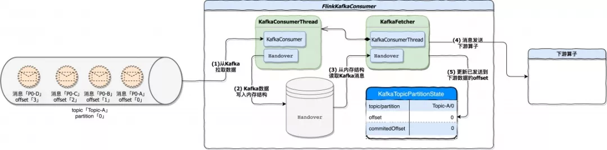

接下来我们再结合消息真正开始处理后，KafkaTopicPartitionState 结构中的数据变化。

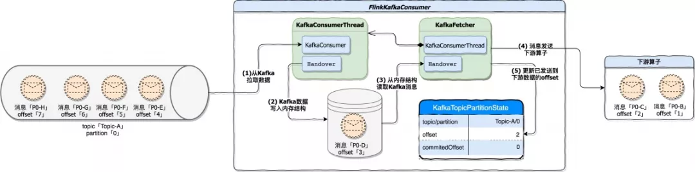

可以看到，随着应用的运行，`KafkaTopicPartitionState`中的 offset 属性值发生了变化，它记录了已经发送到下游算子消息在 Kafka 中的 offset。在这里由于消息`P0-C`已经发送到下游算子，所以`KafkaTopicPartitionState.offset`变更为 2。

- **状态快照处理**

  如果 Flink 应用开启了 Checkpoint，JobManager 会定期触发 Checkpoint。`FlinkKafkaConsumer`实现了`CheckpointedFunction`，所以它具备快照状态 (snapshotState) 的能力。在实现中，snapshotState 具体干了这么两件事

  下图描述当一轮 Checkpoint 开始时`FlinkKafkaConsumer`的处理过程。在例子中，FlinkKafkaConsumer 已经将 offset=3 的`P0-D`消息发送到下游，当 checkpoint 触发时将 topic=Topic-A；partition=0；offset=3 作为最后的状态持久化到外部存储。

  - 将当前快照轮次 (CheckpointId) 与 topic、partition、offset 写入到一个`待提交 offset`的 Map 集合，其中 key 是 CheckpointId。
  - 将`FlinkKafkaConsumer`当前运行状态持久化，即将 topic、partition、offset 持久化。一旦出现故障，就可以根据最新持久化的快照进行恢复。

下图描述当一轮 Checkpoint 开始时`FlinkKafkaConsumer`的处理过程。在例子中，FlinkKafkaConsumer 已经将 offset=3 的`P0-D`消息发送到下游，当 checkpoint 触发时将 topic=Topic-A；partition=0；offset=3 作为最后的状态持久化到外部存储。

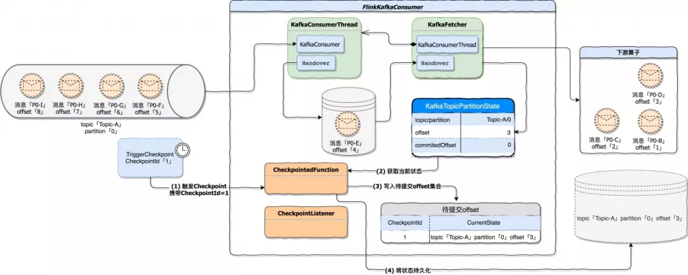

- **快照结束处理**

  当所有算子基于同一轮次快照处理结束后，会调用`CheckpointListener.notifyCheckpointComplete(checkpointId)`通知算子 Checkpoint 完成，参数 checkpointId 指明了本次通知是基于哪一轮 Checkpoint。在`FlinkKafkaConsumer`的实现中，接到 Checkpoint 完成通知后会变更`KafkaTopicPartitionState.commitedOffset`属性值。最后再将变更后的 commitedOffset 提交到 Kafka brokers 或 Zookeeper。

  在这个例子中，commitedOffset 变更为 4，因为在快照阶段，将`topic=Topic-A;partition=0;offset=3`的状态做了快照，在真正提交 offset 时是将快照的`offset + 1`作为结果提交的。「源代码`KafkaFetcher.java 207 行`doCommitInternalOffsetsToKafka 方法」

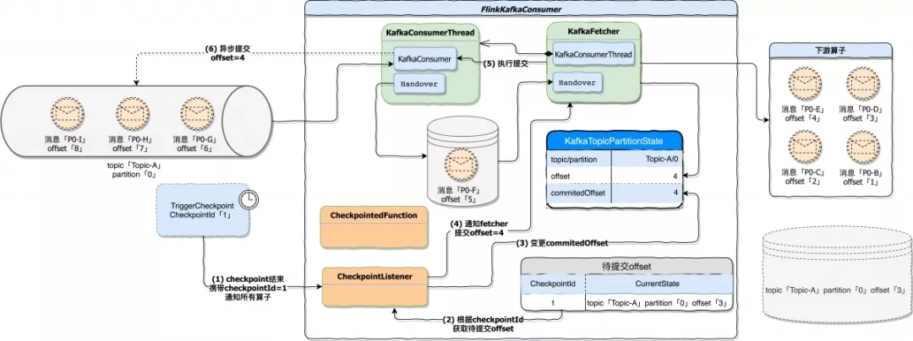

#### 故障恢复

Flink 应用崩溃后，开始进入恢复模式。假设 Flink Kafka Consumer 最后一次成功的快照状态是`topic=Topic-A；partition=0；offset=3`，在恢复期间按照下面的先后顺序执行处理。

- **状态初始化**

  状态初始化阶段尝试从状态后端加载出可以用来恢复的状态。它由`CheckpointedFunction.initializeState`接口定义。在`FlinkKafkaConsumer`的实现中，从状态后端获得快照并写入到内部存储结构 TreeMap，其中 key 是由`KafkaTopicPartition`表示的 topic 与 partition，value 为 offset。下图描述的是故障恢复的第一个阶段，从状态后端获得快照，并恢复到内部存储。

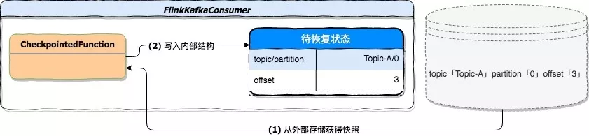

- **function 初始化**

  function 初始化阶段除了初始化 OffsetCommitMode 和 partitionDiscoverer 外，还会初始化一个 Map 结构，该结构用来存储应用`待消费信息`。如果应用需要从快照恢复状态，则从`待恢复状态`中初始化这个 Map 结构。下图是该阶段从快照恢复的处理过程。

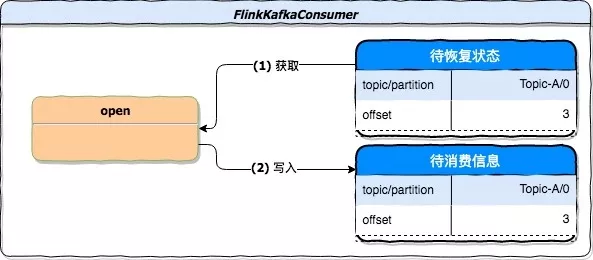

function 初始化阶段兼容了正常启动和状态恢复时 offset 的初始化。对于正常启动过程，`StartupMode`的设置决定`待消费信息`中的结果。该模式共有 5 种，默认为`StartupMode.GROUP_OFFSETS`。


- **开始执行**

  在该阶段中，将 KafkaFetcher 初始化、初始化内部消费状态、启动消费线程等等，其目的是为了将`FlinkKafkaConsumer`运行起来，下图描述了这个阶段的处理流程

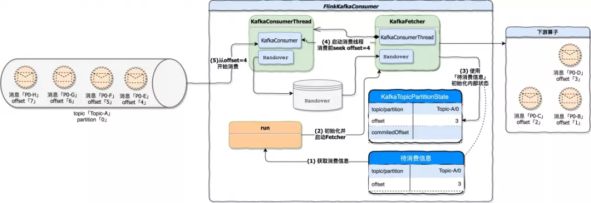

这里对图中两个步骤做个描述

- 步骤 3，使用状态后端的快照结果`topic=Topic-A；partition=0；offset=3`初始化`Flink Kafka Consumer`内部维护的 Kafka 处理状态。因为是恢复流程，所以这个内部维护的处理状态也应该随着快照恢复。
- 步骤 4，在真正消费 Kafka 数据前 (指调用 KafkaConsumer.poll 方法)，使用 Kafka 提供的 seek 方法将 offset 重置到指定位置，而这个 offset 具体算法就是`状态后端 offset + 1`。在例子中，消费 Kafka 数据前将 offset 重置为 4，所以状态恢复后 KafkaConsumer 是从 offset=4 位置开始消费。「源代码`KafkaConsumerThread.java 428 行`」

#### 总结

上述的 3 个步骤是恢复期间主要的处理流程，一旦恢复逻辑执行成功，后续处理流程与正常运行期间一致。最后对 FlinkKafkaConsumer 用一句话做个总结。

「将 offset 提交权交给 FlinkKafkaConsumer，其内部维护 Kafka 消费及提交的状态。基于 Kafka 可重复消费能力并配合 Checkpoint 机制和状态后端存储能力，就能实现 FlinkKafkaConsumer 容错性，即 Source 端的 Exactly-once 语义」。

#### Flink Kafka Producer

Flink Kafka Producer 是 Flink 应用向 Kafka 写出数据的一个实现。在 Kafka 0.11.0 及以上版本中提供了事务支持，这让 Flink 搭载 Kafka 的事务特性可以轻松实现 Sink 端的 Exactly-once 语义。关于 Kafka 事务特性在《Kafka 幂等与事务》中做了详细讨论。

在 Flink Kafka Producer 中，有一个非常重要的组件`FlinkKafkaInternalProducer`，这个组件代理了 Kafka 客户端`org.apache.kafka.clients.producer.KafkaProducer`，它为 Flink Kafka Producer 操作 Kafka 提供了强有力的支撑。在这个组件内部，除了代理方法外，还提供了一些关键操作。个人认为，Flink Kafka Sink 能够实现 Exactly-once 语义除了需要 Kafka 支持事务特性外，同时也离不开`FlinkKafkaInternalProducer`组件提供的支持，尤其是下面这些关键操作：

- **事务重置**`FlinkKafkaInternalProducer`组件中最关键的处理当属事务重置，事务重置由 resumeTransaction 方法实现「源代码`FlinkKafkaInternalProducer.java` 144 行」。由于 Kafka 客户端未暴露针对事务操作的 API，所以在这个方法内部，大量的使用了反射。方法中使用反射获得 KafkaProducer 依赖的 transactionManager 对象，并将状态后端快照的属性值恢复到 transactionManager 对象中，这样以达到让 Flink Kafka Producer 应用恢复到重启前的状态。

下面我们结合 Flink *运行时* 和 *故障恢复* 两个不同的处理时机来了解 Flink Kafka Producer 内部如何工作。

#### 运行时

我们假设 Flink 应用正常运行，Flink Kafka Producer 正常接收上游数据并写到 Topic-B 的 Topic 中，Topic-B 只有一个 partition。在运行期间，主要做以下几件事：

- **数据发送到 Kafka**

  上游算子不断的将数据 Sink 到`FlinkKafkaProducer`，`FlinkKafkaProducer`接到数据后封装`ProducerRecord`对象并调用 Kafka 客户端`KafkaProducer.send`方法将`ProducerRecord`对象写入缓冲「源代码 FlinkKafkaProducer.java 616 行」。下图是该阶段的描述：

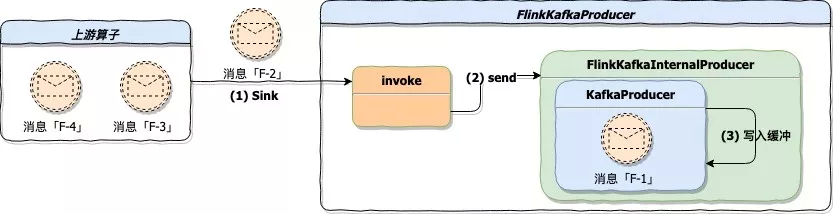

- **状态快照处理**

  Flink 1.7 及以上版本使用`FlinkKafkaProducer`作为 Kafka Sink，它继承抽象类`TwoPhaseCommitSinkFunction`，根据名字就能知道，这个抽象类主要实现`两阶段提交`。为了集成 Flink Checkpoint 机制，抽象类实现了`CheckpointedFunction`和`CheckpointListener`，因此它具备快照状态 (snapshotState) 能力。状态快照处理具体做了下面三件事：

- 调用 KafkaProducer 客户端 flush 方法，将缓冲区内全部记录发送到 Kafka，但不提交。这些记录写入到 Topic-B，此时这些数据的事务隔离级别为 UNCOMMITTED，也就是说如果有个服务消费 Topic-B，并且设置的`isolation.level=read_committed`，那么此时这个消费端还无法 poll 到 flush 的数据，因为这些数据尚未 commit。什么时候 commit 呢？在`快照结束处理`阶段进行 commit，后面会提到。

- 将快照轮次与当前事务记录到一个 Map 表示的待提交事务集合中，key 是当前快照轮次的 CheckpointId，value 是由`TransactionHolder`表示的事务对象。`TransactionHolder`对象内部记录了 transactionalId、producerId、epoch 以及 Kafka 客户端 kafkaProducer 的引用。

- 持久化当前事务处理状态，也就是将当前处理的事务详情存入状态后端，供应用恢复时使用。

下图是状态快照处理阶段处理过程

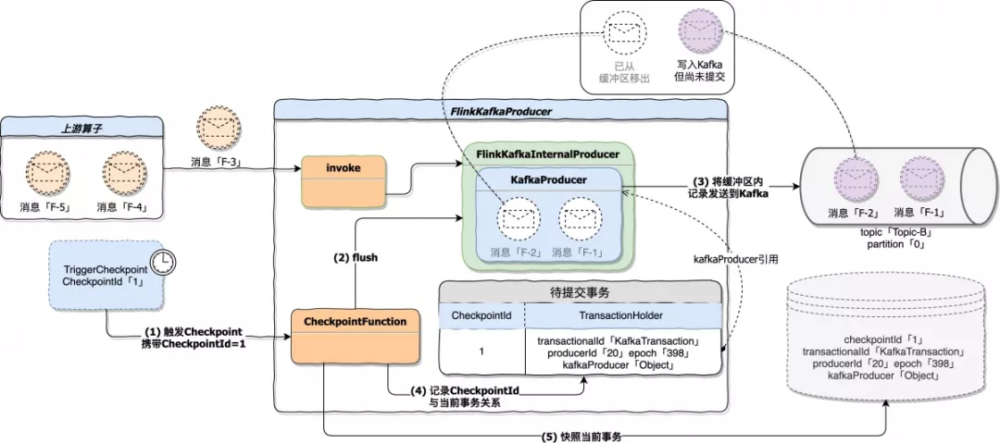

- **快照结束处理**

  `TwoPhaseCommitSinkFunction`实现了`CheckpointListener`，应用中所有算子的快照处理成功后会收到基于某轮 Checkpoint 完成的通知。当`FlinkKafkaProducer`收到通知后，主要任务就是提交上一阶段产生的事务，而具体要提交哪些事务是从上一阶段生成的待提交事务集合中获取的。

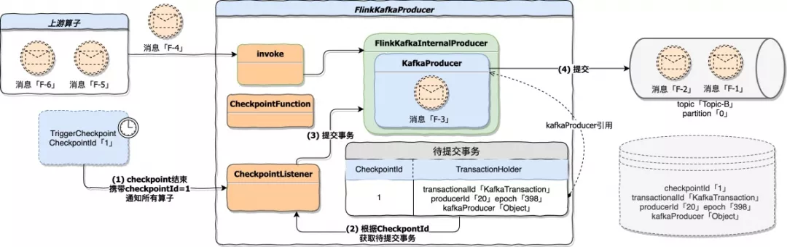

图中第 4 步执行成功后，flush 到 Kafka 的数据从 UNCOMMITTED 变更为 COMMITTED，这意味着此时消费端可以 poll 到这批数据了。

2PC(两阶段提交) 理论的两个阶段分别对应了 FlinkKafkaProducer 的`状态快照处理`阶段和`快照结束处理`阶段，前者是通过 Kafka 的事务初始化、事务开启、flush 等操作预提交事务，后者是通过 Kafka 的 commit 操作真正执行事务提交。

#### 故障恢复

Flink 应用崩溃后，`FlinkKafkaProducer`开始进入恢复模式。下图为应用崩溃前的状态描述：

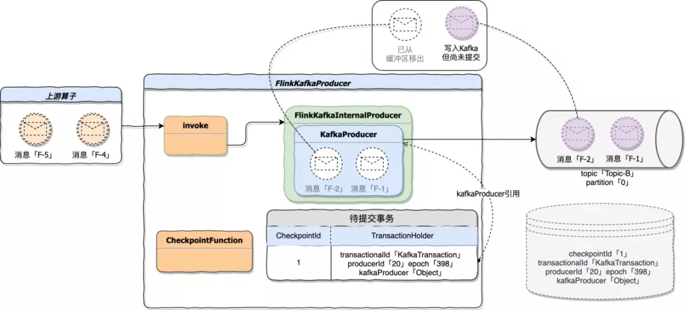

在恢复期间主要的处理在状态初始化阶段。当 Flink 任务重启时会触发状态初始化，此时应用与 Kafka 已经断开了连接。但在运行期间可能存在数据 flush 尚未提交的情况。

如果想重新提交这些数据需要从状态后端恢复当时 KafkaProducer 持有的事务对象，具体一点就是恢复当时事务的 transactionalId、producerId、epoch。这个时候就用到了`FlinkKafkaInternalProducer`组件中的事务重置，在状态初始化时从状态后端获得这些事务信息，并重置到当前 KafkaProducer 中，再执行 commit 操作。这样就可以恢复任务重启前的状态，Topic-B 的消费端依然可以 poll 到应用恢复后提交的数据。

需要注意的是：`如果这个重置并提交的动作失败了，可能会造成数据丢失。`下图描述的是状态初始化阶段的处理流程：

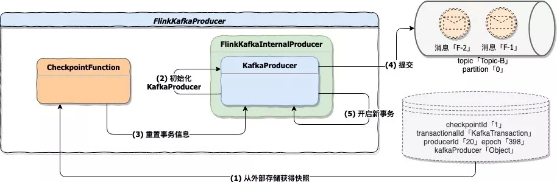

#### 总结

`FlinkKafkaProducer`故障恢复期间，状态初始化是比较重要的处理阶段。这个阶段在 Kafka 事务特性的强有力支撑下，实现了事务状态的恢复，并且使得状态存储占用空间最小。依赖 Flink 提供的`TwoPhaseCommitSinkFunction`实现类，我们自己也可以对 Sink 做更多的扩展。