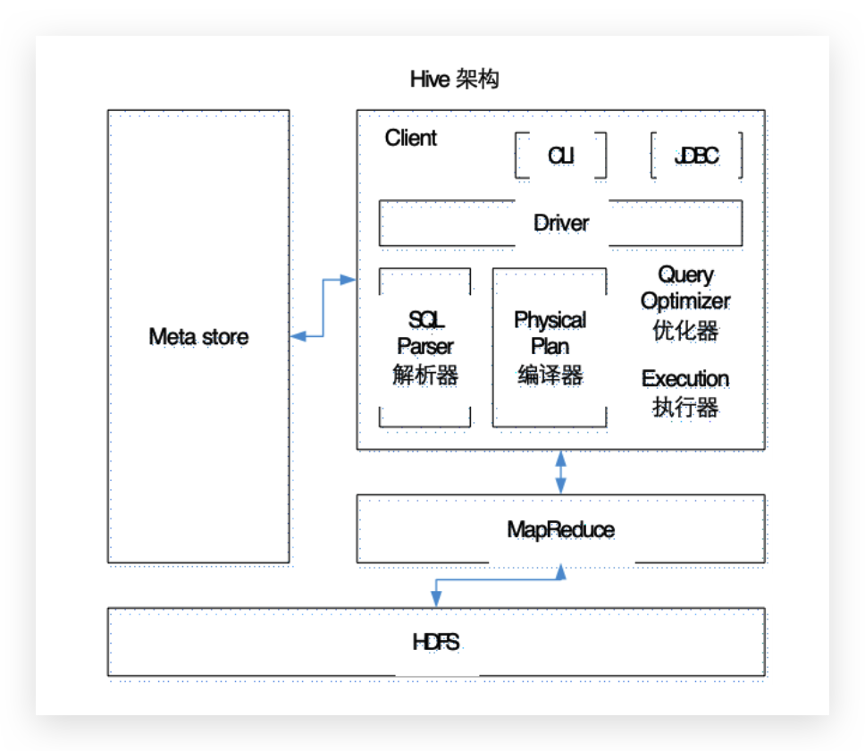
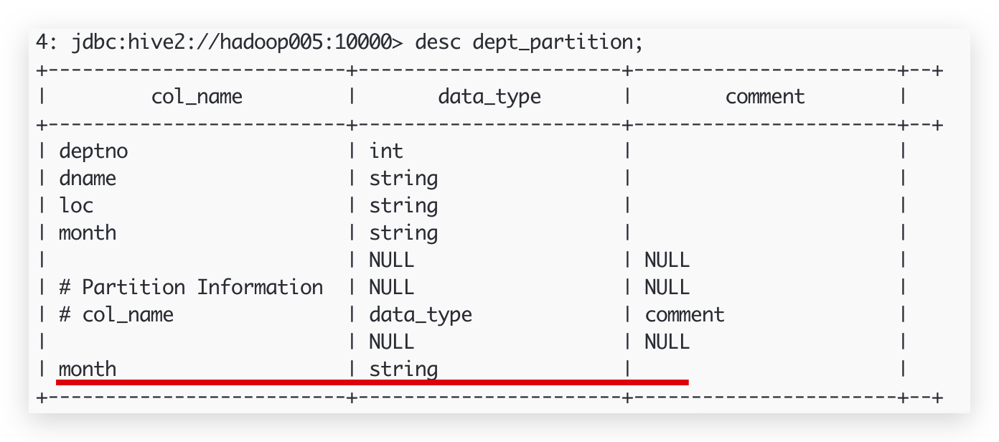

## Hive Architecture



## Hive计算引擎

Mapreduce(Default).Tez,Spark

## 源码目录

* bin
* conf —> hive-site.xml

```xml
<?xml version="1.0" encoding="UTF-8" standalone="no"?>
<?xml-stylesheet type="text/xsl" href="configuration.xsl"?>
<configuration>

    <!--元数据-->
    <property>
        <name>javax.jdo.option.ConnectionURL</name>
        <value>jdbc:mysql://hadoop102:3306/metastore?createDatabaseIfNotExist=true</value>
        <description>JDBC connect string for a JDBC metastore</description>
    </property>

  	<!--驱动-->
    <property>
        <name>javax.jdo.option.ConnectionDriverName</name>
        <value>com.mysql.jdbc.Driver</value>
        <description>Driver class name for a JDBC metastore</description>
    </property>

  	<!--用户名-->
    <property>
        <name>javax.jdo.option.ConnectionUserName</name>
        <value>root</value>
        <description>username to use against metastore database</description>
    </property>

  	<!--密码-->
    <property>
        <name>javax.jdo.option.ConnectionPassword</name>
        <value>shibin</value>
        <description>password to use against metastore database</description>
    </property>

  	<!--数据存放目录,默认hdfs-->
    <property>
        <name>hive.metastore.warehouse.dir</name>
        <value>/user/hive/warehouse</value>
        <description>location of default database for the warehouse</description>
    </property>

  	<!--hive命令时,打印头-->
    <property>
        <name>hive.cli.print.header</name>
        <value>true</value>
    </property>

    <!--hive命令时,打印当前数据库-->
    <property>
        <name>hive.cli.print.current.db</name>
        <value>true</value>
    </property>

    <property>
        <name>hive.metastore.schema.verification</name>
        <value>false</value>
    </property>

  	<!--更换计算引擎为Tez,默认MR计算,见Tez.md-->
    <property>
        <name>hive.execution.engine</name>
        <value>tez</value>
    </property>

</configuration>
```


* lib —> mysql-connector-java-5.1.17-bin.jar
* example

MySQL初始化

```shell
bin/schematool -dbType mysql -initSchema
```


## Client 连接

### cli连接: hive

```shell
> hive -H
usage: hive
 -d,--define <key=value>          Variable substitution to apply to Hive
                                  commands. e.g. -d A=B or --define A=B
    --database <databasename>     Specify the database to use
 -e <quoted-query-string>         SQL from command line
 -f <filename>                    SQL from files
 -H,--help                        Print help information
    --hiveconf <property=value>   Use value for given property
    --hivevar <key=value>         Variable substitution to apply to Hive
                                  commands. e.g. --hivevar A=B
 -i <filename>                    Initialization SQL file
 -S,--silent                      Silent mode in interactive shell
 -v,--verbose                     Verbose mode (echo executed SQL to the console
```


```shell
hive -f ~/test.hql # 执行脚本中sql语句
hive -i ~/test.hql # Initialization
hive > source ~/test.hql
hive -e "select * from student" # 不进入hive的交互窗口执行sql语句
hive -S <-e/-f> "select * from student" # silent
hive --define var=xxx
hive --hiveconf var=xxx
hive --hivevar foo=student
select * from ${hivevar:foo}
select * from ${foo}

# 获取所有的配置信息
set;
set -v;
# 获取单个的配置信息
set varname;
# 设置单个的配置信息
set varname=val;

# 执行外部命令
! pwd;
! bin/echo "hello";

# hdfs命令
dfs -ls /l
```

~/.hiverc文件 —> hive启动默认加载

```shell
set hiveconf:hive.cli.print.current.db=true;
set hiveconf:hive.exec.mode.local.auto=true;
set hive.metastore.warehouse.dir=/hive; # 路径
set mapred.reduce.tasks=100;
```

~/.hivehistory —>hive 历史记录,(quit;才会触发)


### JDBC 连接(CS架构)

```shell
> hiveserver2
> beeline
Beeline version 1.2.1 by Apache Hive
beeline> !connect jdbc:hive2://hadoop005:10000
Connecting to jdbc:hive2://hadooop005:10000
Enter username for jdbc:hive2://hadoop005:10000: ben
Enter password for jdbc:hive2://hadoop005:10000:
Connected to: Apache Hive (version 1.2.1)
Driver: Hive JDBC (version 1.2.1)
Transaction isolation: TRANSACTION_REPEATABLE_READ
1: jdbc:hive2://hadoop005:10000>
```

### Java code

```java
package com.ishibin;

import java.sql.*;

/**
 * Created with IntelliJ IDEA.
 * Description:
 * User: Ben
 * Date: 2019-03-12
 * Time: 20:14
 */
public class HelloHive {
	public static void main(String[] args) throws ClassNotFoundException, SQLException {
		Class.forName("org.apache.hive.jdbc.HiveDriver");
		Connection conn = DriverManager.getConnection("jdbc:hive2://hadoop005:10000");
		String sql = "select * from default.student";
		PreparedStatement ps = conn.prepareStatement(sql);
		ResultSet resultSet = ps.executeQuery();
		while (resultSet.next()) {
			int id = resultSet.getInt(1);
			String name = resultSet.getString(2);
			System.out.println(id + " - " + name + "\t");
		}
	}

	public boolean isOld(int i) {
		return (i % 2) == 1;
	}
}
```


## 数据类型

### 基本数据类型

| Hive数据类型 | Java数据类型 | 长度                                                 | 例子                                 |
| ------------ | ------------ | ---------------------------------------------------- | ------------------------------------ |
| TINYINT      | byte         | 1byte有符号整数                                      | 20                                   |
| SMALINT      | short        | 2byte有符号整数                                      | 20                                   |
| INT          | int          | 4byte有符号整数                                      | 20                                   |
| BIGINT       | long         | 8byte有符号整数                                      | 20                                   |
| BOOLEAN      | boolean      | 布尔类型，true或者false                              | TRUE  FALSE                          |
| FLOAT        | float        | 单精度浮点数                                         | 3.14159                              |
| DOUBLE       | double       | 双精度浮点数                                         | 3.14159                              |
| STRING       | string       | 字符系列。可以指定字符集。可以使用单引号或者双引号。 | ‘now is the time’ “for all good men” |
| TIMESTAMP    |              | 时间类型                                             |                                      |
| BINARY       |              | 字节数组                                             |                                      |

### 集合数据类型

| 数据类型 | 描述                                                         | 语法示例 |
| -------- | ------------------------------------------------------------ | -------- |
| STRUCT   | 和c语言中的struct类似，都可以通过“点”符号访问元素内容。例如，如果某个列的数据类型是STRUCT{first STRING, last STRING},那么第1个元素可以通过字段.first来引用。 | struct() |
| MAP      | MAP是一组键-值对元组集合，使用数组表示法可以访问数据。例如，如果某个列的数据类型是MAP，其中键->值对是’first’->’John’和’last’->’Doe’，那么可以通过字段名[‘last’]获取最后一个元素 | map()    |
| ARRAY    | 数组是一组具有相同类型和名称的变量的集合。这些变量称为数组的元素，每个数组元素都有一个编号，编号从零开始。例如，数组值为[‘John’, ‘Doe’]，那么第2个元素可以通过数组名[1]进行引用。 | Array()  |

实例:

```json
{
    "name": "songsong",
    "friends": ["bingbing" , "lili"] ,       	//列表Array,
    "children": {                      				//键值Map,
        "xiao song": 18 ,
        "xiaoxiao song": 19
    },
    "address": {                      				//结构Struct,
        "street": "hui long guan" ,
        "city": "beijing"
    }
}
```

test.txt

```
songsong,bingbing_lili,xiao song:18_xiaoxiao song:19,hui long guan_beijing
yangyang,caicai_susu,xiao yang:18_xiaoxiao yang:19,chao yang_beijin
```

Create table hql;

```sql
create table test(
    name string,
    friends array<string>,
    children map<string, int>,
    address struct<street:string, city:string>
)
row format delimited fields terminated by ','
collection items terminated by '_'
map keys terminated by ':'
lines terminated by '\n';
```

Hive shell;

```shell
> load data local inpath '/opt/module/hive/test.txt' into table test
```


### 类型转化

**隐式类型转换规则如下**

- 任何整数类型都可以隐式地转换为一个范围更广的类型，如TINYINT可以转换成INT，INT可以转换成BIGINT。
- 所有整数类型、FLOAT和STRING类型都可以隐式地转换成DOUBLE。
- TINYINT、SMALLINT、INT都可以转换为FLOAT。
- BOOLEAN类型不可以转换为任何其它的类型。

**可以使用CAST操作显示进行数据类型转换**

- 例如CAST('1' AS INT)将把字符串'1' 转换成整数1；如果强制类型转换失败，如执行CAST('X' AS INT)，表达式返回空值 NULL


## DDL数据定义

### 创建库

```sql
> create database db_name;			-- 默认hive-site.xml中,hive.metastore.warehouse.dir
> create database if not exists db_name;
> create database db_name location '/hive/hb_hive.db';
```

### 查询库

```sql
> show databases;
> show databases like 'db_nam*';
> desc database db_name;
> desc database extended db_name;
> use db_name;
```

### 修改库

```sql
> alter database db_name set dbproperties('createtime'='20170830');
> desc database extended db_name;
```

### 删除库

```sql
> drop database db_name;
> drop database if exists db_name;
> drop database db_name cascade; -- 强制删除
```

### 创建表

```sql
CREATE [EXTERNAL] TABLE [IF NOT EXISTS] table_name
[(col_name data_type [COMMENT col_comment], ...)]
[COMMENT table_comment]
[PARTITIONED BY (col_name data_type [COMMENT col_comment], ...)]
[CLUSTERED BY (col_name, col_name, ...)
[SORTED BY (col_name [ASC|DESC], ...)] INTO num_buckets BUCKETS]
[ROW FORMAT row_format]
[STORED AS file_format]
[LOCATION hdfs_path]
```

* EXTERNAL 外部表/管理表
* PARTITIONED  BY 分区(建子目录)
* CLUSTERED BY 分桶
* SORTED BY
* ROW FORMAT DELIMITED
  * [FIELDS TERMINATED BY char] **—flelds分隔符**
  * [COLLECTION ITEMS TERMINATED BY char] **— collection 分隔符**
  * [MAP KEYS TERMINATED BY char]  **— map 分隔符**
  * [LINES TERMINATED BY char]  **—行分隔符**
  * | SERDE serde_name **— SerDe是Serialize/Deserilize的简称，目的是用于序列化和反序列化**
  * [WITH SERDEPROPERTIES (property_name=property_value, property_name=property_value, ...)]
* STORED AS 指定存储文件类型
  * SEQUENCEFILE（二进制序列文件）
  * TEXTFILE（文本）
  * RCFILE（列式存储格式文件）
* LOCATION 位置
* LIKE 复制表结构

```sql
create table test(
    name string,
    friends array<string>,
    children map<string, int>,
    address struct<street:string, city:string>
)
row format delimited
	fields terminated by ','
	collection items terminated by '_'
	map keys terminated by ':'
	lines terminated by '\n';

desc test;
desc formatted test;
show create table test;
```


#### 管理表(Default)

```shell
set hive.metastore.warehouse.dir;
```

> **管理表会关联 dfs 上的数据, 删除表时,同时也会删除 dfs 中的数据**

```sql
create table if not exists student2(
	id int, name string
)
row format delimited fields terminated by '\t'
stored as textfile
location '/user/hive/warehouse/student2';

create table if not exists student3 as select id, name from student; --表结构及表内容

create table if not exists student4 like student; --表结构
```


#### 外部表external

> 因为表是外部表，所以Hive并非认为其完全拥有这份数据。**删除该表并不会删除掉这份数据，不过描述表的元数据信息会被删除掉。**

```sql
create external table if not exists default.dept(
	deptno int,
	dname string,
	loc int
)
row format delimited fields terminated by '\t';
```

```sql
create external table if not exists default.emp(
	empno int,
	ename string,
	job string,
	mgr int,
	hiredate string,
	sal double,
	comm double,
	deptno int
)
row format delimited fields terminated by '\t';
```

```sql
load data local inpath '/opt/module/datas/dept.txt' into table default.dept;
```

```sql
alter table student set tblproperties ('EXTERNAL'='TURE'); --转成外部表
alter table student set tblproperties ('EXTERNAL'='FALSE'); --转成内部表
```

### 分区表

>  Hive中的分区本质上是在 HDFS 中分目录,文件夹名是分区号(/dept_partition/201906/dept.txt)

```sql
-- create table
create table dept_partition(
deptno int, dname string, loc string
)
partitioned by (month string)
row format delimited fields terminated by '\t';

-- load data
load data local inpath '/Users/ben/Downloads/dept.txt' into table default.dept_partition partition(month='201709');
load data local inpath '/Users/ben/Downloads/dept.txt' into table default.dept_partition partition(month='201708');
load data local inpath '/Users/ben/Downloads/dept.txt' into table default.dept_partition partition(month='201707’);

-- query
select * from dept_partition where month='201707';

select * from dept_partition where month='201707'
union
select * from dept_partition where month='201708'
union
select * from dept_partition where month='201709';

-- add partition
alter table dept_partition add partition(month='201706');
alter table dept_partition add partition(month='201705') partition(month='201704');

-- delete partition
alter table dept_partition drop partition (month='201704');
alter table dept_partition drop partition (month='201705'), partition (month='201706');

-- 显示表的分区
show partitions dept_partition;
desc formatted dept_partition;
```




```sql
create table dept_partition2(
    deptno int, dname string, loc string
)
partitioned by (month string, day string)
row format delimited fields terminated by '\t';

load data local inpath './dept.txt' into table dept_partition2 partition(month='201903', day='15');

select * from dept_partition2 where month= '201903' and  day = '15';
```

#### 把数据直接上传到分区目录上，让分区表和数据产生关联的三种方式

**方式一：上传数据后修复**

```sql
dfs -put ./dept.txt  /user/hive/warehouse/dept_partition2/month=201903/day=15;
select * from dept_partition2 where month='201903' and day='15';  --查不到
msck repair table dept_partition2;  --修复命令
select * from dept_partition2 where month='201903' and day='15';  --可以查到
```

**方式二：上传数据后添加分区**

```sql
dfs -put /opt/module/datas/dept.txt  /user/hive/warehouse/dept_partition2/month=201709/day=11;
alter table dept_partition2 add partition(month='201709', day='11');
select * from dept_partition2 where month='201709' and day='11';
```

**方式三：创建文件夹后load数据到分区**

```sql
load data local inpath './dept.txt' into table dept_partition2 partition(month='201709',day='10');
select * from dept_partition2 where month='201709' and day='10';
```

### 修改表

```sql
-- rename tablename
ALTER TABLE table_name RENAME TO new_table_name
alter table dept_partition2 rename to dept_partition1;

-- change column
ALTER TABLE table_name CHANGE [COLUMN] col_old_name col_new_name column_type [COMMENT col_comment] [FIRST|AFTER column_name]
alter table dept_partition1 change phone_num addr string;

-- add column
ALTER TABLE table_name ADD|REPLACE COLUMNS (col_name data_type [COMMENT col_comment], ...)
alter table dept_partition1 add columns (phone_num string);
-- replce columns
alter table dept_partition1 replace columns(deptno string, dname string, loc string);

-- desc
desc dept_partition1;
desc formatted dept_partition1;

-- delete data from table(Cannot truncate non-managed table emp)
truncate table table_name;

-- delete table
drop table dept_partition1;

-- alter table to external table
alter table student set tblproperties ('EXTERNAL'='TURE');
alter table student set tblproperties ('EXTERNAL'='FALSE');
```


## DML数据操作

### 数据导入

#### 向表中装载数据（Load）

```sql
LOAD DATA LOCAL INPATH './examples/files/kv2.txt' OVERWRITE INTO TABLE invites PARTITION (ds='2008-08-15');
```

- load data:表示加载数据
- local:表示从本地加载数据到hive表；否则从HDFS加载数据到hive表
- inpath:表示加载数据的路径
- overwrite:表示覆盖表中已有数据，否则表示追加
- into table:表示加载到哪张表
- student:表示具体的表
- partition:表示上传到指定分区


#### 通过查询语句向表中插入数据(insert)

```sql
create table student(id int, name string) partitioned by (month string) row format delimited fields terminated by '\t';

-- basic insert
insert into table student partition(month='201709') values(1,'wangwu');

-- insert data from a talbe
-- overwrite:如果有分区 overwrite只会去覆盖分区中的内容
insert overwrite table student partition(month='201708')
	select id, name from student where month='201709';

-- insert data from muti tables
from student
	insert overwrite table student partition(month='201707')
	select id, name where month='201709'
	insert overwrite table student partition(month='201706')
	select id, name where month='201709';
```

#### 查询语句中创建表并加载数据(As Select)

```sql
create table if not exists student3
	as select id, name from student;
```

#### 创建表时通过Location指定加载数据路径

```sql
create table if not exists student5(
    id int, name string
)
row format delimited fields terminated by '\t'
location '/user/hive/warehouse/student5';

dfs -put /opt/module/datas/student.txt /user/hive/warehouse/student5;

select * from student5;
```

#### Import数据到指定Hive表中

> 注意：先用export导出后，再将数据导入。

```sql
import table student2 partition(month='201709') from '/user/hive/warehouse/export/student';
```


### 数据导出

#### Insert导出

1．将查询的结果导出到本地

```sql
insert overwrite local directory './student' select * from student;
```

2．将查询的结果格式化导出到本地

```sql
insert overwrite local directory './student1' ROW FORMAT DELIMITED FIELDS TERMINATED BY '\t';

select * from student;
```

3．将查询的结果导出到HDFS上(没有local)

```sql
insert overwrite directory './student2' ROW FORMAT DELIMITED FIELDS TERMINATED BY '\t'

select * from student;
```

#### Hadoop命令导出到本地

```shell
dfs -get /user/hive/warehouse/student/month=201709/000000_0 /opt/module/datas/export/student3.txt;
```

#### Hive Shell 命令导出

基本语法：（hive -f/-e 执行语句或者脚本 > file）

```shell
bin/hive -e 'select * from default.student;' > /opt/module/datas/export/student4.txt;
```

#### Export导出到HDFS上

```shell
export table default.student to '/user/hive/warehouse/export/student';
```

#### 清除表中数据（Truncate）

注意：Truncate只能删除管理表，不能删除外部表中数据

```sql
truncate table student;

alter table emp set tblproperties ('EXTERNAL'='FALSE');
```


## 查询

### 基本查询（Select…From）

```sql
select * from table_name;
select column_name1, column_name2 from table_name;
select column_name1 as alias_name, column_name2 from table_name; -- alias
```

#### 算术运算符

| 运算符 | 描述           |
| ------ | -------------- |
| A+B    | A和B 相加      |
| A-B    | A减去B         |
| A*B    | A和B 相乘      |
| A/B    | A除以B         |
| A%B    | A对B取余       |
| A&B    | A和B按位取与   |
| A\|B   | A和B按位取或   |
| A^B    | A和B按位取异或 |
| ~A     | A按位取反      |

#### 常用函数

count(), max(), min(), avg(), sum()

#### Limit语句

```sql
select * from table_name limit 10;
```

#### Where语句

```sql
select * from table_name where column_name < 1000;
```

#### 比较运算符（Between/In/ Is Null）

| 操作符                  | 支持的数据类型 | 描述                                                         |
| ----------------------- | -------------- | ------------------------------------------------------------ |
| A=B                     | 基本数据类型   | 如果A等于B则返回TRUE，反之返回FALSE                          |
| A<=>B                   | 基本数据类型   | **如果A和B都为NULL，则返回TRUE，其他的和等号（=）操作符的结果一致，如果任一为NULL则结果为NULL** |
| A<>B, A!=B              | 基本数据类型   | A或者B为NULL则返回NULL；如果A不等于B，则返回TRUE，反之返回FALSE |
| A<B                     | 基本数据类型   | A或者B为NULL，则返回NULL；如果A小于B，则返回TRUE，反之返回FALSE |
| A<=B                    | 基本数据类型   | A或者B为NULL，则返回NULL；如果A小于等于B，则返回TRUE，反之返回FALSE |
| A>B                     | 基本数据类型   | A或者B为NULL，则返回NULL；如果A大于B，则返回TRUE，反之返回FALSE |
| A>=B                    | 基本数据类型   | A或者B为NULL，则返回NULL；如果A大于等于B，则返回TRUE，反之返回FALSE |
| A [NOT] BETWEEN B AND C | 基本数据类型   | 如果A，B或者C任一为NULL，则结果为NULL。如果A的值大于等于B而且小于或等于C，则结果为TRUE，反之为FALSE。如果使用NOT关键字则可达到相反的效果。 |
| A IS NULL               | 所有数据类型   | 如果A等于NULL，则返回TRUE，反之返回FALSE                     |
| A IS NOT NULL           | 所有数据类型   | 如果A不等于NULL，则返回TRUE，反之返回FALSE                   |
| IN(数值1, 数值2)        | 所有数据类型   | 使用 IN运算显示列表中的值                                    |
| A [NOT] LIKE B          | STRING 类型    | B是一个SQL下的简单正则表达式，如果A与其匹配的话，则返回TRUE；反之返回FALSE。B的表达式说明如下：‘x%’表示A必须以字母‘x’开头，‘%x’表示A必须以字母’x’结尾，而‘%x%’表示A包含有字母’x’,可以位于开头，结尾或者字符串中间。如果使用NOT关键字则可达到相反的效果。 |
| A RLIKE B, A REGEXP B   | STRING 类型    | B是一个正则表达式，如果A与其匹配，则返回TRUE；反之返回FALSE。匹配使用的是JDK中的正则表达式接口实现的，因为正则也依据其中的规则。例如，正则表达式必须和整个字符串A相匹配，而不是只需与其字符串匹配。 |

2）案例实操

```sql
select * from table_name column_name = column_val;
select * from table_name column_name is null;
select * from table_name column_name between column_val1 and column_val2;
select * from table_name column_name in (column_val1, column_val2);
```

Like / Rlike(正则)

> %代表匹配多个, _代表匹配一个

#### 逻辑运算符（And/Or/Not）

| 操作符 | 含义   |
| ------ | ------ |
| AND    | 逻辑并 |
| OR     | 逻辑或 |
| NOT    | 逻辑否 |

```sql
select * from table_name column_name > column_val1 and column_name < column_val2;
select * from table_name column_name = column_val1 or column_name = column_val2;
select * from table_name column_name not in (column_val1, column_val2);
```

### 分组

#### Group By语句

> 一般和聚合函数一起使用

```sql
select job, max(sal) as max_sal from emp group by job;
select job, avg(sal) as avg_sal from  emp group by job;
```


#### Having语句

* where针对表中的列发挥作用，查询数据；having针对查询结果中的列发挥作用，筛选数据。
* where后面不能写分组函数，而having后面可以使用分组函数。
* having只用于group by分组统计语句。

```sql
select deptno, avg(sal) as avg_sal from emp group by deptno having avg_sal > 2000;
```


### Join语句

* 等值Join
* 内连接
* 左外连接
* 右外连接
* 满外连接
* 多表连接


### 排序

* 区内排序(Sort By)
* 全局排序(Order By)
* 分区排序(Distribute By):通常与sort by连用
* Cluster By:当distribute by和sorts by字段相同时，可以使用cluster by方式


#### 每个MapReduce内部排序-Sort By

```sql
select * from emp sort by empno desc;

insert overwrite local directory '/opt/module/datas/result' select * from emp sort by deptno desc;
```

#### 全局排序Order By

#### 分区Distribute By

一般配合sort by使用(分区了不排序没什么意义)

```sql
insert overwrite local directory '/opt/module/datas/distribute-result' select * from emp distribute by deptno sort by empno desc;
```

#### Cluster By

> 当distribute by和sorts by字段相同时，可以使用cluster by方式。
>
> cluster by clumon1 == distribut by clumon1 sort by clumon1
>
> cluster by除了具有distribute by的功能外还兼具sort by的功能。但是排序只能是升序排序，不能指定排序规则为ASC或者DESC。

```sql
select * from emp cluster by deptno;
select * from emp distribute by deptno sort by deptno;
```


### 分桶及抽样查询

* 分桶表数据存储
* 分桶抽样查询


### 其他常用查询函数

#### 空字段赋值NVL()

```sql
-- 如果comm字段为null用-1, mgr替代
hive> select nvl(comm,-1) from emp;
hive> select nvl(comm,mgr) from emp;
```


#### CASE WHEN

```sql
-- 语法
case column_name
	when 'column_val'
		then val_1
		else val_2
end
```

emp_sex.txt

```
悟空	A	男
大海	A	男
宋宋	B	男
凤姐	A	女
婷姐	B	女
婷婷	B	女
```

```sql
-- create table
create table emp_sex(
name string,
dept_id string,
sex string)
row format delimited fields terminated by "\t";

-- load data
load data local inpath '/Users/ben/bigdata/hivelearn/emp_sex.txt' into table emp_sex;

-- 求出不同部门男女各多少人。结果如下：
A     2       1
B     1       2

select dept_id,
-- 如果sex是'男'取1,否则0,然后对其进行sum
sum(case sex when '男' then 1 else 0 end) male_count,
sum(case sex when '女' then 1 else 0 end) female_count
from emp_sex
group by dept_id;
```


#### 行转列

> 一列中多行合并成一行, 多行合并成一行

* CONCAT(string A/col, string B/col…) 拼接字符串或者列
* CONCAT_WS(separator, str1, str2,…) 用指定分割符separator拼接字符串
* COLLECT_SET(col) 多行中的一列合并成array

````sql
> vi person_info.txt
孙悟空	白羊座	A
大海	     射手座	A
宋宋	     白羊座	B
猪八戒    白羊座	A
凤姐	     射手座	A

-- create table
create table person_info(
name string,
constellation string,
blood_type string)
row format delimited fields terminated by "\t";

load data local inpath “/opt/module/datas/person_info.txt” into table person_info;

-- 把星座和血型一样的人归类到一起
射手座,A            大海|凤姐
白羊座,A            孙悟空|猪八戒
白羊座,B            宋宋

select t.base, concat_ws('|', collect_set(t.name))
from (
  select name, concat(constellation, ',', blood_type) as base
  from person_info
) t
group by t.base
````


#### 列转行

> 一行中的array/map转成多行

* EXPLODE(col)：udtf函数,将hive一列中复杂的array或者map结构拆分成多行。
  * array: 炸裂成一列多行
  * map: 炸裂成两列多行
* LATERAL VIEW

> 语法：LATERAL VIEW udtf(col_name/expression) tableAlias AS columnAlias
>
> 解释：用于和split, explode等UDTF一起使用，它能够将一列数据拆成多行数据，在此基础上可以对拆分后的数据进行聚合。

```sql
> vi movie.txt
《疑犯追踪》	悬疑,动作,科幻,剧情
《Lie to me》	悬疑,警匪,动作,心理,剧情
《战狼2》	战争,动作,灾难

-- create table
create table movie_info(
    movie string,
    category array<string>)
row format delimited fields terminated by "\t"
collection items terminated by ",";

-- load data
load data local inpath "/opt/module/datas/movie.txt" into table movie_info;

-- 将电影分类中的数组数据展开
select
    movie,
    category_name
from
    movie_info lateral view explode(category) table_tmp as category_name;

-- output
+--------------+-----------+--+
|    movie     | col_name  |
+--------------+-----------+--+
| 《疑犯追踪》   | 悬疑       |
| 《疑犯追踪》   | 动作       |
| 《疑犯追踪》   | 科幻       |
| 《疑犯追踪》   | 剧情       |
| 《Lie to me》 | 悬疑       |
| 《Lie to me》 | 警匪       |
| 《Lie to me》 | 动作       |
| 《Lie to me》 | 心理       |
| 《Lie to me》 | 剧情       |
| 《战狼2》    	 | 战争      |
| 《战狼2》    	 | 动作      |
| 《战狼2》    	 | 灾难      |
+--------------+-----------+--+
```


#### 窗口和分析函数

官方文档https://cwiki.apache.org/confluence/display/Hive/LanguageManual+WindowingAndAnalytics

> 窗口 + 函数


* 窗口大小

* 聚合函数

* Windowing functions

  * LAG(col [,offset] [,default]) OVER ([query_partition_clause] order_by_clause)：往前第n行数据
  * LEAD(col [,offset] [,default]) OVER ([query_partition_clause] order_by_clause)：往后第n行数据
  * FIRST_VALUE(col [,false|ture]): 获取第一个,每二个参数:是否跳过NULL
  * LAST_VSLUE(col [,false|ture]): 获取最后一个值,一般配合order by + 窗口子句

* The OVER clause

  * OVER with standard aggregates:

    * COUNT
    * SUM
    * MIN
    * MAX
    * AVG

  * 子窗口

    * ```sql
      -- 子窗口语法
      (ROWS | RANGE) BETWEEN (UNBOUNDED | [num]) PRECEDING AND ([num] PRECEDING | CURRENT ROW | (UNBOUNDED | [num]) FOLLOWING)
      (ROWS | RANGE) BETWEEN CURRENT ROW AND (CURRENT ROW | (UNBOUNDED | [num]) FOLLOWING)
      (ROWS | RANGE) BETWEEN [num] FOLLOWING AND (UNBOUNDED | [num]) FOLLOWING
      ```

    * 如果没有ORDER BY和 WINDOW clauses, 窗口大小是:窗口的第一个到窗口的最后一个ROWS BETWEEN UNBOUNDED PRECEDING AND UNBOUNDED FOLLOWING

    * 如果有ORDER BY,窗口大小是:窗口的第一个到当前行RANGE BETWEEN UNBOUNDED PRECEDING AND CURRENT ROW

    > The OVER clause supports the following functions, but it does not support a window with them (see [HIVE-4797](https://issues.apache.org/jira/browse/HIVE-4797)):
    >
    > Ranking functions: Rank, NTile, DenseRank, CumeDist, PercentRank.
    >
    > Lead and Lag functions.

* Analytics functions

  * RANK: 排名,允许**并列**名次,并列之后**跳号**
  * DENSE_RANK: 排名,允许**并列**名次,并列之后**不跳号**
  * ROW_NUMBER: 排名,原始序列号,**不并列,不跳号**
  * CUME_DIST: 当前行rank()值大小之前的行数 / 窗口内总行数
  * PERCENT_RANK: (分组内当前行的RANK值-1) / (分组内总行数-1)
  * NTILE(n)：把有序分区中的行分发到指定数据的组中，各个组有编号，编号从1开始，对于每一行，NTILE返回此行所属的组的编号。注意：n必须为int类型


* CURRENT ROW：当前行
* n PRECEDING：往前n行数据
* n FOLLOWING：往后n行数据
* UNBOUNDED：起点，UNBOUNDED PRECEDING 表示从前面的起点， UNBOUNDED FOLLOWING表示到后面的终点


#### Windowing functions实例

```sql
-- 查询在2017年4月份购买过的顾客及总人数
select name, count(*) over() from business where year(orderdate) = 2017 and month(orderdate) = 4 group by name;

-- 查询顾客的购买明细及月购买总额
select name, orderdate, sum(cost) over(partition by name, year(orderdate), month(orderdate)) from business;

-- 要将cost按照日期进行累加:sum
select name, orderdate, sum(cost) over(partition by name order by orderdate) from business;

-- 上一次来的时间:lag
select name, orderdate, lag(orderdate, 1, '--') over(partition by name order by orderdate) from business;

-- 每月第一比金额:first_value
select name, orderdate, cost, first_value(cost) over(partition by name, year(orderdate), month(orderdate) order by orderdate) from business;

-- 每月第一比金额和最后一比金额:first_value,last_value+窗口子句
select name, orderdate, cost,
first_value(cost) over(partition by name, year(orderdate), month(orderdate) order by orderdate) as first_cost,
last_value(cost) over(partition by name, year(orderdate), month(orderdate) order by orderdate ROWS BETWEEN UNBOUNDED PRECEDING AND UNBOUNDED FOLLOWING) as last_cost
from business;

-- 最近三笔:sum()
select name, orderdate, cost,
sum(cost) over(partition by name, year(orderdate), month(orderdate) order by orderdate rows between 2 PRECEDING AND CURRENT ROW) as sum
from business;

-- 最近三笔:lag()上一笔+ current_cost + lead()下一笔
select name, orderdate, cost,
lag(cost, 1, 0) over(partition by name, year(orderdate), month(orderdate) order by orderdate)
+ cost +
lead(cost, 1, 0) over(partition by name, year(orderdate), month(orderdate) order by orderdate)
from business;
```


#### Analytics functions实例

```sql
select *,
rank() over( order by score desc), -- 序号,并列,跳号
dense_rank() over( order by score desc), -- 排序,并列,不跳号
row_number() over( order by score desc), -- 原始排序,不并列,不跳号
cume_dist() over( order by score desc), -- 小于(或大于)等于当前值的行数 / 窗口内总行数
percent_rank() over( order by score desc), -- (分组内当前行的RANK值-1) / (窗口内总行数-1)
ntile(5) over( order by score desc) -- 分成n个组,返回每个组的序号
from score;
```


## 函数

### 系统内置函数

```shell
hive> show functions;
hive> show functions like 'xpath*';
hive> desc function upper;
hive> desc function extended upper;
```

### 自定义UDF函数(一对一)

* 编写代码
  * 继承UDF
  * 重写方法evaluate
* 代码打 jar 包
* 把jar包放到hive lib 下(启动会加载)
* 定义函数
* 调用函数

```xml
<!--添加hive依赖-->
<dependency>
    <groupId>org.apache.hive</groupId>
    <artifactId>hive-exec</artifactId>
    <!--<version>${hive.version}</version>-->
    <version>1.2.1</version>
</dependency>
```

```java
package com.ishibin.hive;
import org.apache.hadoop.hive.ql.exec.UDF;

public class Lower extends UDF {
	public String evaluate (final String s) {
		if (s == null) {
			return null;
		}
		return s.toLowerCase();
	}
}
```


```shell
# copy jar 包
> cp hivefunction-1.0-SNAPSHOT.jar /opt/module/hive/lib
# add jar 包
hive (gmall)> add jar /opt/module/hive/lib/hivefunction-1.0-SNAPSHOT.jar;
# 创建临时函数 永久函数在 hive-site.xml 中配置
# 或者写在.hiverc中, 启动时就去加载
hive (gmall)> create temporary function base_analizer as 'com.ishibin.udf.BaseFieldUDF';
hive (gmall)> create temporary function flat_analizer as 'com.ishibin.udtf.EventJsonUDTF';
# delete function
hive (gmall)> Drop [temporary] function [if exists] [dbname.]function_name;
# test function
hive (gmail)> select flat_analizer('ABC');
```


### 自定义UDTF函数(一对多)

- 编写代码
  - 继承GenericUDTF
  - 重写方法initialize/process/close
- 打 jar 包
- 放到 lib 下
- hive 中添加 jar 包
- 定义函数
- 调用函数


## 调优

### Fetch抓取

Hive中对某些情况的查询可以不必使用MapReduce计算, 能不走mr就不要走mr

```xml
<property>
    <name>hive.fetch.task.conversion</name>
    <value>more</value>
    <description>
      Expects one of [none, minimal, more].
      Some select queries can be converted to single FETCH task minimizing latency.
      Currently the query should be single sourced not having any subquery and should not have
      any aggregations or distincts (which incurs RS), lateral views and joins.
      0. none : disable hive.fetch.task.conversion
      1. minimal : SELECT STAR, FILTER on partition columns, LIMIT only
      2. more  : SELECT, FILTER, LIMIT only (support TABLESAMPLE and virtual columns)
    </description>
  </property>
```


### 本地模式

当Hive的输入数据量是非常小,建议开启本地模式

```sql
hive> set hive.exec.mode.local.auto=true;  -- 开启本地mr
-- 设置local mr的最大输入数据量，当输入数据量小于这个值时采用local  mr的方式，默认为134217728，即128M
hive> set hive.exec.mode.local.auto.inputbytes.max=50000000;
-- 设置local mr的最大输入文件个数，当输入文件个数小于这个值时采用local mr的方式，默认为4
hive> set hive.exec.mode.local.auto.input.files.max=10;
```


### 表的优化

#### 小表,大表的join

> 新版的hive已经对小表JOIN大表和大表JOIN小表进行了优化。小表放在左边和右边已经没有明显区别

#### 大表Join大表

1. 空KEY过滤

2. 空key转换

#### MapJoin

```sql
set hive.auto.convert.join = true; -- 开启Mapjoin功能,默认为true
set hive.mapjoin.smalltable.filesize=25000000; -- 25M以下是小表
```

#### Count(Distinct) 去重统计

一般COUNT DISTINCT使用先GROUP BY再COUNT的方式替换

#### 笛卡尔积

避免笛卡尔积

#### 行列过滤

列处理：在SELECT中，只拿需要的列，如果有，尽量使用分区过滤，少用SELECT *。

行处理：在分区剪裁中，当使用外关联时，如果将副表的过滤条件写在Where后面，那么就会先全表关联，之后再过滤

#### 动态分区调整

```sql
set hive.exec.dynamic.partition=true; -- 默认
set hive.exec.dynamic.partition.mode=nonstrict; -- 打开非严格模式
set hive.exec.max.dynamic.partitions=1000; -- 最大可以创建的分区数
set hive.exec.max.created.files=100000; -- 最大可以创建的HDFS文件数
```

#### 分区

数据分文件夹

#### 分桶

数据分文件


### 数据倾斜

#### 合理设置Map数

**通常情况下，作业会通过input的目录产生一个或者多个map任务**

> 主要的决定因素有：input的文件总个数，input的文件大小，集群设置的文件块大小。

**是不是map数越多越好？**

> 答案是否定的。如果一个任务有很多小文件（远远小于块大小128m），则每个小文件也会被当做一个块，用一个map任务来完成，而一个map任务启动和初始化的时间远远大于逻辑处理的时间，就会造成很大的资源浪费。而且，同时可执行的map数是受限的。

**是不是保证每个map处理接近128m的文件块，就高枕无忧了？**

> 答案也是不一定。比如有一个127m的文件，正常会用一个map去完成，但这个文件只有一个或者两个小字段，却有几千万的记录，如果map处理的逻辑比较复杂，用一个map任务去做，肯定也比较耗时。


#### 小文件进行合并

```sql
set hive.input.format= org.apache.hadoop.hive.ql.io.CombineHiveInputFormat;
```

#### 复杂文件增加Map数

> 增加map的方法为：根据computeSliteSize(Math.max(minSize,Math.min(maxSize,blocksize)))=blocksize=128M公式，调整maxSize最大值。让maxSize最大值低于blocksize就可以增加map的个数

```sql
set mapreduce.input.fileinputformat.split.maxsize=100; -- 设置最大切片值为100个字节
```


### JVM重用

小文件的场景或task特别多的场景，这类场景大多数执行时间都很短,

Hadoop的默认配置通常是使用派生JVM来执行map和Reduce任务的。这时JVM的启动过程可能会造成相当大的开销，尤其是执行的job包含有成百上千task任务的情况。**JVM重用可以使得JVM实例在同一个job中重新使用N次**。N的值可以在Hadoop的mapred-site.xml文件中进行配置。通常在10-20之间，具体多少需要根据具体业务场景测试得出

```xml
<property>
  <name>mapreduce.job.jvm.numtasks</name>
  <value>10</value>
  <description>How many tasks to run per jvm. If set to -1, there is no limit. </description>
</property>
```


### 数据压缩


### 执行计划（Explain）

```sql
-- 语法
EXPLAIN [EXTENDED | DEPENDENCY | AUTHORIZATION] query

hive > explain extended select * from emp;
hive > explain extended select deptno, avg(sal) avg_sal from emp group by deptno;
```

