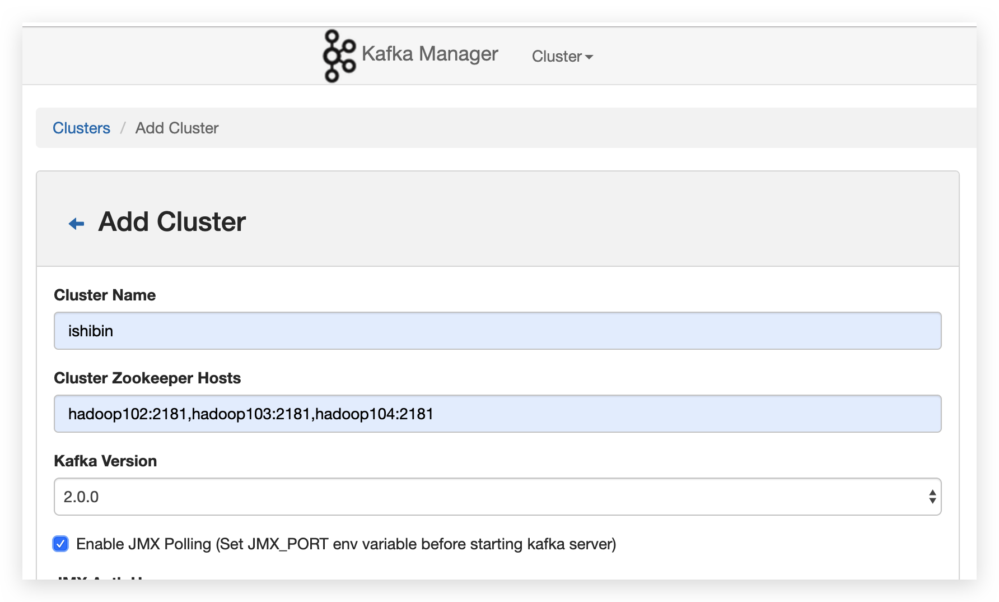

## config

conf/server.properties

```properties
#broker的全局唯一编号，不能重复
broker.id=0
#删除topic功能使能
delete.topic.enable=true
#处理网络请求的线程数量
num.network.threads=3
#用来处理磁盘IO的现成数量
num.io.threads=8
#发送套接字的缓冲区大小
socket.send.buffer.bytes=102400
#接收套接字的缓冲区大小
socket.receive.buffer.bytes=102400
#请求套接字的缓冲区大小
socket.request.max.bytes=104857600
#kafka运行日志存放的路径	
log.dirs=/opt/module/kafka/logs
#topic在当前broker上的分区个数
num.partitions=1
#用来恢复和清理data下数据的线程数量
num.recovery.threads.per.data.dir=1
#segment文件保留的最长时间，超时将被删除
log.retention.hours=168
#配置连接Zookeeper集群地址
zookeeper.connect=hadoop102:2181,hadoop103:2181,hadoop104:2181
```

```shell
 #KAFKA_HOME
 export KAFKA_HOME=/opt/module/kafka_2.11-0.11.0.2
 export PATH=$PATH:$KAFKA_HOME/bin
```


common cmd

```shell
> bin/kafka-server-start.sh config/server.properties
> bin/kafka-server-stop.sh stop

# list topic
> bin/kafka-topics.sh --zookeeper hadoop102:2181 --list

# create topic
> bin/kafka-topics.sh --zookeeper hadoop102:2181 --create --replication-factor 3 --partitions 1 --topic first_topic
# --topic 定义topic名
# --replication-factor  定义副本数
# --partitions  定义分区数

# delete topic
> bin/kafka-topics.sh --zookeeper hadoop102:2181 --delete --topic first

# send msg to topic
> bin/kafka-console-producer.sh --broker-list hadoop102:9092 --topic first_topic
#
> bin/kafka-console-consumer.sh --zookeeper hadoop102:2181 --from-beginning --topic first_topic
# show more details about topic
> bin/kafka-topics.sh --zookeeper hadoop102:2181 --describe --topic first_topic
```


## Kafka Manage

```shell
> unzip kafka-manager-1.3.3.22.zip -d /opt/module/
```


conf/application.conf

```properties
# kafka-manager.zkhosts="kafka-manager-zookeeper:2181"
kafka-manager.zkhosts="hadoop102:2181,hadoop103:2181,hadoop104:2181"
kafka-manager.zkhosts=${?ZK_HOSTS}
```

```shell
# 指定 port, 默认9000, 与Hadoop冲突
> bin/kafka-manager -Dhttp.port=7456 >/opt/module/kafka-manager-1.3.3.22/start.log
```


<http://hadoop102:7456/>



更多 details: <https://blog.csdn.net/u011089412/article/details/87895652>


## Kafka压力测试

### Kafka压测

用Kafka官方自带的脚本，对Kafka进行压测。Kafka压测时，可以查看到哪个地方出现了瓶颈（CPU，内存，网络IO）。一般都是网络IO达到瓶颈。 

* kafka-consumer-perf-test.sh
* kafka-producer-perf-test.sh


### Kafka Producer压力测试

```shell
# record-size是一条信息有多大，单位是字节
# num-records是总共发送多少条信息
# throughput 是每秒多少条信息
> bin/kafka-producer-perf-test.sh  --topic test --record-size 100 --num-records 100000 --throughput 1000 --producer-props bootstrap.servers=hadoop102:9092,hadoop103:9092,hadoop104:9092

4999 records sent, 999.8 records/sec (0.10 MB/sec), 3.7 ms avg latency, 315.0 max latency.
5008 records sent, 1001.4 records/sec (0.10 MB/sec), 0.8 ms avg latency, 9.0 max latency.
5002 records sent, 999.4 records/sec (0.10 MB/sec), 0.9 ms avg latency, 7.0 max latency.
5004 records sent, 1000.8 records/sec (0.10 MB/sec), 0.8 ms avg latency, 12.0 max latency.
5000 records sent, 1000.0 records/sec (0.10 MB/sec), 0.8 ms avg latency, 9.0 max latency.
5002 records sent, 1000.2 records/sec (0.10 MB/sec), 0.8 ms avg latency, 13.0 max latency.
5000 records sent, 1000.0 records/sec (0.10 MB/sec), 0.8 ms avg latency, 7.0 max latency.
5002 records sent, 1000.2 records/sec (0.10 MB/sec), 0.8 ms avg latency, 9.0 max latency.
5000 records sent, 1000.0 records/sec (0.10 MB/sec), 0.8 ms avg latency, 5.0 max latency.
5001 records sent, 1000.0 records/sec (0.10 MB/sec), 0.8 ms avg latency, 6.0 max latency.
5000 records sent, 1000.0 records/sec (0.10 MB/sec), 0.8 ms avg latency, 8.0 max latency.
4999 records sent, 999.8 records/sec (0.10 MB/sec), 0.8 ms avg latency, 4.0 max latency.
5000 records sent, 1000.0 records/sec (0.10 MB/sec), 0.9 ms avg latency, 10.0 max latency.
5003 records sent, 1000.4 records/sec (0.10 MB/sec), 0.9 ms avg latency, 4.0 max latency.
5001 records sent, 1000.0 records/sec (0.10 MB/sec), 0.8 ms avg latency, 15.0 max latency.
5001 records sent, 1000.2 records/sec (0.10 MB/sec), 0.8 ms avg latency, 16.0 max latency.
5000 records sent, 1000.0 records/sec (0.10 MB/sec), 0.8 ms avg latency, 15.0 max latency.
5002 records sent, 1000.2 records/sec (0.10 MB/sec), 0.9 ms avg latency, 24.0 max latency.
5001 records sent, 1000.0 records/sec (0.10 MB/sec), 0.8 ms avg latency, 11.0 max latency.
100000 records sent, 999.880014 records/sec (0.10 MB/sec), 0.96 ms avg latency, 315.00 ms max latency, 1 ms 50th, 1 ms 95th, 3 ms 99th, 43 ms 99.9th.
```

> 参数解析：本例中一共写入10w条消息，每秒向Kafka写入了**0.10****MB**的数据，平均是1000条消息/秒，每次写入的平均延迟为0.8毫秒，最大的延迟为254毫秒


### Kafka Consumer压力测试

```shell
# --zookeeper 指定zookeeper的链接信息
# --topic 指定topic的名称
# --fetch-size 指定每次fetch的数据的大小
# --messages 总共要消费的消息个数
> bin/kafka-consumer-perf-test.sh --zookeeper hadoop102:2181 --topic test --fetch-size 10000 --messages 10000000 --threads 1

start.time, end.time, data.consumed.in.MB, MB.sec, data.consumed.in.nMsg, nMsg.sec
2019-04-08 13:01:32:207, 2019-04-08 13:01:34:480, 9.5367, 4.1957, 100000, 43994.7206
```

