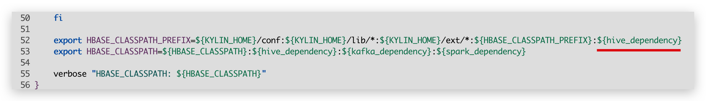
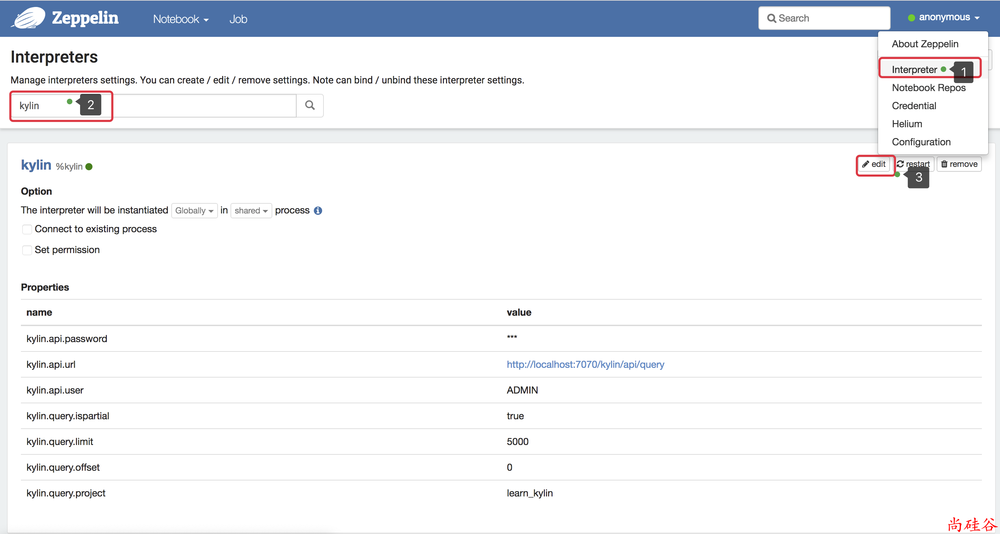
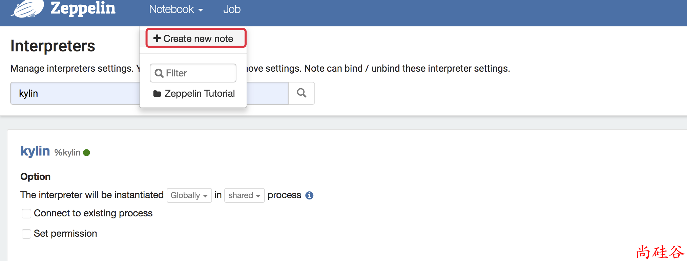
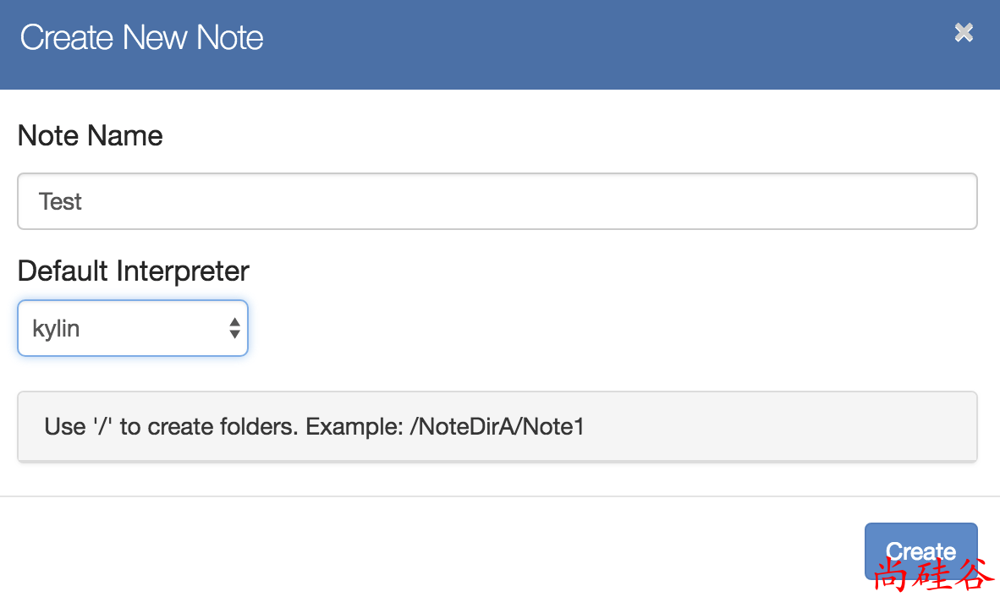
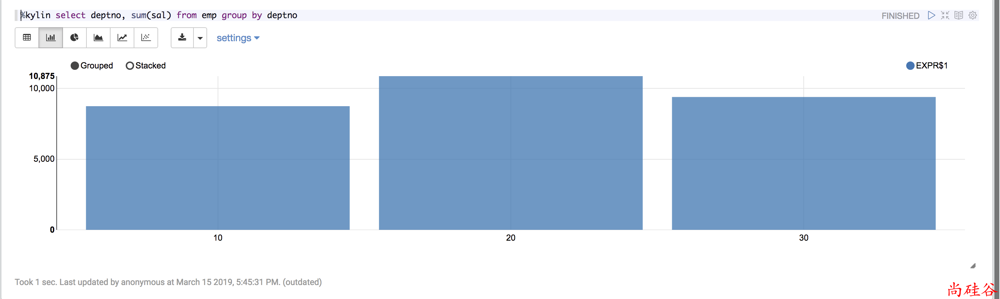

## Over View

>  Kylin的使命是超高速的大数据OLAP（Online Analytical Processing），也就是要让大数据分析像使用数据库一样简单迅速，用户的查询请求可 以在秒内返回(<u>***因为提前对数据进行了处理***</u>)，交互式数据分析将以前所未有的速度释放大数据里潜藏 的知识和信息


## Kylin特点

Kylin 的主要特点包括支持 SQL 接口、支持超大规模数据集、亚秒级响应、可伸缩性、高吞吐率、BI 工具集成等

- 可扩展超快 OLAP 引擎 Kylin是为减少在 Hadoop/Spark 上百亿规模数据查询延迟而设计

  > On-Line Analytical Processing，简称OLAP

- Hadoop ANSI SQL 接口 Kylin为Hadoop提供标准SQL支持大部分查询功能

- 交互式查询能力 通过 Kylin，用户可以与 Hadoop 数据进行亚秒级交互，在同样的数据集上提供比Hive 更好的性能

- 多维立方体（MOLAP Cube) 用户能够在 Kylin 里为百亿以上数据集定义数据模型并构建立方体

- 与 BI 工具无缝整合 Kylin 提供与 BI 工具的整合能力，如 Tableau，PowerBI/Excel，MSTR，QlikSense，Hue 和 SuperSet

  > BI: Business intelligence 商业智能


## Kylin工作原理

Apache Kylin 的工作原理本质上是 MOLAP（Multidimensional Online Analytical Processing）Cube，也就是多维立方体分析。

这是数据分析中相当经典的理论，在关系数据库年代就已经有了广泛的应用.

在说明 MOLAP Cube 之前需要先介绍一下维度`（Dimension）`和度量`(Measure）`这两个概念。

## Kylin 中的概念

### 维度和度量

#### 事实表(Fact Table)

#### 维度表(Dimension Table)

### Cube和Cuboid


每一种维度组合就是一个Cuboid，16个Cuboid整体就是一个Cube


## Kylin架构


预计算过程是Kylin从Hive中读取原始数据，按照我们选定的维度进行计算，并将结果集保存到Hbase中，默认的计算引擎为MapReduce，可以选择Spark作为计算引擎。

- REST Server
- Query Engine
- Routing
- Metadata
- Cube Build Engine


## Kylin核心算法

1）指定数据模型，定义维度和度量；

2）预计算Cube，计算所有Cuboid并保存为物化视图；

> kylin.cube.algorithm参数决定，参数值可选 auto(default)，layer 和 inmem

3）执行查询，读取Cuboid，运行，产生查询结果


### 逐层构建算法（layer）


### 快速构建算法（inmem）


## Kylin Install and conf

**dependence依赖**: JDK,Hadoop(HDFS,Yarn), Zookeeper, Hive, Hbase


```shell
> tar -zxvf apache-kylin-2.5.1-bin-hbase1x.tar.gz -C /opt/module/

# conf/keylin.properties 改成东八区, 否则会出现时间显示不准的问题
kylin.web.timezone=GMT+8

> bin/kylin.sh start
> bin/kylin.sh stop
```

<http://hadoop005:7070/kylin>

> 用户名为：ADMIN，密码为：KYLIN（系统已填）


## Hive数据准备

```sql
# 建表 dept
create external table if not exists default.dept(
    deptno int,
    dname string,
    loc int
)
row format delimited fields terminated by '\t';

# 建表 emp
create external table if not exists default.emp(
    empno int,
    ename string,
    job string,
    mgr int,
    hiredate string,
    sal double,
    comm double,
    deptno int)
row format delimited fields terminated by '\t';

# 分别向两张表导入数据
load data local inpath '/opt/module/datas/dept.txt' into table default.dept;
load data local inpath '/opt/module/datas/emp.txt' into table default.emp;
```

dept.txt

```
10	ACCOUNTING	1700
20	RESEARCH	1800
30	SALES	1900
40	OPERATIONS	1700
```

emp.txt

```
7369	SMITH	CLERK	7902	1980-12-17	800.00		20
7499	ALLEN	SALESMAN	7698	1981-2-20	1600.00	300.00	30
7521	WARD	SALESMAN	7698	1981-2-22	1250.00	500.00	30
7566	JONES	MANAGER	7839	1981-4-2	2975.00		20
7654	MARTIN	SALESMAN	7698	1981-9-28	1250.00	1400.00	30
7698	BLAKE	MANAGER	7839	1981-5-1	2850.00		30
7782	CLARK	MANAGER	7839	1981-6-9	2450.00		10
7788	SCOTT	ANALYST	7566	1987-4-19	3000.00		20
7839	KING	PRESIDENT		1981-11-17	5000.00		10
7844	TURNER	SALESMAN	7698	1981-9-8	1500.00	0.00	30
7876	ADAMS	CLERK	7788	1987-5-23	1100.00		20
7900	JAMES	CLERK	7698	1981-12-3	950.00		30
7902	FORD	ANALYST	7566	1981-12-3	3000.00		20
7934	MILLER	CLERK	7782	1982-1-23	1300.00		10
```


## Kylin Setup

1. Load Table:from hive
2. New Project
   1. **Project Config**: key-value
3. New Model
   1. Data Model:fact table
   2. Dimensions:纬度
   3. Measures:度量
4. New Cube
   1. Dimensions:纬度
   2. Measures:度量
   3. Refresh Setting
   4. Advanced Setting
   5. Configuration Overwrites


**Load Table Metadata: 推荐Database_name.table_name**


**Load Table Metadata可能碰到的问题**


打开`bin/kylin.sh` 文件, 在如下位置添加:`${hive_dependency}`




## 可视化

### JDBC

```xml
    <dependencies>
        <dependency>
            <groupId>org.apache.kylin</groupId>
            <artifactId>kylin-jdbc</artifactId>
            <version>2.5.1</version>
        </dependency>
    </dependencies>
```

```java
package com.ishibin;

import java.sql.Connection;
import java.sql.DriverManager;
import java.sql.PreparedStatement;
import java.sql.ResultSet;

/**
 * Created with IntelliJ IDEA.
 * Description:
 * User: Ben
 * Date: 2019-04-01
 * Time: 20:10
 */
public class HelloKylin {

	public static void main(String[] args) throws Exception {

		// load Driver
		String KYLIN_DRIVER = "org.apache.kylin.jdbc.Driver";

		// Kylin_URL
		String KYLIN_URL = "jdbc:kylin://hadoop005:7070/test_project";

		//Kylin的用户名
		String KYLIN_USER = "ADMIN";

		//Kylin的密码
		String KYLIN_PASSWD = "KYLIN";

		//添加驱动信息
		Class.forName(KYLIN_DRIVER);

		//获取连接
		Connection connection = DriverManager.getConnection(KYLIN_URL, KYLIN_USER, KYLIN_PASSWD);

		//预编译SQL
		PreparedStatement ps = connection.prepareStatement("SELECT sum(sal) FROM emp group by deptno");

		//执行查询
		ResultSet resultSet = ps.executeQuery();

		//遍历打印
		while (resultSet.next()) {
			System.out.println(resultSet.getInt(1));
		}
	}
}
```

Print

```
10875
8750
9400

Process finished with exit code 0
```


### Zeppelin 插件

Install Zeppelin

> 可视化工具. 用来从 Kylin 查数据

```shell
> tar -zxvf zeppelin-0.8.0-bin-all.tgz -C /opt/module/
> bin/zeppelin-daemon.sh start
> bin/zeppelin-daemon.sh stop
```

http://hadoop005:8080

#### conf Zeepelin




#### 使用 Zeppelin 查询







```sql
%kylin select deptno, sum(sal) from emp group by deptno
```




## Cube构建优化

从之前章节的介绍可以知道，在没有采取任何优化措施的情况下，Kylin会对每一种维度的组合进行预计算，每种维度的组合的预计算结果被称为Cuboid。假设有4个维度，我们最终会有24 =16个Cuboid需要计算。

但在现实情况中，用户的维度数量一般远远大于4个。假设用户有10 个维度，那么没有经过任何优化的Cube就会存在210 =1024个Cuboid；而如果用户有20个维度，那么Cube中总共会存在220 =1048576个Cuboid。虽然每个Cuboid的大小存在很大的差异，但是单单想到Cuboid的数量就足以让人想象到这样的Cube对构建引擎、存储引擎来说压力有多么巨大。因此，在构建维度数量较多的Cube时，尤其要注意Cube的剪枝优化（即减少Cuboid的生成）。

### 找到问题Cube

#### 检查Cuboid数量

#### 检查Cube大小


### 优化构建

#### 使用聚合组

#### 并发粒度优化