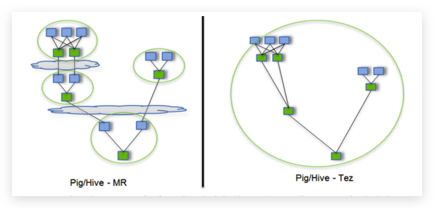

## Hive运行引擎Tez

> Tez是一个Hive的运行引擎，性能优于MR

<http://tez.apache.org>

https://cwiki.apache.org/confluence/display/Hive/LanguageManual+LZO



用Hive直接编写MR程序，假设有四个有依赖关系的MR作业，上图中，绿色是Reduce Task，云状表示写屏蔽，需要将中间结果持久化写到HDFS。

**Tez可以将多个有依赖的作业转换为一个作业，这样只需写一次HDFS，且中间节点较少，从而大大提升作业的计算性能。**


## Install and Conf

```
> tar -zxvf apache-tez-0.9.1-bin.tar.gz /opt/module
```

/opt/module/hive/conf/hive-env.sh

```shell
export HIVE_CONF_DIR=/opt/module/hive/conf

# Folder containing extra libraries required for hive compilation/execution can be controlled by:
export TEZ_HOME=/opt/module/tez-0.9.1    #是你的tez的解压目录
export TEZ_JARS=""
for jar in `ls $TEZ_HOME |grep jar`; do
    export TEZ_JARS=$TEZ_JARS:$TEZ_HOME/$jar
done
for jar in `ls $TEZ_HOME/lib`; do
    export TEZ_JARS=$TEZ_JARS:$TEZ_HOME/lib/$jar
done

export HIVE_AUX_JARS_PATH=/opt/module/hadoop-2.7.2/share/hadoop/common/hadoop-lzo-0.4.20.jar$TEZ_JARS
```

/opt/module/hive/conf/hive-site.xml

```xml
<property>
  <name>hive.execution.engine</name>
  <value>tez</value>
</property>
```

/opt/module/hive/conf/tez-site.xml

```xml
<?xml version="1.0" encoding="UTF-8"?>
<?xml-stylesheet type="text/xsl" href="configuration.xsl"?>
<configuration>
    <property>
        <name>tez.lib.uris</name>
        <value>${fs.defaultFS}/tez/tez-0.9.1,${fs.defaultFS}/tez/tez-0.9.1/lib</value>
    </property>
    <property>
        <name>tez.lib.uris.classpath</name>
        <value>${fs.defaultFS}/tez/tez-0.9.1,${fs.defaultFS}/tez/tez-0.9.1/lib</value>
    </property>
    <property>
        <name>tez.use.cluster.hadoop-libs</name>
        <value>true</value>
    </property>
    <property>
        <name>tez.history.logging.service.class</name>
        <value>org.apache.tez.dag.history.logging.ats.ATSHistoryLoggingService</value>
    </property>
</configuration>
```

上传Tez到集群

```shell
> hadoop fs -mkdir /tez
> hadoop fs -put /opt/module/tez-0.9.1/ /tez
> hadoop fs -ls /tez 
```

# 建表

```sql
hive (gmall)> 
drop table if exists ods_start_log;
CREATE EXTERNAL TABLE ods_start_log (`line` string)
PARTITIONED BY (`dt` string)
STORED AS
  INPUTFORMAT 'com.hadoop.mapred.DeprecatedLzoTextInputFormat'
  OUTPUTFORMAT 'org.apache.hadoop.hive.ql.io.HiveIgnoreKeyTextOutputFormat'
LOCATION '/warehouse/gmall/ods/ods_start_log';
```

```sql
hive (gmall)> load data inpath '/origin_data/gmall/log/topic_start/2019-02-10' into table gmall.ods_start_log partition(dt='2019-02-10');

hive (gmall)> select * from ods_start_log limit 2;
```


## Tez 遇到的问题

**运行Tez时检查到用过多内存而被NodeManager杀死进程问题**

> Caused by: org.apache.tez.dag.api.SessionNotRunning: TezSession has already shutdown. Application application_1546781144082_0005 failed 2 times due to AM Container for appattempt_1546781144082_0005_000002 exited with  exitCode: -103
>
> For more detailed output, check application tracking page:http://hadoop103:8088/cluster/app/application_1546781144082_0005Then, click on links to logs of each attempt.
>
> Diagnostics: Container [pid=11116,containerID=container_1546781144082_0005_02_000001] is running beyond virtual memory limits. Current usage: 216.3 MB of 1 GB physical memory used; 2.6 GB of 2.1 GB virtual memory used. Killing container.

这种问题是从机上运行的Container试图使用过多的内存，而被NodeManager kill掉了。

> [摘录] The NodeManager is killing your container. It sounds like you are trying to use hadoop streaming which is running as a child process of the map-reduce task. The NodeManager monitors the entire process tree of the task and if it eats up more memory than the maximum set in mapreduce.map.memory.mb or mapreduce.reduce.memory.mb respectively, we would expect the Nodemanager to kill the task, otherwise your task is stealing memory belonging to other containers, which you don't want.

**解决方法：**

方案一：或者是关掉虚拟内存检查。我们选这个，修改yarn-site.xml

```xml
<property>
		<name>yarn.nodemanager.vmem-check-enabled</name>
		<value>false</value>
</property>
```

方案二：mapred-site.xml中设置Map和Reduce任务的内存配置如下：(value中实际配置的内存需要根据自己机器内存大小及应用情况进行修改)

```xml
<property>
    <name>mapreduce.map.memory.mb</name>
    <value>1536</value>
</property>
<property>
    <name>mapreduce.map.java.opts</name>
    <value>-Xmx1024M</value>
</property>
<property>
    <name>mapreduce.reduce.memory.mb</name>
    <value>3072</value>
</property>
<property>
    <name>mapreduce.reduce.java.opts</name>
    <value>-Xmx2560M</value>
</property>
```

