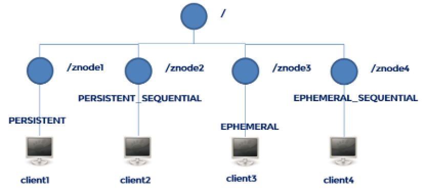

## Zookeeper概论

> 分布式框架,为分布式提供协调服务的 Apache 项目,基于观察者模式设计**

文件系统 + 通知机制

### 特点

- 一致性：zookeeper中的数据按照顺序分批入库，且最终一致！
- 原子性：一次数据更新要么成功，要么失败。
- 单一视图：client无论连接到哪个ZK节点，数据都是一致的。
- 可靠性：每次对zk的操作状态都会保存到服务端，每个server保存一份相同的数据副本。
- 更新请求顺序进行，来自同一个client的更新请求按其发送顺序依次执行。
- 实时性，在一定时间范围内，client能读到最新数据

### 数据结构

> 类似 unix 文件系统

### 应用场景

1. 消息发布/订阅
2. 负载均衡
3. 集群管理


## Zookeeper安装

```shell
安装 java
配置 export ZOOKEEPER_HOME=balabala
配置 export PATH=PATH:ZOOKEEPER_HOME/bin
```

#### Tar目录:

* bin： 存放常用的可执行文件，例如启动服务端和客户端。
* conf : 存放zookeeper的配置文件。
* contrib: 其他的工具。
* dis-maven: 使用maven编译后产生的目录。
* lib：使用客户端开发，可能使用到的jar包。
* recipes：官方提供的案例demo代码。
* src： 源码目录。


## Zookeeper单点模式

### Server启动

```shell
zkServer.sh {start|start-foreground|stop|restart|status|upgrade|print-cmd}
```

默认加载$ZOOKEEPER_HOME/conf/zoo.cfg

### Client 启动

```shell
zkCli.sh –server hostname:port
```

默认连接localhost:2181

### zoo.cfg文件

* tickTime : The number of milliseconds of each tick
* initLimit : The number of ticks that the initial synchronization phase can take
* syncLimit : The number of ticks that can pass between sending a request and getting an acknowledgement
* dataDir : the directory where the snapshot is stored
* clientPort : port

### Zookeeper四字命令

通过 telnet 或 nc 向 ZooKeeper 提交相应的命令:

```shell
echo conf | nc localhost 2181
```


| ruok | 测试服务是否处于正确状态。如果确实如此，那么服务返回"imok"，否则不做任何相应。 |
| ---- | ------------------------------------------------------------ |
| conf | 3.3.0版本引入的。打印出服务相关配置的详细信息。              |
| cons | 列出所有连接到这台服务器的客户端全部连接/会话详细信息。包括"接受/发送"的包数量、会话id、操作延迟、最后的操作执行等等信息。 |
| crst | 重置所有连接的连接和会话统计信息                             |
| dump | 列出那些比较重要的会话和临时节点。这个命令只能在leader节点上有用。 |
| envi | 打印出服务环境的详细信息                                     |
| reqs | 列出未经处理的请求                                           |
| stat | 输出关于性能和连接的客户端的列表                             |
| srst | 重置服务器的统计                                             |
| srvr | 列出连接服务器的详细信息                                     |
| wchs | 列出服务器watch的详细信息                                    |
| wchc | 通过session列出服务器watch的详细信息，它的输出是一个与watch相关的会话的列表 |
| wchp | 通过路径列出服务器watch的详细信息。它输出一个与session相关的路径 |
| mntr | 输出可用于检测集群健康状态的变量列表                         |


## Zookeeper常用命令

### 常见命令

```shell
ZooKeeper -server host:port cmd args
        stat path [watch]
        set path data [version]
        ls path [watch]
        delquota [-n|-b] path
        ls2 path [watch] 查看当前节点数据及状态信息，相当于ls+stat
        setAcl path acl
        setquota -n|-b val path
        history
        redo cmdno
        printwatches on|off
        delete path [version]
        sync path
        listquota path
        rmr path 递归删除节点
        get path [watch]
        create [-s] [-e] path data acl 
        	-s 创建一个带sequnence（递增序号）的目录
        	-e  临时（session关闭后消失）
        addauth scheme auth
        quit
        getAcl path
        close
        connect host:port
```

### Stat状态说明

| czxid-         | 节点创建的事务zxid。每次修改ZooKeeper状态都会收到一个zxid形式的时间戳，也就是ZooKeeper事务ID。事务ID是ZooKeeper中所有修改总的次序。每个修改都有唯一的zxid，如果zxid1小于zxid2，那么zxid1在zxid2之前发生。 |
| :------------- | ------------------------------------------------------------ |
| ctime          | znode被创建的毫秒数(从1970年开始)                            |
| mzxid          | znode最后修改的zxid                                          |
| mtime          | znode最后修改的毫秒数(从1970年开始)                          |
| pZxid          | znode最后更新的子节点zxid                                    |
| cversion       | znode子节点变化号，每变化一次就自增1                         |
| dataversion    | znode数据变化号，数据每变化一次就自增1                       |
| aclVersion     | znode访问控制列表的变化号                                    |
| ephemeralOwner | 如果是临时节点，这个是znode拥有者的session id。如果不是临时节点则是0 |
| dataLength     | znode的数据长度                                              |
| numChildren    | znode子节点数量                                              |

### 节点类型

**ZNode两种类型**

* Ephemeral:客户端与服务端断开后,会删除数据
* Persistent:客户端与服务端断开后,不会删除数据'

**Znode有四种形式的目录节点（默认是persistent ）**

- 持久化目录节点（PERSISTENT）客户端与zookeeper断开连接后，该节点依旧存在
- 持久化顺序编号目录节点（PERSISTENT_SEQUENTIAL）客户端与zookeeper断开连接后，该节点依旧存在，只是Zookeeper给该节点名称进行顺序编号
- 临时目录节点（EPHEMERAL）客户端与zookeeper断开连接后，该节点被删除
- 临时顺序编号目录节点（EPHEMERAL_SEQUENTIAL）客户端与zookeeper断开连接后，该节点被删除，只是Zookeeper给该节点名称进行顺序编号



创建znode时设置顺序标识，znode名称后会附加一个值，顺序号是一个单调递增的计数器，由父节点维护

在分布式系统中，顺序号可以被用于为所有的事件进行全局排序，这样客户端可以通过顺序号推断事件的顺序


## Zookeeper集群模式

### 集群的特点

1）Zookeeper：一个领导者（leader），多个跟随者（follower）组成的集群。

2）Leader负责进行投票的发起和决议，更新系统状态

3）Follower用于接收客户请求并向客户端返回结果，在选举Leader过程中参与投票

4）集群中只要有半数以上节点存活，Zookeeper集群就能正常服务。

5）Zookeeper的集群可以主从复制，但是没用读写分离。

6）Follower在掉线后，重新上线可以同步数据。

### 集群的搭建

**0）集群规划**

在hadoop102、hadoop103和hadoop104三个节点上部署Zookeeper。

**1）解压安装**

（1）解压zookeeper安装包到/opt/module/目录下

```shell
tar -zxvf zookeeper-3.4.10.tar.gz -C /opt/module/
```

（2）在/opt/module/zookeeper-3.4.10/这个目录下创建zkData

```
mkdir -p zkData
```

（3）重命名/opt/module/zookeeper-3.4.10/conf这个目录下的zoo_sample.cfg为zoo.cfg

```shell
mv zoo_sample.cfg zoo.cfg
```

**2）配置zoo.cfg文件**

​	（1）具体配置

```shell
dataDir=/opt/module/zookeeper-3.4.10/zkData
```

​	增加如下配置

```shell
###### #################cluster##########################
server.2=hadoop102:2888:3888
server.3=hadoop103:2888:3888
server.4=hadoop104:2888:3888
```

​	（2）配置参数解读

```shell
Server.A=B:C:D
```

- A是一个数字，表示这个是第几号服务器；
- B是这个服务器的ip地址；
- C是这个服务器与集群中的Leader服务器交换信息的端口；
- D是万一集群中的Leader服务器挂了，需要一个端口来重新进行选举，选出一个新的Leader，而这个端口就是用来执行选举时服务器相互通信的端口。

集群模式下在dataDir目录下配置一个文件**myid**，这个文件里面有一个数据就是A的值，Zookeeper启动时读取此文件，拿到里面的数据与zoo.cfg里面的配置信息比较从而判断到底是哪个server。

**3）集群操作**

（1）在/opt/module/zookeeper-3.4.10/zkData目录下创建一个myid的文件

```shell
touch myid
```

添加myid文件，注意一定要在linux里面创建，在notepad++里面很可能乱码

（2）编辑myid文件

```shell
vi myid
```

​	在文件中添加与server对应的编号：如2

（3）拷贝配置好的zookeeper到其他机器上

```shell
scp -r zookeeper-3.4.10/ root@hadoop103.atguigu.com:/opt/app/
scp -r zookeeper-3.4.10/ root@hadoop104.atguigu.com:/opt/app/
```

​	并分别修改myid文件中内容为3、4

（4）分别启动zookeeper

```shell
bin/zkServer.sh start
```

（5）查看状态

```shell
bin/zkServer.sh status
```

zk.sh

```shell
#!/bin/bash

case $1 in
"start") {
    for i in hadoop102 hadoop103 hadoop104; do
        ssh $i "/opt/module/zookeeper-3.4.10/bin/zkServer.sh start"
    done
} ;;
"stop") {
    for i in hadoop102 hadoop103 hadoop104; do
        ssh $i "/opt/module/zookeeper-3.4.10/bin/zkServer.sh stop"
    done
} ;;
"status") {
    for i in hadoop102 hadoop103 hadoop104; do
        ssh $i "/opt/module/zookeeper-3.4.10/bin/zkServer.sh status"
    done
} ;;
esac
```


#### 选举机制

1）**半数机制**（Paxos 协议）：集群中半数以上机器存活，集群可用。所以zookeeper适合装在奇数台机器上。

2）Zookeeper虽然在配置文件中并没有指定master和slave。但是，zookeeper工作时，是有一个节点为leader，其他则为follower，Leader是通过内部的选举机制临时产生的

3）以一个简单的例子来说明整个选举的过程。

假设有五台服务器组成的zookeeper集群，它们的id从1-5，同时它们都是最新启动的，也就是没有历史数据，在存放数据量这一点上，都是一样的。假设这些服务器依序启动，来看看会发生什么。


（1）服务器1启动，此时只有它一台服务器启动了，它发出去的报没有任何响应，所以它的选举状态一直是LOOKING状态。

（2）服务器2启动，它与最开始启动的服务器1进行通信，互相交换自己的选举结果，由于两者都没有历史数据，所以id值较大的服务器2胜出，但是由于没有达到超过半数以上的服务器都同意选举它(这个例子中的半数以上是3)，所以服务器1、2还是继续保持LOOKING状态。

（3）服务器3启动，根据前面的理论分析，服务器3成为服务器1、2、3中的老大，而与上面不同的是，此时有三台服务器选举了它，所以它成为了这次选举的leader。

（4）服务器4启动，根据前面的分析，理论上服务器4应该是服务器1、2、3、4中最大的，但是由于前面已经有半数以上的服务器选举了服务器3，所以它只能接收当小弟的命了。

（5）服务器5启动，同4一样当小弟。

#### 写数据流程


1）比如 Client 向 ZooKeeper 的 Server1 上写数据，发送一个写请求。

2）如果Server1不是Leader，那么Server1 会把接受到的请求进一步转发给Leader，因为每个ZooKeeper的Server里面有一个是Leader。这个Leader 会将写请求广播给各个Server，比如Server1和Server2， 各个Server写成功后就会通知Leader。

3）当Leader收到大多数 Server 数据写成功了，那么就说明数据写成功了。如果这里三个节点的话，只要有两个节点数据写成功了，那么就认为数据写成功了。写成功之后，Leader会告诉Server1数据写成功了。

4）Server1会进一步通知 Client 数据写成功了，这时就认为整个写操作成功。ZooKeeper 整个写数据流程就是这样的。


## Java Client

#### 环境

- zookeeper-3.4.10.jar、
- jline-0.9.94.jar、
- log4j-1.2.16.jar、
- netty-3.10.5.Final.jar、
- slf4j-api-1.6.1.jar、
- slf4j-log4j12-1.6.1.jar

Log4j.properties

```properties
log4j.rootLogger=INFO, stdout  
log4j.appender.stdout=org.apache.log4j.ConsoleAppender  
log4j.appender.stdout.layout=org.apache.log4j.PatternLayout  
log4j.appender.stdout.layout.ConversionPattern=%d %p [%c] - %m%n  
log4j.appender.logfile=org.apache.log4j.FileAppender  
log4j.appender.logfile.File=target/spring.log  
log4j.appender.logfile.layout=org.apache.log4j.PatternLayout  
log4j.appender.logfile.layout.ConversionPattern=%d %p [%c] - %m%n  
```


#### 创建 Client

```java
	private static String connectString = "hadoop102:2181,hadoop103:2181,hadoop104:2181";
	private static int sessionTimeout = 2000;
	private ZooKeeper zkClient = null;

	@Before
	public void init() throws Exception {

	zkClient = new ZooKeeper(connectString, sessionTimeout, new Watcher() {
			@Override
			public void process(WatchedEvent event) {
				// 收到事件通知后的回调函数（用户的业务逻辑）
				System.out.println(event.getType() + "--" + event.getPath());

				// 再次启动监听
				try {
					zkClient.getChildren("/", true);
				} catch (Exception e) {
					e.printStackTrace();
				}
			}
		});
	}
```


#### 创建子节点

```java
	// 创建子节点
	@Test
	public void create() throws Exception {
		// 数据的增删改查
		// 参数1：要创建的节点的路径； 参数2：节点数据 ； 参数3：节点权限 ；参数4：节点的类型
		String nodeCreated = zkClient.create("/eclipse", "hello zk".getBytes(), Ids.OPEN_ACL_UNSAFE,CreateMode.PERSISTENT);
	}
```


#### 获取子节点并监听

```java
// 获取子节点
	@Test
	public void getChildren() throws Exception {
		List<String> children = zkClient.getChildren("/", true);

		for (String child : children) {
			System.out.println(child);
		}

		// 延时阻塞
		Thread.sleep(Long.MAX_VALUE);
	}
```


#### 判断 ZNode 是否存在

```java
	// 判断znode是否存在
	@Test
	public void exist() throws Exception {
		Stat stat = zkClient.exists("/eclipse", false);

		System.out.println(stat == null ? "not exist" : "exist");
	}
```


## 监听服务器节点动态上下线案例


#### 现在集群上创建/servers节点

```shell
create /servers "servers"	
```

### Server

```java
package com.atguigu.zkcase;
import java.io.IOException;
import org.apache.zookeeper.CreateMode;
import org.apache.zookeeper.WatchedEvent;
import org.apache.zookeeper.Watcher;
import org.apache.zookeeper.ZooKeeper;
import org.apache.zookeeper.ZooDefs.Ids;

public class DistributeServer {
	private static String connectString = "hadoop102:2181,hadoop103:2181,hadoop104:2181";
	private static int sessionTimeout = 2000;
	private ZooKeeper zk = null;
	private String parentNode = "/servers";
	
	// 创建到zk的客户端连接
	public void getConnect() throws IOException{
		
		zk = new ZooKeeper(connectString, sessionTimeout, new Watcher() {

			@Override
			public void process(WatchedEvent event) {

			}
		});
	}
	
	// 注册服务器
	public void registServer(String hostname) throws Exception{
		String create = zk.create(parentNode + "/server", hostname.getBytes(), Ids.OPEN_ACL_UNSAFE, CreateMode.EPHEMERAL_SEQUENTIAL);
		
		System.out.println(hostname +" is noline "+ create);
	}
	
	// 业务功能
	public void business(String hostname) throws Exception{
		System.out.println(hostname+" is working ...");
		
		Thread.sleep(Long.MAX_VALUE);
	}
	
	public static void main(String[] args) throws Exception {
		// 获取zk连接
		DistributeServer server = new DistributeServer();
		server.getConnect();
		
		// 利用zk连接注册服务器信息
		server.registServer(args[0]);
		
		// 启动业务功能
		server.business(args[0]);
	}
}
```

### Client

```java
package com.atguigu.zkcase;
import java.io.IOException;
import java.util.ArrayList;
import java.util.List;
import org.apache.zookeeper.WatchedEvent;
import org.apache.zookeeper.Watcher;
import org.apache.zookeeper.ZooKeeper;

public class DistributeClient {
	private static String connectString = "hadoop102:2181,hadoop103:2181,hadoop104:2181";
	private static int sessionTimeout = 2000;
	private ZooKeeper zk = null;
	private String parentNode = "/servers";
	private volatile ArrayList<String> serversList = new ArrayList<>();

	// 创建到zk的客户端连接
	public void getConnect() throws IOException {
		zk = new ZooKeeper(connectString, sessionTimeout, new Watcher() {
			@Override
			public void process(WatchedEvent event) {

				// 再次启动监听
				try {
					getServerList();
				} catch (Exception e) {
					e.printStackTrace();
				}
			}
		});
	}

	//
	public void getServerList() throws Exception {
		
		// 获取服务器子节点信息，并且对父节点进行监听
		List<String> children = zk.getChildren(parentNode, true);
		ArrayList<String> servers = new ArrayList<>();
		
		for (String child : children) {
			byte[] data = zk.getData(parentNode + "/" + child, false, null);

			servers.add(new String(data));
		}

		// 把servers赋值给成员serverList，已提供给各业务线程使用
		serversList = servers;

		System.out.println(serversList);
	}

	// 业务功能
	public void business() throws Exception {
		System.out.println("client is working ...");
		Thread.sleep(Long.MAX_VALUE);
	}

	public static void main(String[] args) throws Exception {

		// 获取zk连接
		DistributeClient client = new DistributeClient();
		client.getConnect();

		// 获取servers的子节点信息，从中获取服务器信息列表
		client.getServerList();

		// 业务进程启动
		client.business();
	}
}
```


