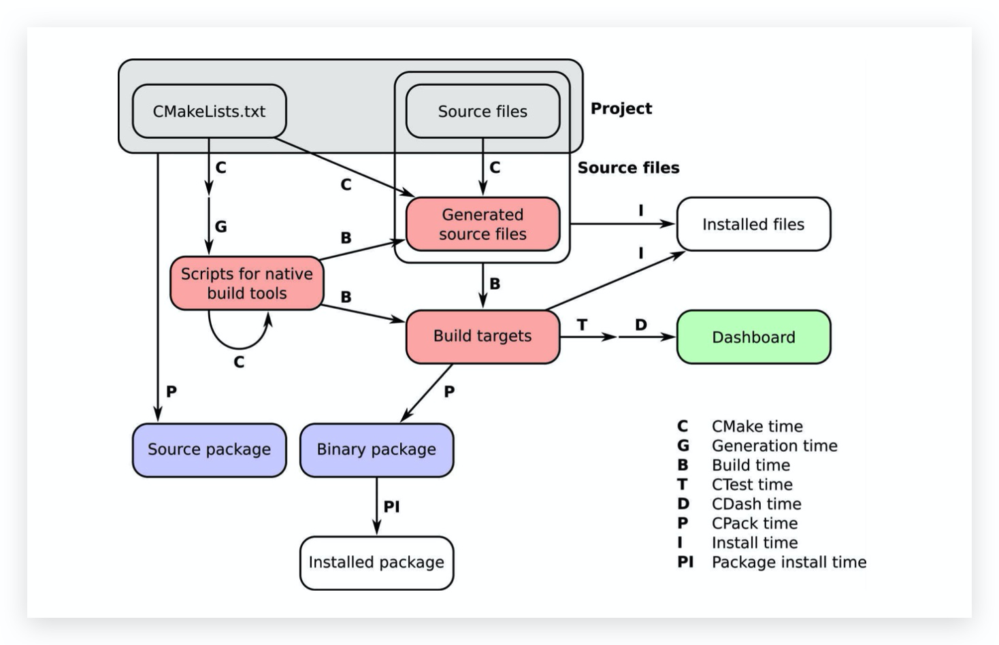
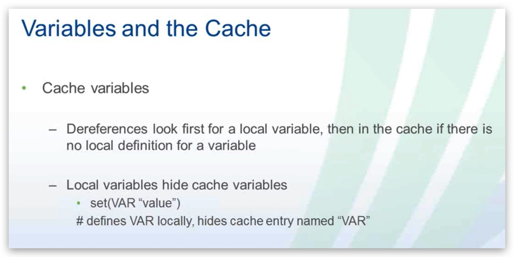
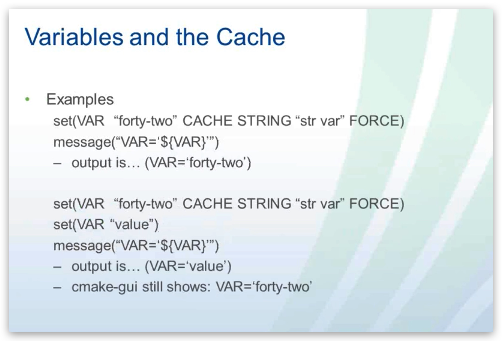

## Overview

> CMake is a _build-system generator_ , offering a powerful domain-specific language (DSL) to describe what the build system should achieve

## Componnet

-   **CMake** lets you describe how your project, whether building an executable, libraries, or both, has to be configured, built, and installed on all major hardware and operating systems用来描述你的项目,不管是生成可执行程序还是库,或者两者,是如何configured,built,和install在所有主要的硬件和操作系统上
-   **CTest** allows you to define tests, test suites, and set how they should be executed.允许你去定义测试,测试套件,和设置他们是如何去执行
-   **CPack** offers a DSL for all your packaging needs, whether your project should be bundled and distributed in source code or platform-native binary form.
-   **CDash** will be useful for reporting the results of tests for your project to an online dashboard把项目test的返回值report到an online dashboard上: 监控测试结果

### Topics

-   Configure, build, test, and install code projects using CMake
-   Detect operating systems, processors, libraries, files, and programs for conditional compilation
-   Increase the portability of your code
-   Refactor a large code base into modules with the help of CMake Build multi-language projects
-   Know where and how to tweak CMake configuration files written by somebody else
-   Package projects for distribution
-   Port projects to CMake

## Workflow



-   **CMake time** or **configure time**:当 cmake 运行时,cmake 会去处理项目中的 CMakeLists.txt,配置这个项目
-   **Generation time**. 在配置成功后,CMake 会在项目中生成**本地构建工具**需要的脚本,用来执行后序的步骤
-   **Build time**. 当本地构建工具被 cmake 调用,本地工具构建生成的脚本,This is when the native build tools are invoked on the platform- and tool-native build scripts previously generated by CMake.
-   编译器会被调用,targets 会被生成到指定的目录
-   Note the recursive CMake-time arrow: this can seem baffling, but it is a mechanism we will use many times throughout the book to achieve a truly platform-independent build.
-   **CTest time** or **test time**. 在运行项目的 test 运行套件时
-   **CDash time** or **report time**. 当项目测试的返回仩被上传到控制面板,去分享给其他开发者人
-   **Install time**. 当项目的生成的 targets,资源文件,可执行文件,库从构建目录被安装到安装目录下
-   **CPack time** or **packaging time**. 打包成源代码或是二进制文件, 分发项目,
-   **Package install time**. 当新生成的包被安装到系统内

### HelloWorld

CMakeLists.txt 文件名必需相同

```cmake
# set minimum cmake version
cmake_minimum_required(VERSION 3.10.0 FATAL_ERROR)
project(hello-world VERSION 0.1 LANGUAGES CXX)
add_executable(helloworld hello-world.cpp)
```

-   命令大小写不敏感
-   参数大小写敏感

```shell
cmake --help
mkdir build
cmake -S. -Bbuild # 配置,指定source code的目录,指定build生成的目录
cmake --build build # 生成target,指定build生成的目录
cmake --build . --target help # target list

cmake -G Ninja ..
```

build 目录

-   Makefile:make 的构建语句和构建规则(不同编译系统不一样)
-   CMakeFiles: CMake 在配置过程中生成的临时文件
-   cmake_install.cmake: CMake 脚本:用于处理程序安装时的规则
-   CMakeCache.txt: CMake 缓存文件

target

-   all: default 默认 target
-   clean: 清理 build 生成的文件
-   depend: 调用 cmake 生成依赖
-   rebuild_cache: 重新生成缓存文件
-   edit_cache: this target will let you edit cache entries directly.
-   test: will run the test suite with the help of CTest. We will discuss testing and CTest extensively in Chap ter 4,_CreatingandRunningTests_.
-   install: will execute the installation rules for the project. 
-   package: this target will invoke CPack to generate a redistributable package for the project.

## Command 指令

add_library

-   STATIC : create static libraries,
-   SHARED : create shared libraries, shared object
-   OBJECT : 从源代码编译出 object 文件,但是,这个文件既不能归档到静态库,也不能链接到动态库; 当需要一次创建动态库和静态库时使用
-   MODULE : 另一种动态库(共享库),和动态库相比,不能被链接到任何的 target, 但他可能会在之后被动态的加载, 作为参数在构建一个运行插件时使用
-   IMPORTED,这种类型的库位于项目之外,主要用途是对上游软件包提供的项目的现有依赖关系进行建模
-   INTERFACE: 和 IMPORTED 类似,但是是可变的,也没有 location,Its main use case is to model usage requirements for a target that is outside our project.
-   ALIAS: 用于定义一个库的别名,但不能用于 IMPORTED 的库 target

set_target_properties

set

list(APPEND \_sources Message.hpp Message.cpp)

option(<variable> "<help_text>" [value])

## Variables 变量

-   USE_LIBRARY
-   BUILD_SHARED_LIBS: 全局变量, 如果 add_library 没有指定第二个参数,就会来找这个变量,
-

## Module 模块

> CMake has mechanisms in place to extend its syntax and capabilities through the inclusion of _modules_, either shipped with CMake itself or custom ones, CMake 有一种能在合适的地方通过引入模块,要么使用他自己的, 就是去自定义一个,去拓展他自己的语法和能力

### CMakeDependentOption

```cmake
cmake --help-module-list #查看所有的module列表


include(CMakeDependentOption)

# second option depends on the value of the first
cmake_dependent_option(
  MAKE_STATIC_LIBRARY "Compile sources into a static library" ON
  "USE_LIBRARY" OFF
  )

# third option depends on the value of the first
cmake_dependent_option(
  MAKE_SHARED_LIBRARY "Compile sources into a shared library" ON
  "USE_LIBRARY" ON
  )
```

## 指定编译器

两种方式修改编译器:

-   设置`CMAKE_<LANG>_COMPILER`变量:LANG(CXX, C, or Fortran)
-   命令行传参数:
    -   CMake 传参数`cmake -D CMAKE_CXX_COMPILER=clang++ ..` 👍
    -   导出变量:👎🏿
        -   指定 C++编译器:`env CXX=clang++ cmake ..`
        -   指定 C 编译器:`env CC=clang cmake ..`

> **Explicit is better than implicit**

> At configure time, CMake performs a series of platform tests to determine which compilers are available, 取决于平台和编译器
>
> * The first test CMake performs is based on the name of the compiler for the project language


### 7.Switching build type

变量CMAKE_BUILD_TYPE

* Debug: 这个版本没有优化target目标,会带一些debug symbol
* Release: 相反, 会构建优化target目标,不会带debug symbol
* RelWithDebInfo: 带有少量的优化和debug symbol的target目标
* MinSizeRel:最小化构建target目标

```cmake
cmake -D CMAKE_BUILD_TYPE=Release ..

cmake_minimum_required(VERSION 3.10.0 FATAL_ERROR)

project(demo LANGUAGES CXX)

message(STATUS "build type : ${CMAKE_BUILD_TYPE}")
if(NOT CMAKE_BUILD_TYPE)
  set(CMAKE_BUILD_TYPE Release CACHE STRING "build type " FORCE)
endif(NOT CMAKE_BUILD_TYPE)

message(STATUS "build type : ${CMAKE_BUILD_TYPE}")

message(STATUS "C flags, Debug configuration: ${CMAKE_C_FLAGS_DEBUG}")
message(STATUS "C flags, Release configuration: ${CMAKE_C_FLAGS_RELEASE}")
message(STATUS "C flags, Release configuration with Debug info: ${CMAKE_C_FLAGS_RELWITHDEBINFO}")
message(STATUS "C flags, minimal Release configuration: ${CMAKE_C_FLAGS_MINSIZEREL}")

message(STATUS "C++ flags, Debug configuration: ${CMAKE_CXX_FLAGS_DEBUG}")
message(STATUS "C++ flags, Release configuration: ${CMAKE_CXX_FLAGS_RELEASE}")
message(STATUS "C++ flags, Release configuration with Debug info: ${CMAKE_CXX_FLAGS_RELWITHDEBINFO}")
message(STATUS "C++ flags, minimal Release configuration: ${CMAKE_CXX_FLAGS_MINSIZEREL}")
```


### 8.controlling complier flags
两种方式
* target_compile_options命令: 为每一个target指定flags,不会重写CMake默认的
* Cli参数:`CMAKE_<LANG>_FLAGS_<CONFIG>`全局的变量,会在所有的target都生效

#### target_compile_options

* PRIVATE: compile options will only be applied to the given target and not to other targets consuming it.
* PUBLIC: compile options will be applied to the given target and all other targets consuming it.
* INTERFACE: compile options on a given target will only be applied to targets consuming it.

```shell
cmake --build . -- VERBOSE=1
```

### 9.Setting the standard for the language

```cmake
add_library(animals
  SHARED
    Animal.cpp
    Animal.hpp
    Cat.cpp
    Cat.hpp
    Dog.cpp
    Dog.hpp
    Factory.hpp
)

set_target_properties(animals PROPERTIES
	CXX_STANDARD 14 
	CXX_EXTENSIONS OFF 
	CXX_STANDARD_REQUIRED ON 
	POSITION_INDEPENDENT_CODE 1
)
```

* CXX_STANDARD 设置使用标准的版本.
* CXX_EXTENSIONS 告诉CMake仅仅使用编译器ISO C++标准的flags,不使用特定编译器的拓展的flags
* CXX_STANDARD_REQUIRED 指定需要的标准版本 如果这个版本不可用, CMake会停止配置,并报错, 当设置成OFF,CMake会去找下一个最后的标准版本,走到正确的flags被设置, This means to first look for C++14, then C++11, then C++98. 

target_compile_features

> CMake offers an even finer level of control over the language standard by introducing the concept of *compile features*. These are features introduced by the language standard, such as variadic templates and lambdas in C++11, and automatic return type deduction in C++14. You can ask for certain features to be available for specific targets with the target_compile_features() command and CMake will automatically set the correct compiler flag for the standard. It is also possible to have CMake generate compatibility headers for optional compiler features. 


set_source_files_properties 
```cmake
set_source_files_properties([file1 [file2 [...]]]
                            PROPERTIES prop1 value1
                            [prop2 value2 [...]])
```
给source file设置properties参数
https://cmake.org/cmake/help/v3.5/manual/cmake-properties.7.html#properties-on-source-files


get_source_file_property 
```cmake
get_source_file_property(VAR file property)
```
把file的property属性值存放在var变量中
如果没找到, 这依赖于


https://vimeo.com/32212195

### Comments 注释

```cmake
# a single line comment

#[==[
    multi lines comments
    multi lines comments
    multi lines comments

    #[==[
        nested
        nested
    #]==]
#]==]
```

### Flow Control 流程控制

#### if statement

```cmake
 if(<condition>)
   <commands>
 elseif(<condition>) # optional block, can be repeated
   <commands>
 else()              # optional block
   <commands>
 endif()
```

```cmake
set(var 9)

if(${var} LESS 10)
    message(STATUS "${var} less than 10")
endif(${var} LESS 10)

# 这个var会自动去匹配:看有没有名为var这个变量,如果有就用var的值来替换,如果没有就"var"这个字符串
# 不建议这种用法
if(var LESS 10)
    message(STATUS "${var} less than 10")
endif(var LESS 10)

set(var 50)
if(${var} LESS 10)
    message(STATUS "${var} less than 10")
elseif(${var} LESS 100)
    message(STATUS "${var} between 10 and 100")
endif(${var} LESS 10)
```

##### Condition

-   unary tests such as `EXISTS`, `COMMAND`, and `DEFINED`.

-   Then binary tests such as`EQUAL`, `LESS`, `LESS_EQUAL`, `GREATER`, `GREATER_EQUAL`,`STREQUAL`, `STRLESS`, `STRLESS_EQUAL`, `STRGREATER`,`STRGREATER_EQUAL`, `VERSION_EQUAL`, `VERSION_LESS`,`VERSION_LESS_EQUAL`, `VERSION_GREATER`, `VERSION_GREATER_EQUAL`,and `MATCHES`.

-   Then the boolean operators in the order `NOT`, `AND`, and finally `OR`.

##### True / False

-   True if the constant is `1`, `ON`, `YES`, `TRUE`, `Y`,or a non-zero number

-   False if the constant is `0`, `OFF`, `NO`, `FALSE`, `N`, `IGNORE`, `NOTFOUND`, the empty string, or ends in the suffix `-NOTFOUND`

> here is no automatic evaluation for environment or cache :ref:`Variable References`. Their values must be referenced as `$ENV{<name>}` or `$CACHE{<name>}` wherever the above-documented condition syntax accepts `<variable|string>`.

#### Foreach/while statement

```cmake
 foreach(<loop_var> <items>)
   <commands>
 endforeach()

 foreach(<loop_var> RANGE <stop>)
 foreach(<loop_var> RANGE <start> <stop> [<step>])
 foreach(loop_var IN [LISTS [<lists>]] [ITEMS [<items>]])

 break()
 continue()
```

```cmake
 set(A 0;1)
 set(B 2 3)
 set(C "4 5")
 set(D 6;7 8)
 set(E "")
 foreach(X IN LISTS A B C D E)
     message(STATUS "X=${X}")
 endforeach()
```

### Message

```cmake

```

### Macro

Start recording a macro for later invocation as a command

```cmake
 macro(<name> [<arg1> ...])
   <commands>
 endmacro()
```

```cmake
macro(foo)
   <commands>
endmacro()

# can be invoked through any of, case-insensitive大小写不敏感

foo()
Foo()
FOO()

macro(foo a b c d)
    message(STATUS "a = ${a}; b = ${b}; c = ${c}; d = ${d}" )
    message(STATUS "argc = ${ARGC}; argv = ${ARGV}")
    message(STATUS "arg0 = ${ARG0}; arg1 = ${ARG1}; arg2 = ${ARG2}")
    message(STATUS "argn = ${ARGN}") # foo()调用时多余的参数集合
endmacro()

foo(1 2 3 4 5 6 7)
```

几个变量

-   ARGC

-   ARGV - list of all arguments
-   ARGN - list of all arguments beyond the last formal parameter

*   ARG0, ARG1, ARG2....

#### Function(2.6 and later)

```cmake
 function(<name> [<arg1> ...])
   <commands>
 endfunction()
```

```cmake
 function(foo)
   <commands>
   set(var value PARENT_SCOPE)
 endfunction()

 # can be invoked through any of

 foo()
 Foo()
 FOO()
```

#### Common Commands

```cmake
cmake_minimun_required(VERSION 3.0.0)
project(project_name CXX)
set(lib_name sumdumlib)
add_library(${lib_name} source1.cxx source2.cxx ...)
add_executable(exe_name source1.cxx source2.cxx ...)
target_link_libraries(exe_name ${lib_name})
add_subdirectory(Tests)
```

#### All commands

```shell
cmake --help-command-list
cmake --help-command command_name
cmake --help command_name
cmake -h command_name
```

#### Variable Scope add_subdirectory and inheritance

add_subdirectory 会分隔成多个目录或子目录

variable 也会被继承到子目录

#### CMakeCache.txt

存储一些可选, 提供项目全局变量的 repository

这个文件就是一个 entries 的集合

```cmake
KEY:TYPE=VALUE
```

TYPE

-   BOOL
-   STRING
-   PATH
-   FILEPATH
-   INTERNAL

#### Variables and the Cache

CMakeCache.txt 在 build 目录的顶层目录下

重新运行的时候才会用

设置的两种方法 option 和 set with cache

-   option(VAR "option var" TRUE)
-   set(VAR TRUE CACHE BOOL "bool var") # first time only
-   set(VAR TRUE CACHE BOOL "bool var" FORCE) # always





#### CMake Special Variables

```shell
> cmake --help-variable
--help-variable       -- Print help for a single variable and exit
--help-variable-list  -- List documented variables and exit
--help-variables      -- Print help for all variables and exit
```

##### User settable variables

-   BUILD_SHARED_LIBS
-   CMAKE_INSTALL_PREFIX

##### CMake pre-defined variables

-   WIN32, UNIX, APPLE, CMAKE_VERSION
-   CMAKE_SOURCE_DIR, CMAKE_BINARY_DIR
-   PROJECT_NAME
-   PROJECT_SOURCE_DIR, PROJEcT_BINARY_DIR

#### Building Libraries

```cmake
option(BUILD_SHARED_LIBS "build shared libs" OFF)
add_library(Mylib src1 ...)
add_library(MyShared SHARED src1 ...)
add_library(MyStatic STATIC src1 ...)
add_library(MyModule MODULE src1 ...)
add_library(Mylib src1 ...)
```

Library versions on UNIX

set_target_properties(myshared PROPERTIES VERSION 1.2 SOVERSION 4)

this result in the following library and symbolic link;

libmyshared.so.1.2

libmyshared.so.4 -> libmyshared.so.1.2

libmyshared.so -> libmyshared.so.4


Adding a library

* Using your favorite directory difference viewing tool shudy the differences between the Exercises Tutorial/Step1 and Tutorial/Step2 directories
* Follow the direction in Step2 of the "Tutorials" chapter of the book "Mastering CMake"
* Run cmake or cmake-gui to configure the project and then build it with your chosen build tool
* Run the build Tutorial executable
* Which function gives better results.


### Using Modules

* find_package(Tcl REQUIRED)
* include(FindTcl)


* cmake --help-module-list
* cmake --help-module module


### Build configurations

with makefile generators:

* CMAKE_BUILD_TYPE:STRING=Release
* Known values are: Debug, Release, MinSizeRel, RelWithDebInfo

to build multiple configurations with a Makefile generator, use multiple build trees

with IDE generators (visual studio / Xcode)

* CMAKE_CONFIGURATION_TYPES
  * = list of valid values for config types
* all binaries go into config subdirectory
* CMAKE_INTDIR(a C++ preprocessor symbol)
  * = active config directory
* CMAKE_CFG_INTDIR(a CMake variables)
  * `= "," or "$(OutDir)" or "$(CONFIGURATION)"`

CMAKE_CXX_FLAGS_<ConfigName>


## Setp3-adding install rules and tests

* study the differences between the exercises 


## System introspection

find_* commands

* find_file
* find_library
* find_package
* find_path
* find_program

try_compile

Macros to help with common tests

* CheckIncludeFileCXX.cmake
* CheckCSourceCompiles.cmake
* CheckIncludeFiles.cmake
* CheckCSourceRuns.cmake
* CheckLibraryExists.cmake
* CheckCXXCompilerFlag.cmake
* CheckSizeOf.cmake

try_run, but only if not cross-compiling

* CheckCXXSourceRuns.cmake
* CheckStructHasMember.cmake
* CheckSymbolExists.cmake
* CheckTypeSize.cmake
* CheckFunctionExists.cmake
* CheckIncludeFile.cmake
* CheckVariableExists.cmake

## Step4-adding system introspection checks

 

## Custom Commands

add_custom_command()

* Allows you to run arbitrary comands before, during, or after a target is built

* Can be used to generate new files

* Can be used to move or fixup generatored or compiled files


## Include command

```cmake
include(cmakefile)
include(cmakefile OPTIONAL)
include(${VTK_SOURCE_DIR}/Local.cmake OPTIONAL)
```

#### mark_as_advanced

* advanced variables are not displayed in the cache editors by default
* Allows for complicated, seldom changed options to be hidden form users

#### include_regular_expression

* CMkae adds dependency checking to Unix makefiles
* This command allow you to define which files have important dependencies and what happens when they can not be found

```cmake
include_regular_expression(
	regex_match
	[regex_complain])
```

* CMake will trace dependencies in regex_match files (ex vtk*)
* CMake will only complain about those that are also in regex_complain


## Cmake Scripts

cmake -E Command

* Cross platform command line utility for:
* Copy file, remove file, compare and conditionally copy, time, others

cmake -P script.cmake

* Cross platform scripting utility
* Dose not generate CMakeCache.txt
* Ignores commands specific to generating build enviroment


## Setp5-adding a generated file

### imported targets

logical name for an outside library

* reference like any other target

```cmake
add_library(math STATIC IMPORTED)
set_property(TARGET math PROPERTY IMPORTED_LOCATION /uer/lib/libm.a)
target_link_libraries(myexe math)
```

logical name for an outside executable

```cmake
add_executable(copy IMPORTED)
set_property(TARGET copy PROPERTY 
	IMPORTED_LOCATION /usr/bin/cp)
add_custom_command(OUTPUT foo.txt 
	COMMAND copy ${DIR}/foo.txt.in foo.txt
	DEPENDS ${DIR}/foo.txt.in)
```

Exporting Targets

* install eules can generate imported targets

```cmake
add_library(mylib STATIC mylib.c)
install(TARGETS mylib 
	DESTINATION lib
	EXPORT myproj-targets)
install(EXPORT myproj-targets
	DESTINATION lib/myproj)
```

* Install library and target import rules

```cmake
<prefix>/lib/libmylib.a
<prefix>/lib/myproj/myproj-targets.cmake
```


## Creating Packages

package config fiiles come with installation

```cmake
# myproj-config.cmake
include(${DIR}/myproj-targets.cmake)
set(myproj_INCLUDE_DIRECTORIES ${PREFIX}/include/myproj)

# myproj-config-version.cmake
set(PACKAGE_VERSION 1.3)
if("${PACKAGE_FING_VERSION_MAJOR}" RQUAL 1)
	set(PACKAGE_VERSION_COMPATIBLE 1)
endif()
```

## CTest

* Why and when to test
* Testing with cmake
* Testing with cdash

### Why Test

* if it si not tested , it does not work
* Tests take time, but there is a cost//benefit tradeoff
  * CMake tests 40% to 78% quality has improved
  * VTK tests 76%
* With good testing, global changes are much easier to make,
  * Object factory added to vtk's New, global change, and it was safe to do

create_test_sourcelist

Get around the problem of too many executables

```cmake
create_test_sourcelist(testSrcs 
	TestDriverTest
	test1
	test2
	surdir/test3
	EXTRA_INCLUDE testArgs.h FUNCTION testProcessArgs)
add_executable(TestDriverTest ${testSrcs})
```

creates "C" source code in TestDriverTest.cxx that can call test1() or test2() based on the command line

```cmake
add_test(test1 TestDriverTest test1)
```


* run CTest at the top of a binary directory to run all tests
  * -R option allows you to choose a test
  * -E exclude tests
  * -C ConfigDir (Debug, Release)
* Running tests from Makefiles or projects
  * make test
  * build RUN_TESTS project
* ctest --help for more information

## CPack

### What is CPack

* cross platform packaging and distribution tool
* package binary into native package format

### Using CPack

* On Windows install command line ZIP program, and NSIS
* Setup your project to work with cpack
  * get make install to work
    * install(...)
    * Make sure you executables work with relative paths and can work from and directory
  * set cpack option variables if needed
  * install(CPack)

* running cpack
  * make package  (create all packages)
  * make package_source (create source package)
  * cpack -C -CPackConfig.cmake -G NSIS
  * cpack -C -CPackConfig.cmake -G ZIP
  * cpack -C -CPackSourceConfig.cmake -G ZIP

#### Using CPack: Example Input

```cmake
project(CoolStuff)
add_executable(coolstuff coolstuff.cxx)
install(TARGETS coolstuff RUNTIME DESTIANTION bin)
set(CPACK_PACKAGE_EXECUTABLES "coolstuff" "the cool stuff")
install(CPack)
```

#### Using CPack: Example Output

> make package


### CPack and Visual Studio

* install the microsoft run time libraries
  * include(installRequiredSystemLibraries)
* That will add the run time libraries and all side-by-side manifests needed by your project  