| [database](https://docs.influxdata.com/influxdb/v1.7/concepts/key_concepts/#database) | [field key](https://docs.influxdata.com/influxdb/v1.7/concepts/key_concepts/#field-key) | [field set](https://docs.influxdata.com/influxdb/v1.7/concepts/key_concepts/#field-set) |
| ------------------------------------------------------------ | ------------------------------------------------------------ | ------------------------------------------------------------ |
| [field value](https://docs.influxdata.com/influxdb/v1.7/concepts/key_concepts/#field-value) | [measurement](https://docs.influxdata.com/influxdb/v1.7/concepts/key_concepts/#measurement) | [point](https://docs.influxdata.com/influxdb/v1.7/concepts/key_concepts/#point) |
| [retention policy](https://docs.influxdata.com/influxdb/v1.7/concepts/key_concepts/#retention-policy) | [series](https://docs.influxdata.com/influxdb/v1.7/concepts/key_concepts/#series) | [tag key](https://docs.influxdata.com/influxdb/v1.7/concepts/key_concepts/#tag-key) |
| [tag set](https://docs.influxdata.com/influxdb/v1.7/concepts/key_concepts/#tag-set) | [tag value](https://docs.influxdata.com/influxdb/v1.7/concepts/key_concepts/#tag-value) | [timestamp](https://docs.influxdata.com/influxdb/v1.7/concepts/key_concepts/#timestamp) |

**field value**:strings, floats, integers, or Booleans

**field set**:

**tag key**:string,record metadata

**tag value**:string,record metadata, tags are indexed

**measurement**:string,类似于表的概念, 存储tags, fields, and the `time` column的容器,measurement属于retention policy,一个measurement可以属于多个retention policy,

**retention policy**:数据在influxDB中保存多久(DURATION),以及数据在集群中存多少份(REPLICATION),不指定,会生成默认的retention policy(autogen)

**series**:a ***series*** is the collection of data that share a retention policy, measurement, and tag set.

**point**:由a measurement, tag set, field set, and a timestamp组成的单个数据记录, 一个point由一个time,一个measurement,至少一个field,0到多个tag,

Retention policies

* 保留数据的时间,(最短为1小时), 会影响分片时间,
* 定义在database空间下
* 数据清理以分片为单位, 分片中所有数据过期才会被删除
* 默认无限期保留,7天一个分片
* 分片时间取决于数据保留时间
  * 保留时间小于2天:1小时
  * 保留时间2天到6个月:1天
  * 保留老时间6个月以上:7天


port:8086

```shell
$ influx -precision rfc3339 # rfc3339:YYYY-MM-DDTHH:MM:SS.nnnnnnnnnZ
$ exit
```

```mysql

> CREATE DATABASE mydb
> SHOW DATABASES
> USE mydb
```


InfluxDB line protocol


```sh
<measurement>[,<tag-key>=<tag-value>...] <field-key>=<field-value>[,<field2-key>=<field2-value>...] [unix-nano-timestamp]

# examples
cpu,host=serverA,region=us_west value=0.64

payment,device=mobile,product=Notepad,method=credit billed=33,licenses=3i 1434067467100293230

stock,symbol=AAPL bid=127.46,ask=127.48

temperature,machine=unit42,type=assembly external=25,internal=37 1434067467000000000
```


## Write data

```shell
# create database
curl -i -XPOST http://localhost:8086/query --data-urlencode "q=CREATE DATABASE mydb"

# 
curl -i -XPOST 'http://localhost:8086/write?db=mydb' --data-binary 'cpu_load_short,host=server01,region=us-west value=0.64 1434055562000000000'


```


## Querying data with the InfluxDB API


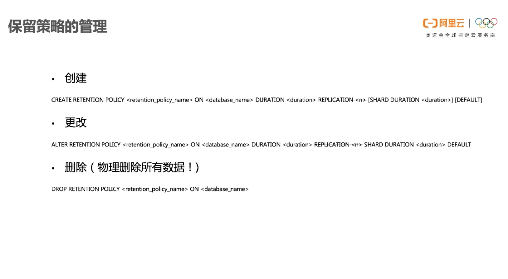

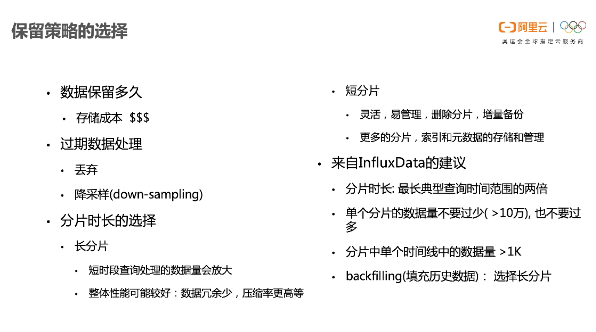


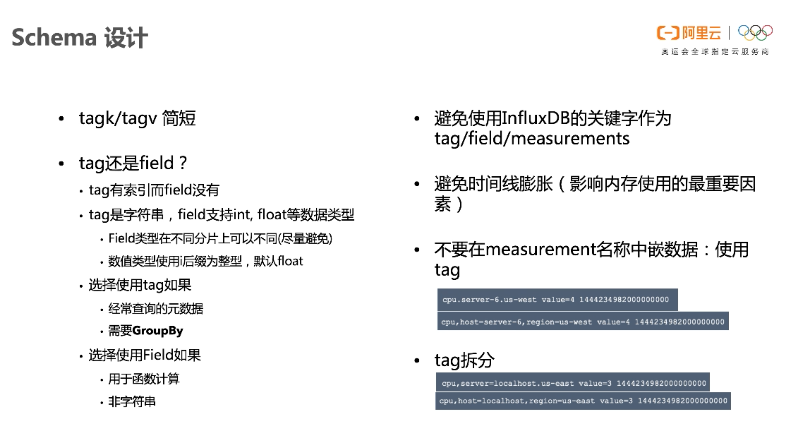


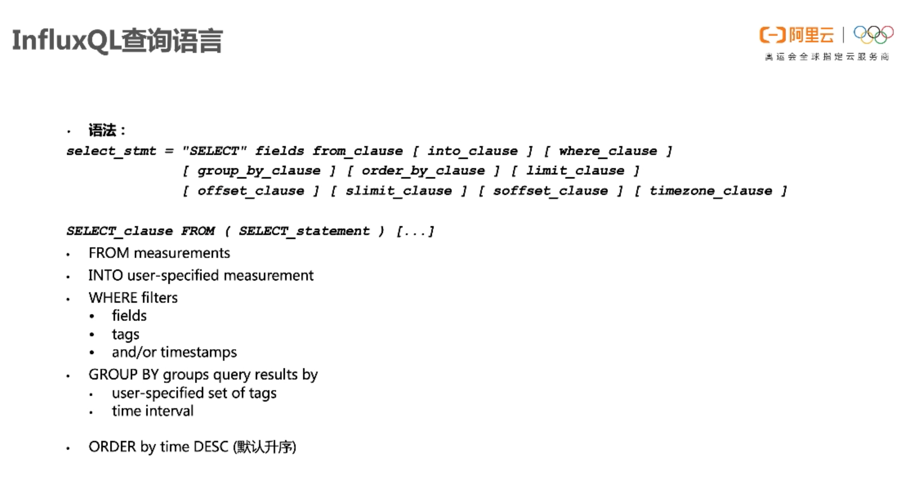


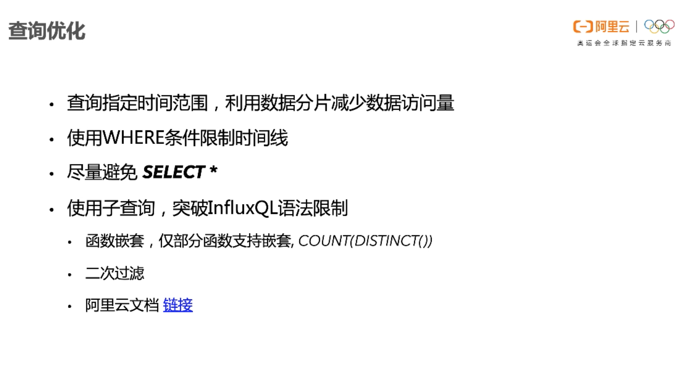


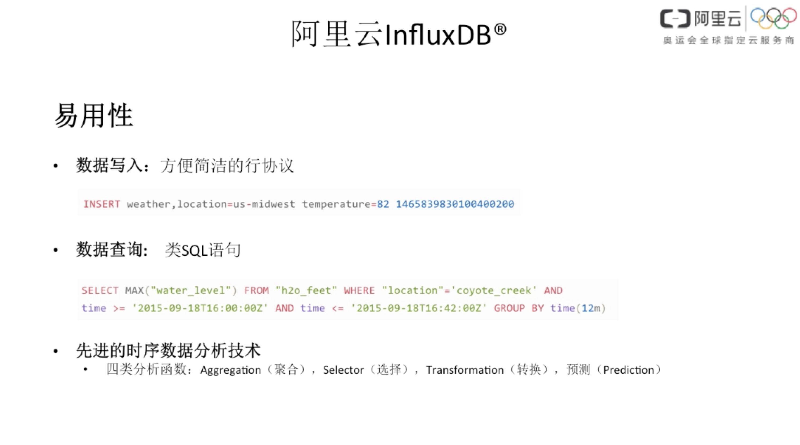


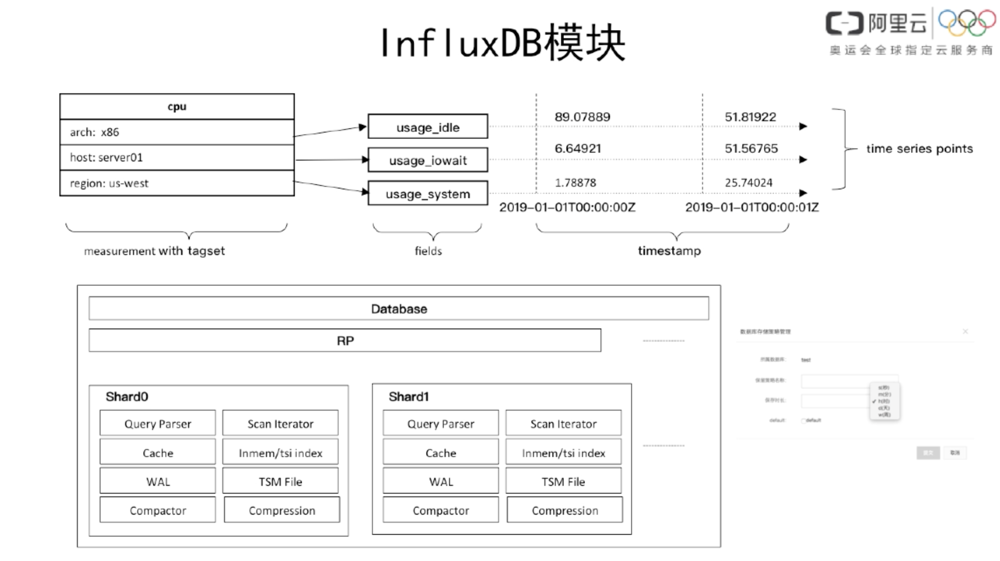


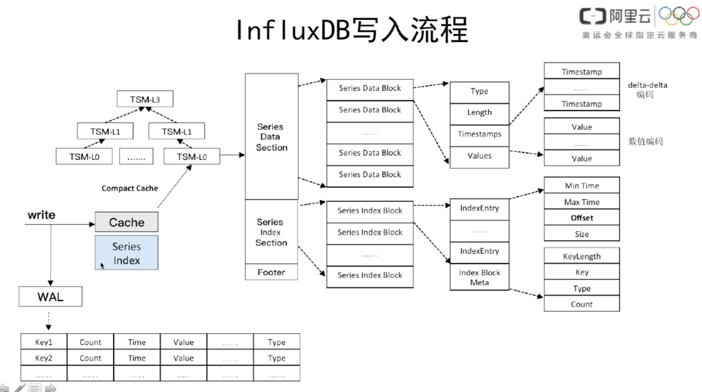


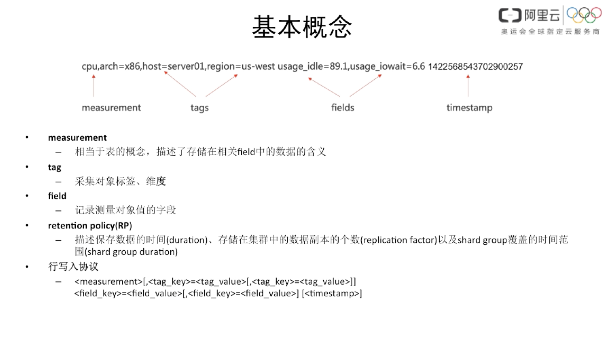

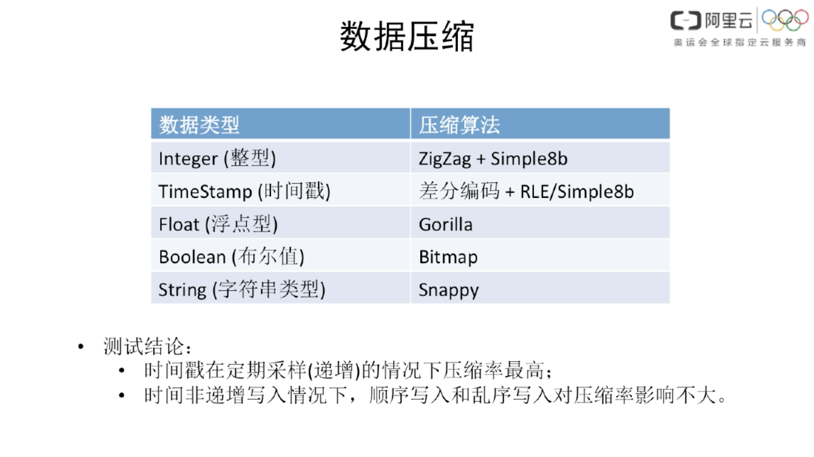


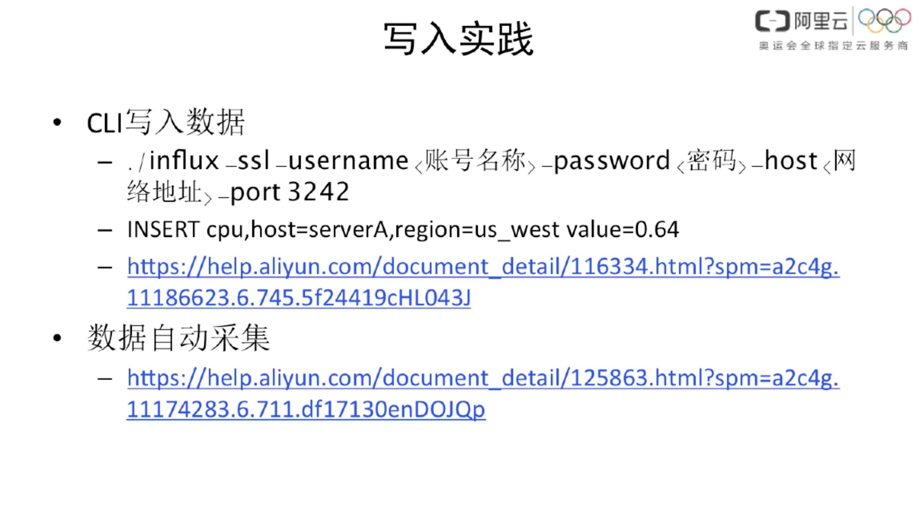


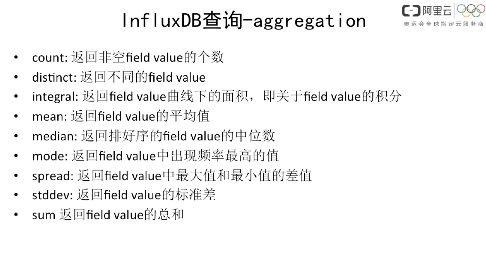


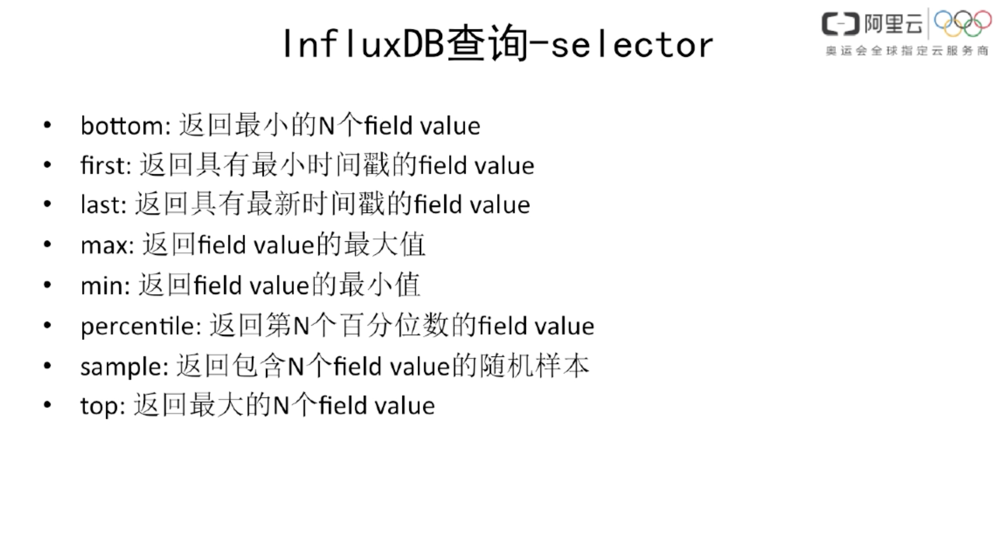

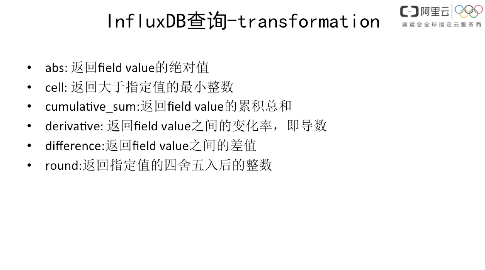

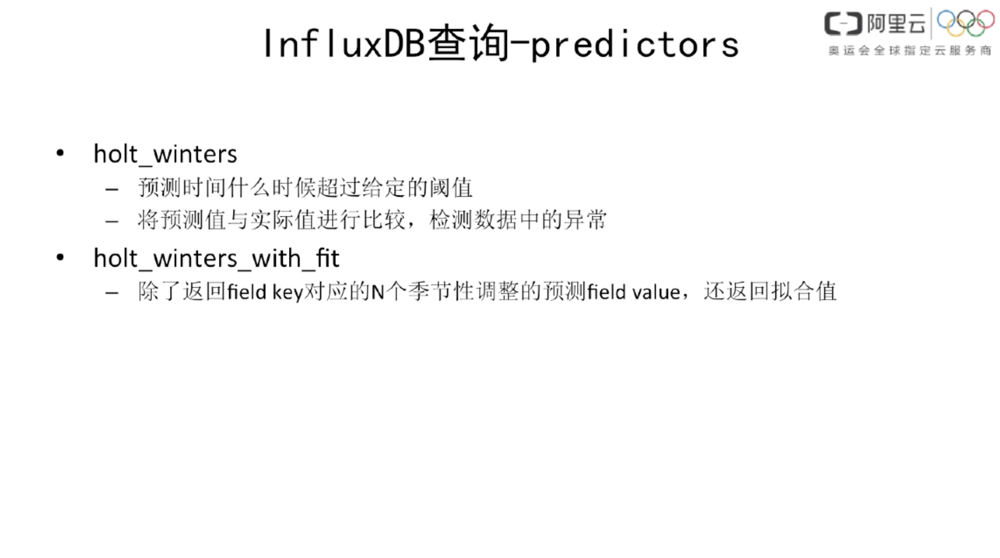

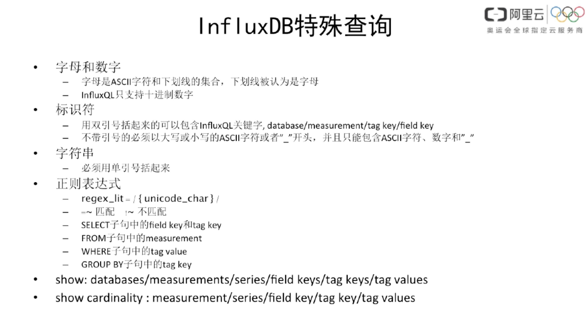


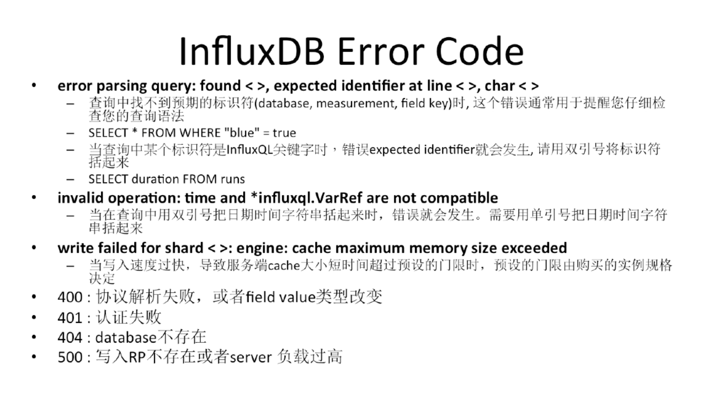

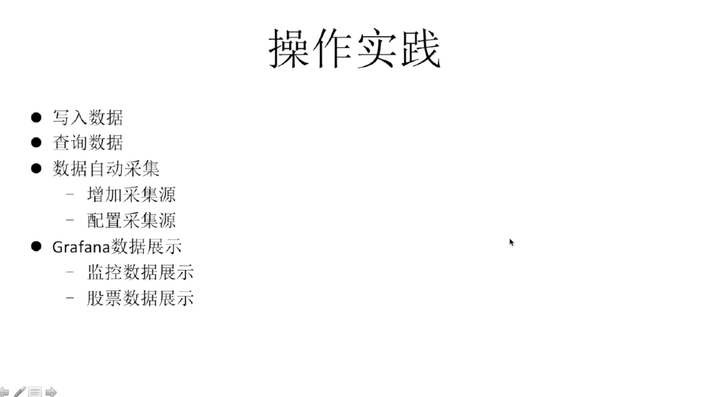