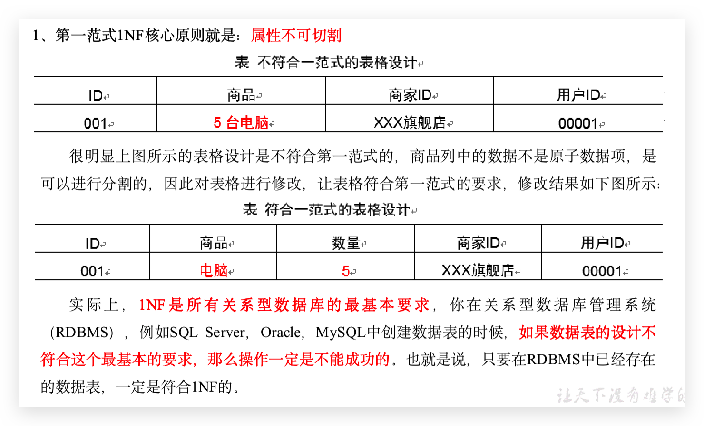
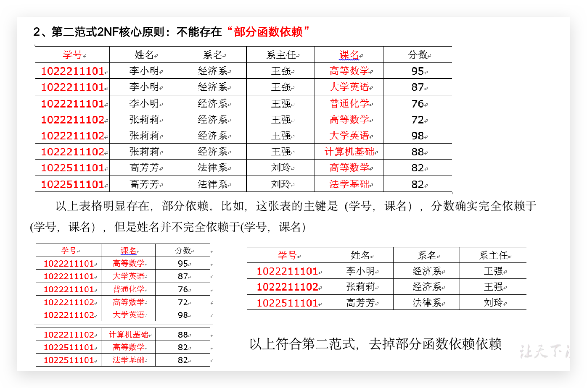

## 范式概念

关系型数据库设计时，遵照一定的规范要求，目的在于降低数据的冗余性，目前业界范式有：第一范式(1NF)、第二范式(2NF)、第三范式(3NF)、巴斯-科德范式(BCNF)、第四范式(4NF)、第五范式(5NF)。

范式的标准定义是：符合某一种级别的关系模式的集合，表示一个关系内部各属性之间的联系的合理化程度。通俗地讲，范式可以理解为一张数据表的表结构，符合的设计标准的级别。

 使用范式的根本目的是：

  1）减少数据冗余，尽量让每个数据只出现一次。

  2）保证数据一致性

**缺点是获取数据时，需要通过Join拼接出最后的数据。**

## 函数依赖

## 三范式

- 属性不可切割 
- 不能存在:总分函数依赖 
- 不能存在:传递函数依赖 

