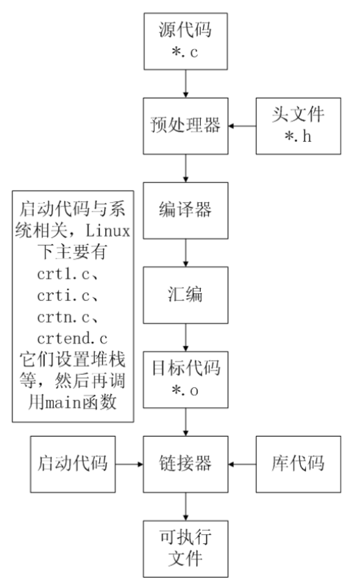
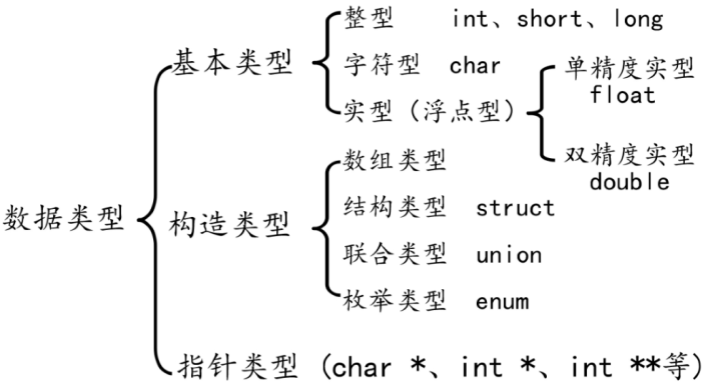

## HelloWorld

```C
#include <stdio.h>

int main()
{
    printf("hello world\n");
    return 0;
}
```


## C语言编译过程

* 预处理：宏定义展开、头文件展开、条件编译等，同时将代码中的注释删除，这里并不会检查语法
* 编译：检查语法，将预处理后文件编译生成汇编文件
* 汇编：将汇编文件生成目标文件(二进制文件)
* 链接：C语言写的程序是需要依赖各种库的，所以编译之后还需要把库链接到最终的可执行程序中去

```shell
预处理：gcc -E hello.c -o hello.i
编  译：gcc -S hello.i -o hello.s
汇  编：gcc -c hello.s -o hello.o
链  接：gcc    hello.o -o hello_elf
```




查找依赖库

```shell
ldd a.out  # on linux
otool -L a.out	# on mac
```


## 数据类型



