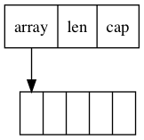
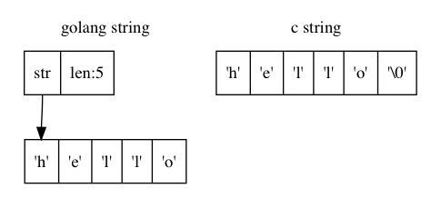

CGO 提供了 golang 和 C 语言相互调用的机制。某些第三方库可能只有 C/C++ 的实现，完全用纯 golang 的实现可能工程浩大，这时候 CGO 就派上用场了。可以通 CGO 在 golang 在调用 C 的接口，C++ 的接口可以用 C 包装一下提供给 golang 调用。被调用的 C 代码可以直接以源代码形式提供或者打包静态库或动态库在编译时链接。推荐使用静态库的方式，这样方便代码隔离，编译的二进制也没有动态库依赖方便发布也符合 golang 的哲学。
CGO 的具体使用教程本文就不涉及了，这里主要介绍下一些细节避免使用 CGO 的时候踩坑。

### 参数传递

#### 基本数值类型

golang 的基本数值类型内存模型和 C 语言一样，就是连续的几个字节(1 / 2 / 4 / 8 字节)。因此传递数值类型时可以直接将 golang 的基本数值类型转换成对应的 CGO 类型然后传递给 C 函数调用，反之亦然:


```go
package main

/*
#include <stdint.h>

static int32_t add(int32_t a, int32_t b) {
    return a + b;
}
*/
import "C"
import "fmt"

func main() {
    var a, b int32 = 1, 2
    var c int32 = int32(C.add(C.int32_t(a), C.int32_t(b)))
    fmt.Println(c) // 3
}
```

golang 和 C 的基本数值类型转换对照表如下：

| C语言类型              | CGO类型     | Go语言类型 |
| :--------------------- | :---------- | :--------- |
| char                   | C.char      | byte       |
| singed char            | C.schar     | int8       |
| unsigned char          | C.uchar     | uint8      |
| short                  | C.short     | int16      |
| unsigned short         | C.ushort    | uint16     |
| int                    | C.int       | int32      |
| unsigned int           | C.uint      | uint32     |
| long                   | C.long      | int32      |
| unsigned long          | C.ulong     | uint32     |
| long long int          | C.longlong  | int64      |
| unsigned long long int | C.ulonglong | uint64     |
| float                  | C.float     | float32    |
| double                 | C.double    | float64    |
| size_t                 | C.size_t    | uint       |


> 注意 C 中的整形比如 int 在标准中是没有定义具体字长的，但一般默认认为是 4 字节，对应 CGO 类型中 C.int 则明确定义了字长是 4 ，但 golang 中的 int 字长则是 8 ，因此对应的 golang 类型不是 int 而是 int32 。为了避免误用，C 代码最好使用 C99 标准的数值类型，对应的转换关系如下:

| C语言类型 | CGO类型    | Go语言类型 |
| :-------- | :--------- | :--------- |
| int8_t    | C.int8_t   | int8       |
| uint8_t   | C.uint8_t  | uint8      |
| int16_t   | C.int16_t  | int16      |
| uint16_t  | C.uint16_t | uint16     |
| int32_t   | C.int32_t  | int32      |
| uint32_t  | C.uint32_t | uint32     |
| int64_t   | C.int64_t  | int64      |
| uint64_t  | C.uint64_t | uint64     |

#### 切片

golang 中切片用起来有点像 C 中的数组，但实际的内存模型还是有点区别的。C 中的数组就是一段连续的内存，数组的值实际上就是这段内存的首地址。golang 切片的内存模型如下所示(参考源码 `$GOROOT/src/runtime/chan.go`)：



由于底层内存模型的差异，不能直接将 golang 切片的指针传给 C 函数调用，而是需要将存储切片数据的内部缓冲区的首地址及切片长度取出传传递：

```go
package main

/*
#include <stdint.h>

static void fill_255(char* buf, int32_t len) {
    int32_t i;
    for (i = 0; i < len; i++) {
        buf[i] = 255;
    }
}
*/
import "C"
import (
    "fmt"
    "unsafe"
)

func main() {
    b := make([]byte, 5)
    fmt.Println(b) // [0 0 0 0 0]
    C.fill_255((*C.char)(unsafe.Pointer(&b[0])), C.int32_t(len(b)))
    fmt.Println(b) // [255 255 255 255 255]
}
```

#### 字符串

golang 的字符串和 C 中的字符串在底层的内存模型也是不一样的：




golang 字串符串并没有用 '\0' 终止符标识字符串的结束，因此直接将 golang 字符串底层数据指针传递给 C 函数是不行的。一种方案类似切片的传递一样将字符串数据指针和长度传递给 C 函数后，C 函数实现中自行申请一段内存拷贝字符串数据然后加上未层终止符后再使用。更好的方案是使用标准库提供的 `C.CString()` 将 golang 的字符串转换成 C 字符串然后传递给 C 函数调用：

```go
package main

/*
#include <stdint.h>
#include <stdlib.h>
#include <string.h>

static char* cat(char* str1, char* str2) {
    static char buf[256];
    strcpy(buf, str1);
    strcat(buf, str2);

    return buf;
}
*/
import "C"
import (
    "fmt"
    "unsafe"
)

func main() {
    str1, str2 := "hello", " world"
    // golang string -> c string
    cstr1, cstr2 := C.CString(str1), C.CString(str2)
    defer C.free(unsafe.Pointer(cstr1)) // must call
    defer C.free(unsafe.Pointer(cstr2))
    cstr3 := C.cat(cstr1, cstr2)
    // c string -> golang string
    str3 := C.GoString(cstr3)
    fmt.Println(str3) // "hello world"
}
```


需要注意的是 `C.CString()` 返回的 C 字符串是在堆上新创建的并且不受 GC 的管理，使用完后需要自行调用 `C.free()` 释放，否则会造成内存泄露，而且这种内存泄露用前文中介绍的 pprof 也定位不出来。

#### 其他类型

golang 中其他类型(比如 map) 在 C/C++ 中并没有对等的类型或者内存模型也不一样。传递的时候需要了解 golang 类型的底层内存模型，然后进行比较精细的内存拷贝操作。传递 map 的一种方案是可以把 map 的所有键值对放到切片里，然后把切片传递给 C++ 函数，C++ 函数再还原成 C++ 标准库的 map 。由于使用场景比较少，这里就不赘述了。

### 总结

本文主要介绍了在 golang 中使用 CGO 调用 C/C++ 接口涉及的一些细节问题。C/C++ 比较底层的语言，需要自己管理内存。使用 CGO 时需要对 golang 底层的内存模型有所了解。另外 goroutine 通过 CGO 进入到 C 接口的执行阶段后，已经脱离了 golang 运行时的调度并且会独占线程，此时实际上变成了多线程同步的编程模型。如果 C 接口里有阻塞操作，这时候可能会导致所有线程都处于阻塞状态，其他 goroutine 没有机会得到调度，最终导致整个系统的性能大大较低。总的来说，只有在第三方库没有 golang 的实现并且实现起来成本比较高的情况下才需要考虑使用 CGO ，否则慎用。