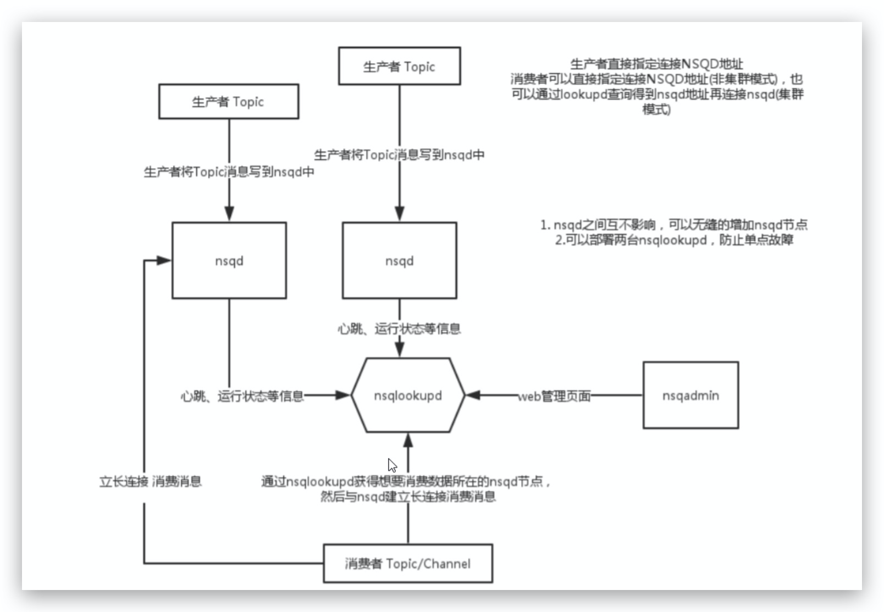
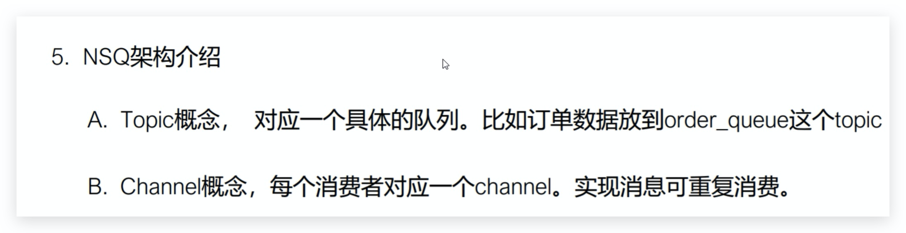
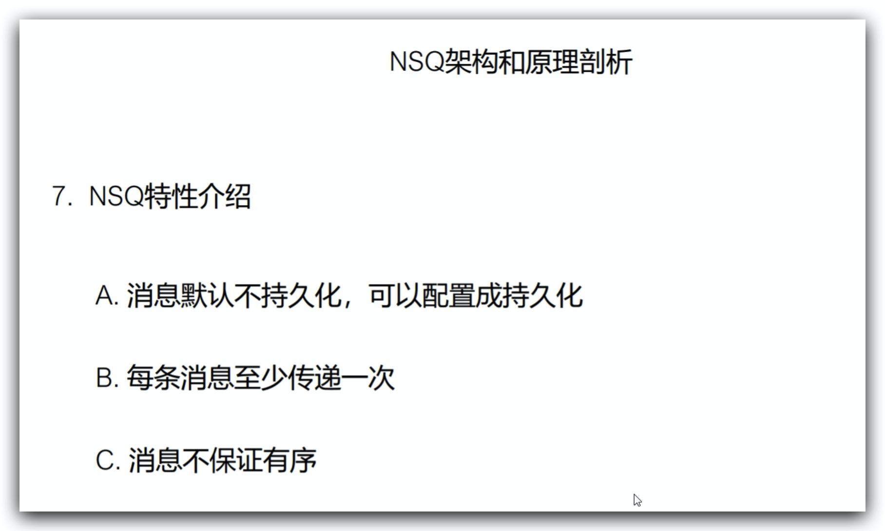
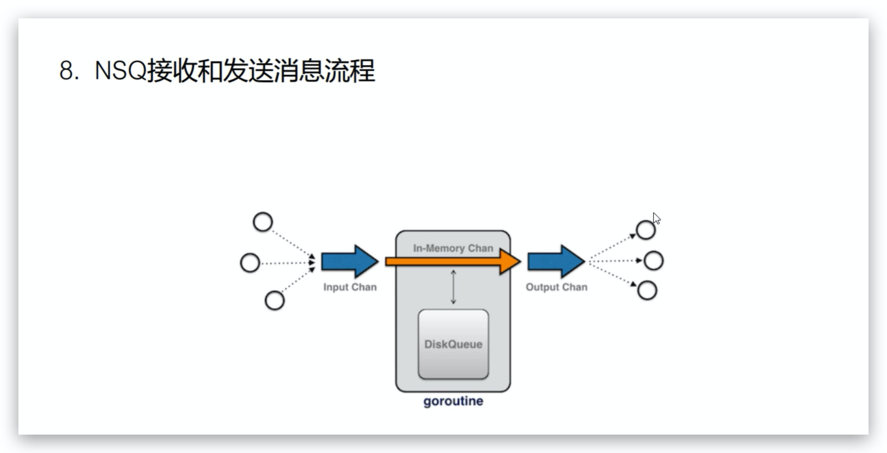

# NSQ：分布式的实时消息平台

[NSQ](https://github.com/bitly/nsq)是一个基于 Go 语言的分布式实时消息平台，它基于[MIT 开源协议](http://mit-license.org/)发布，代码托管在 GitHub。NSQ 可用于大规模系统中的实时消息服务，并且每天能够处理数亿级别的消息，其设计目标是为在分布式环境下运行的去中心化服务提供一个强大的基础架构。NSQ 具有分布式、去中心化的拓扑结构，该结构具有无单点故障、故障容错、高可用性以及能够保证消息的可靠传递的特征。NSQ 非常容易配置和部署，且具有最大的灵活性，支持众多消息协议。另外，官方还提供了拆箱即用 Go 和 Python 库。如果读者兴趣构建自己的客户端的话，还可以参考官方提供的[协议规范](http://nsq.io/clients/tcp_protocol_spec.html)。

#### NSQ 是由四个重要组件构成：

- [nsqd](http://bitly.github.io/nsq/components/nsqd.html)：一个负责接收、排队、转发消息到客户端的守护进程
- [nsqlookupd](http://bitly.github.io/nsq/components/nsqlookupd.html)：管理拓扑信息并提供最终一致性的发现服务的守护进程
- [nsqadmin](http://bitly.github.io/nsq/components/nsqadmin.html)：一套 Web 用户界面，可实时查看集群的统计数据和执行各种各样的管理任务
- [utilities](http://nsq.io/components/utilities.html)：常见基础功能、数据流处理工具，如 nsq_stat、nsq_tail、nsq_to_file、nsq_to_http、nsq_to_nsq、to_nsq

#### NSQ 的主要特点如下:

- 具有分布式且无单点故障的拓扑结构 支持水平扩展，在无中断情况下能够无缝地添加集群节点
- 低延迟的消息推送，参见官方提供的[性能说明文档](http://nsq.io/overview/performance.html)
- 具有组合式的负载均衡和多播形式的消息路由
- 既擅长处理面向流（高吞吐量）的工作负载，也擅长处理面向 Job 的（低吞吐量）工作负载
- 消息数据既可以存储于内存中，也可以存储在磁盘中
- 实现了生产者、消费者自动发现和消费者自动连接生产者，参见 nsqlookupd
- 支持安全传输层协议（TLS），从而确保了消息传递的安全性
- 具有与数据格式无关的消息结构，支持 JSON、Protocol Buffers、MsgPacek 等消息格式
- 非常易于部署（几乎没有依赖）和配置（所有参数都可以通过命令行进行配置）
- 使用了简单的 TCP 协议且具有多种语言的客户端功能库
- 具有用于信息统计、管理员操作和实现生产者等的 HTTP 接口
- 为实时检测集成了统计数据收集器[StatsD](https://github.com/etsy/statsd/)
- 具有强大的集群管理界面，参见 nsqadmin

为了达到高效的分布式消息服务，NSQ 实现了合理、智能的权衡，从而使得其能够完全适用于生产环境中，具体内容如下：

- 支持消息内存队列的大小设置，默认完全持久化（值为 0），消息即可持久到磁盘也可以保存在内存中
- 保证消息至少传递一次, 以确保消息可以最终成功发送
- 收到的消息是无序的, 实现了松散订购
- 发现服务 nsqlookupd 具有最终一致性, 消息最终能够找到所有 Topic 生产者

官方和第三方还为 NSQ 开发了众多客户端功能库，如官方提供的基于 HTTP 的[nsqd](http://nsq.io/components/nsqd.html#http_api)、Go 客户端[go-nsq](https://github.com/bitly/go-nsq)、Python 客户端[pynsq](https://github.com/bitly/pynsq)、基于 Node.js 的 JavaScript 客户端[nsqjs](https://github.com/dudleycarr/nsqjs)、异步 C 客户端[libnsq](https://github.com/mreiferson/libnsq)、Java 客户端[nsq-java](https://github.com/bitly/nsq-java)以及基于各种语言的众多第三方客户端功能库。更多客户端功能库, 请读者点击[这里](http://nsq.io/clients/client_libraries.html)查看。

从 NSQ 的[设计文档](http://nsq.io/overview/design.html)中得知，单个 nsqd 被设计为一次能够处理多个流数据，NSQ 中的数据流模型是由 stream 和 consumer 组成。Topic 是一种独特的 stream，Channel 是一个订阅了给定 Topic 的 consumer 逻辑分组。NSQ 的数据流模型结构如下图所示：

#### 核心概念

* topic: topic是nsq的消息发布的逻辑`关键词`。当程序初次发布带topic的消息时,如果topic不存在,则会被创建。

* channels: 当生产者每次发布消息的时候,消息会采用多播的方式被拷贝到各个channel中,channel起到队列的作用。

* messages: 数据流的形式。

从上图可以看出，单个 nsqd 可以有多个 Topic，每个 Topic 又可以有多个 Channel。Channel 能够接收 Topic 所有消息的副本，从而实现了消息多播分发；而 Channel 上的每个消息被分发给它的订阅者，从而实现负载均衡，所有这些就组成了一个可以表示各种简单和复杂拓扑结构的强大框架。

Note:

> 不适用于有顺序要求的消息

参考文章:

* https://www.infoq.cn/article/2015%2F02%2Fnsq-distributed-message-platform
* https://lihaoquan.me/2016/6/20/using-nsq.html
* https://segmentfault.com/a/1190000009194607#articleHeader9