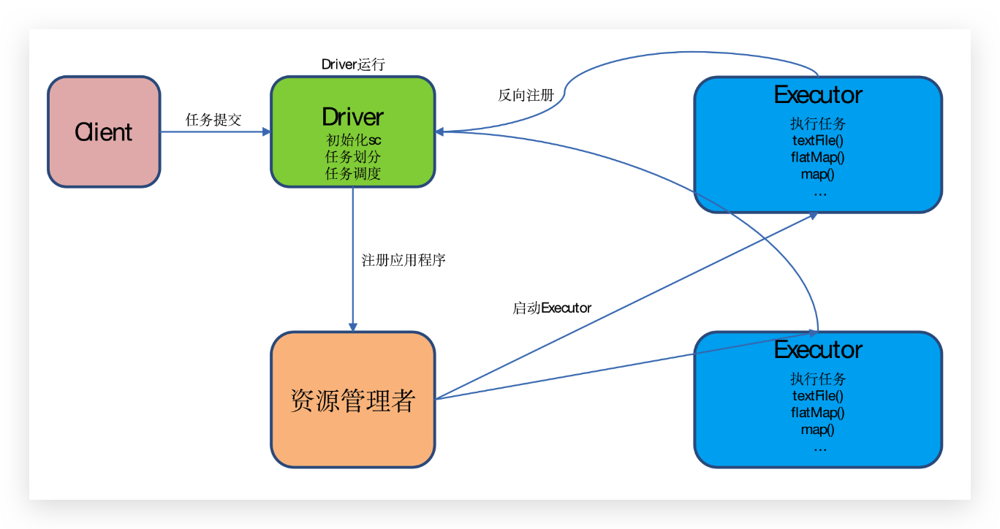
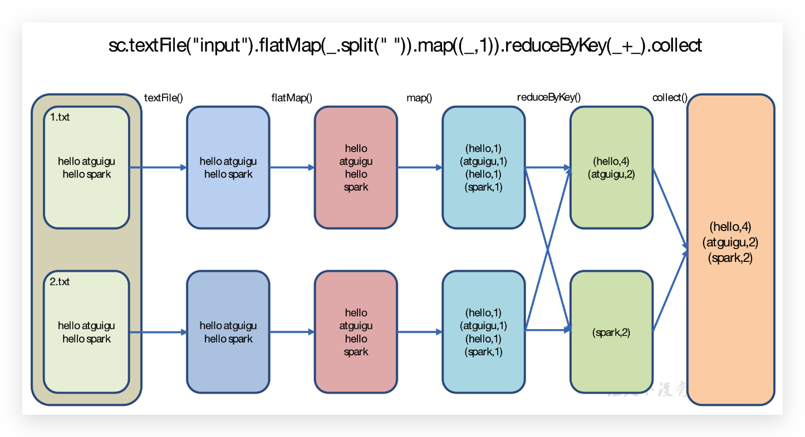
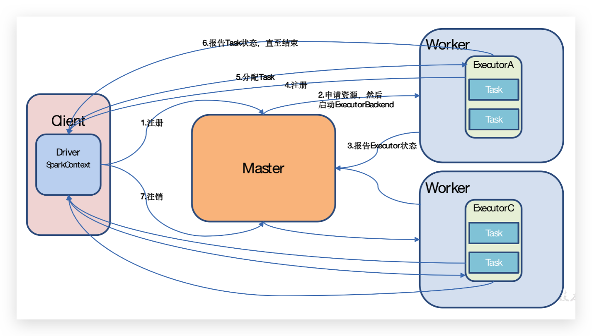
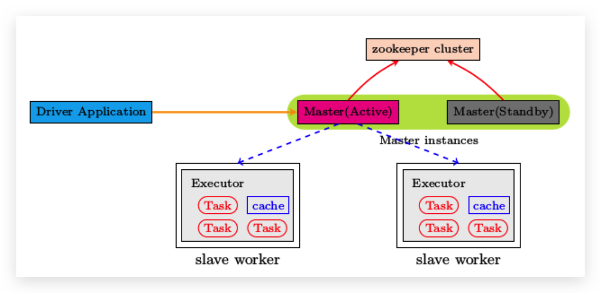

## Spark Overview

### Spark 是什么

Spark 是一个快速(基于内存), 通用, 可扩展的集群计算引擎

官网:<http://spark.apache.org/>


### Spark 特点

* 快速: Spark 基于内存的运算是 MapReduce 的 100 倍.基于硬盘的运算也要快 10 倍以上
* 易用: Spark 支持 Scala, Java, Python, R 和 SQl 脚本, 并提供了超过 80 种高性能的算法, 非常容易创建并行 App
* 通用: Spark 结合了SQL, Streaming和复杂分析.Spark 提供了大量的类库, 包括 SQL 和 DataFrames, 机器学习(MLlib), 图计算(GraphicX), 实时流处理(Spark Streaming)
* 可融合性: Spark 可以非常方便的与其他开源产品进行融合


### Spark 内置模块


#### Spark Core

实现spark的基本功能,包含任务调度,内存管理,错误恢复,与存储文件系统交互等模块,Spark Core中还包含了对弹性分布式数据集(Resilient Distributed DataSet，简称RDD)的API定义

#### Spark SQL

是Spark用来操作结构化数据的程序包。通过Spark SQL，我们可以使用 SQL或者Apache Hive版本的SQL方言(HQL)来查询数据。Spark SQL支持多种数据源，比如Hive表、Parquet以及JSON等

#### Spark Streaming

是Spark提供的对实时数据进行流式计算的组件。提供了用来操作数据流的API，并且与Spark Core中的 RDD API高度对应

#### Spark Mlib

提供常见的机器学习(ML)功能的程序库。包括分类、回归、聚类、协同过滤等，还提供了模型评估、数据 导入等额外的支持功能

#### 集群管理器

Spark 设计为可以高效地在一个计算节点到数千个计算节点之间伸缩计 算。为了实现这样的要求，同时获得最大灵活性，Spark支持在各种集群管理器(Cluster Manager)上运行，包括Hadoop YARN、Apache Mesos，以及Spark自带的一个调度器，叫作独立调度器


## Spark 运行模式

* local
* standalone
* yarn

相关端口号

```shell
# Hadoop
http://hadoop102:50070 # hdfs
http://hadoop102:19888/jobhistory # hadoop jobhistory
http://hadoop103:8088/cluster # yarn cluster

start-dfs.sh
start-yarn.sh
mr-jobhistory-daemon.sh start historyserver # hadoop jobhistory server

# Spark
http://hadoop102:4040/jobs/ # spark jobs
http://hadoop102:18080/ # spark history server
http://hadoop102:8080/ # Spark Master

sbin/start-history-server.sh # spark history server
```


### 集群角色

#### Master和Worker

**Master**:Spark特有资源调度系统的Leader。掌管着整个集群的资源信息，类似于Yarn框架中的ResourceManager

* 监听Worker，看Worker是否正常工作；
* Master对Worker、Application等的管理(接收Worker的注册并管理所有的Worker，接收Client提交的application，调度等待的Application并向Worker提交)。

**Worker**:Spark特有资源调度系统的Slave，有多个。每个Slave掌管着所在节点的资源信息，类似于Yarn框架中的NodeManager

* 通过RegisterWorker注册到Master；

* 定时发送心跳给Master；

* 根据Master发送的Application配置进程环境，并启动ExecutorBackend(执行Task所需的临时进程)


#### Driver和Executor

**1）Driver（驱动器）**

Spark的驱动器是执行开发程序中的main方法的线程。它负责开发人员编写的用来创建SparkContext、创建RDD，以及进行RDD的转化操作和行动操作代码的执行。如果你是用Spark Shell，那么当你启动Spark shell的时候，系统后台自启了一个Spark驱动器程序，就是在Spark shell中预加载的一个叫作 sc的SparkContext对象。如果驱动器程序终止，那么Spark应用也就结束了。主要负责：

* 将用户程序转化为作业（Job）
* 在Executor之间调度任务（Task）
* 跟踪Executor的执行情况
* 通过UI展示查询运行情况

**2）Executor（执行器）**

Spark Executor是一个工作节点，负责在 Spark 作业中运行任务，任务间相互独立。Spark 应用启动时，Executor节点被同时启动，并且始终伴随着整个 Spark 应用的生命周期而存在。如果有Executor节点发生了故障或崩溃，Spark 应用也可以继续执行，会将出错节点上的任务调度到其他Executor节点上继续运行。主要负责：

* 负责运行组成 Spark 应用的任务，并将状态信息返回给驱动器程序；
* 通过自身的块管理器（Block Manager）为用户程序中要求缓存的RDD提供内存式存储。RDD是直接缓存在Executor内的，因此任务可以在运行时充分利用缓存数据加速运算。

> 总结：Master和Worker是Spark的守护进程，即Spark在特定模式下正常运行所必须的进程。Driver和Executor是临时程序，当有具体任务提交到Spark集群才会开启的程序。


### Local 模式

运行在一台计算机上的模式,所有计算都运行在一个Core当中,

local[K]: 指定使用K个Core来运行计算，比如local[4]就是运行4个Core来执行;

local[*]: 这种模式直接使用最大Core数

```shell
> tar -zxvf spark-2.1.1-bin-hadoop2.7.tgz -C /opt/module/
> mv spark-2.1.1-bin-hadoop2.7 spark-local

# 官方案例: 利用蒙特·卡罗算法求PI
> bin/spark-submit \
--class org.apache.spark.examples.SparkPi \ # 后面 jar 包的主类
--executor-memory 1G \ # 执行
--total-executor-cores 2 \ # 执行器的总核心数
./examples/jars/spark-examples_2.11-2.1.1.jar \
100 # 主类的参数
```

基本语法

```
bin/spark-submit \
--class <main-class>
--master <master-url> \
--deploy-mode <deploy-mode> \
--conf <key>=<value> \
... # other options
<application-jar> \
[application-arguments]
```

参数解读:

* --master 指定Master的地址；
* --class: 你的应用的启动类 (如 org.apache.spark.examples.SparkPi)；
* --deploy-mode: 是否发布你的驱动到worker节点(cluster) 或者作为一个本地客户端 (client) (default: client)；
* --conf: 任意的Spark配置属性， 格式key=value. 如果值包含空格，可以加引号“key=value” ；
* application-jar: 打包好的应用jar,包含依赖. 这个URL在集群中全局可见。 比如hdfs:// 共享存储系统， 如果是 file:// path， 那么所有的节点的path都包含同样的jar
* application-arguments: 传给main()方法的参数；
* --executor-memory 1G 指定每个executor可用内存为1G；
* --total-executor-cores 2 指定每个executor使用的cup核数为2个。

#### spark-shell

```shell
# 开启spark-shell
> bin/spark-shell
Spark context Web UI available at http://192.168.3.102:4040
Spark context available as 'sc' (master = local[*], app id = local-1556020258519).
Spark session available as 'spark'.
Welcome to
      ____              __
     / __/__  ___ _____/ /__
    _\ \/ _ \/ _ `/ __/  '_/
   /___/ .__/\_,_/_/ /_/\_\   version 2.1.1
      /_/

Using Scala version 2.11.8 (Java HotSpot(TM) 64-Bit Server VM, Java 1.8.0_144)
Type in expressions to have them evaluated.
Type :help for more information.

# 案例:统计当前input目录下wordcount
> scala>sc.textFile("input").flatMap(_.split(" ")).map((_,1)).reduceByKey(_+_).collect

```

#### 提交流程



#### 数据流程

textFile("input")：读取本地文件input文件夹数据；

flatMap(_.split(" "))：压平操作，按照空格分割符将一行数据映射成一个个单词；

map((_,1))：对每一个元素操作，将单词映射为元组；

reduceByKey(_+_)：按照key将值进行聚合，相加；

collect：将数据收集到Driver端展示。




### Standalone模式

构建一个由Master+Slave构成的Spark集群，使Spark程序运行在集群中，且有Cluster与Client模式两种。主要区别在于：Driver程序的运行节点



```shell
> mv conf/spark-env.sh.template conf/spark-env.sh
> vim conf/spark-env.sh
SPARK_MASTER_HOST=hadoop102
SPARK_MASTER_PORT=7077

> vim conf/slaves
hadoop102
hadoop103
hadoop104

> xsync spark/
> sbin/start-all.sh
> xcall jps
================atguigu@hadoop102================
3330 Jps
3238 Worker
3163 Master
================atguigu@hadoop103================
2966 Jps
2908 Worker
================atguigu@hadoop104================
2978 Worker
3036 Jps

# 官方案例: 利用蒙特·卡罗算法求PI
> bin/spark-submit \
--class org.apache.spark.examples.SparkPi \
--master spark://hadoop102:7077 \
--executor-memory 1G \
--total-executor-cores 2 \
./examples/jars/spark-examples_2.11-2.1.1.jar \
100
```


#### JobHistoryServer配置

```shell
> mv conf/spark-defaults.conf.template conf/spark-defaults.conf

> vim conf/spark-defaults.conf
spark.eventLog.enabled           true
spark.eventLog.dir               hdfs://hadoop102:9000/directory # 注意：HDFS上的目录需要提前存在。

> vi conf/spark-env.sh
export SPARK_HISTORY_OPTS="-Dspark.history.ui.port=18080 -Dspark.history.retainedApplications=30 -Dspark.history.fs.logDirectory=hdfs://hadoop102:9000/directory"
```

**参数描述：**

* spark.eventLog.dir：Application在运行过程中所有的信息均记录在该属性指定的路径下

* spark.history.ui.port=18080  WEBUI访问的端口号为18080

* spark.history.fs.logDirectory=hdfs://hadoop102:9000/directory配置了该属性后，在start-history-server.sh时就无需再显式的指定路径，Spark History Server页面只展示该指定路径下的信息

* spark.history.retainedApplications=30指定保存Application历史记录的个数，如果超过这个值，旧的应用程序信息将被删除。注意：这个是内存中的应用数，而不是页面上显示的应用数。

```
> xsync spark-defaults.conf
> xsync spark-env.sh
> sbin/start-history-server.sh

> bin/spark-submit \
--class org.apache.spark.examples.SparkPi \
--master spark://hadoop102:7077 \
--executor-memory 1G \
--total-executor-cores 2 \
./examples/jars/spark-examples_2.11-2.1.1.jar \
100
```

[http://hadoop102:18080](http://hadoop102:18080/)


#### HA配置



```shell
# 启动 zookeeper 集群
> zk.sh start

# 修改配置
> vim conf/spark-env.sh
# 注释掉如下内容：
# SPARK_MASTER_HOST=hadoop102
# SPARK_MASTER_PORT=7077
# 添加上如下内容：
export SPARK_DAEMON_JAVA_OPTS="-Dspark.deploy.recoveryMode=ZOOKEEPER -Dspark.deploy.zookeeper.url=hadoop102,hadoop103,hadoop104 -Dspark.deploy.zookeeper.dir=/spark"

# 分发配置文件
> xsync spark-env.sh

# 启动全部节点
> sbin/start-all.sh

# 在hadoop103上单独启动master节点
> sbin/start-master.sh

# spark HA集群访问
> /opt/module/spark/bin/spark-shell \
--master spark://hadoop102:7077,hadoop103:7077 \
--executor-memory 2g \
--total-executor-cores 2
```


### Yarn模式

Spark客户端直接连接Yarn，不需要额外构建Spark集群。有yarn-client和yarn-cluster两种模式，

主要区别在于：**Driver程序的运行节点**。

yarn-client：Driver程序运行在客户端，适用于交互、调试，希望立即看到app的输出

yarn-cluster：Driver程序运行在由RM（ResourceManager）启动的AM（APPMaster）适用于生产环境。


hadoop 配置yarn-site.xml

```xml
<!--是否启动一个线程检查每个任务正使用的物理内存量，如果任务超出分配值，则直接将其杀掉，默认是true -->
<property>
    <name>yarn.nodemanager.pmem-check-enabled</name>
    <value>false</value>
</property>
<!--是否启动一个线程检查每个任务正使用的虚拟内存量，如果任务超出分配值，则直接将其杀掉，默认是true -->
<property>
    <name>yarn.nodemanager.vmem-check-enabled</name>
    <value>false</value>
</property>
```

spark中 spark-env.sh配置

```shell
> vim conf/spark-env.sh
# spark和 yarn 关联上
YARN_CONF_DIR=/opt/module/hadoop-2.7.2/etc/hadoop

> xsync /opt/module/hadoop-2.7.2/etc/hadoop/yarn-site.xml

> bin/spark-submit \
--class org.apache.spark.examples.SparkPi \
--master yarn \
--deploy-mode client \
./examples/jars/spark-examples_2.11-2.1.1.jar \
100
```

> 注意：在提交任务之前需启动HDFS以及YARN集群


#### 日志查看

```shell
> vim conf/spark-defaults.conf
# 修改配置文件spark-defaults.conf
spark.yarn.historyServer.address=hadoop102:18080
spark.history.ui.port=18080

> sbin/stop-history-server.sh 
> sbin/start-history-server.sh
> bin/spark-submit \
--class org.apache.spark.examples.SparkPi \
--master yarn \ # 关联到 yarn
--deploy-mode client \
./examples/jars/spark-examples_2.11-2.1.1.jar \
100
```


### Mesos模式

Spark客户端直接连接Mesos；不需要额外构建Spark集群。国内应用比较少，更多的是运用yarn调度


### 几种模式对比

| 模式       | Spark安装机器数 | 需启动的进程   | 所属者 |
| ---------- | --------------- | -------------- | ------ |
| Local      | 1               | 无             | Spark  |
| Standalone | 3               | Master及Worker | Spark  |
| Yarn       | 1               | Yarn及HDFS     | Hadoop |


## 编写WordCount程序

maven

```xml

    <dependencies>
        <dependency>
            <groupId>org.apache.spark</groupId>
            <artifactId>spark-core_2.11</artifactId>
            <version>2.1.1</version>
        </dependency>

    </dependencies>
    <build>
        <plugins>
            <!-- 打包插件, 否则 scala 类不会编译并打包进去 -->
            <plugin>
                <groupId>net.alchim31.maven</groupId>
                <artifactId>scala-maven-plugin</artifactId>
                <version>3.4.6</version>
                <executions>
                    <execution>
                        <goals>
                            <goal>compile</goal>
                            <goal>testCompile</goal>
                        </goals>
                    </execution>
                </executions>
            </plugin>
        </plugins>
    </build>
```


```scala
import org.apache.spark.{SparkConf, SparkContext}

/**
 * Created with IntelliJ IDEA.
 * Description: 
 * User: Ben
 * Date: 2019-04-23
 * Time: 15:58
 */
object HelloSpark {

  def main(args: Array[String]): Unit = {
    
    // 1. 创建 SparkConf对象, 并设置 App名字
    val conf: SparkConf = new SparkConf()
      .setAppName("WordCount")
      .setMaster("local[*]") // 本地运行
    
    // 2. 创建SparkContext对象
    val sc = new SparkContext(conf)
    
    // 3. 使用sc创建RDD并执行相应的transformation和action
    sc.textFile("/Users/Ben/input/")
      .flatMap(_.split("\\W+"))
      .map((_, 1))
      .reduceByKey(_ + _)
      .saveAsTextFile("/Users/Ben/resut")
    
    // 4. 关闭连接
    sc.stop()
  }
}
```

打包到集群测试

```shell
> bin/spark-submit \
--class WordCount \
--master spark://hadoop102:7077 \
WordCount.jar \
/word.txt \
/out
```

远程调试

```shell
> spark-submit --master local[2] \
# 指定端口号
--driver-java-options "-Xdebug -Xrunjdwp:transport=dt_socket,server=y,suspend=y,address=18888" \
# 指定main class,jar包
--class com.atguigu.user_behavior.UserBehaviorCleaner UserBehaviorCleaner.jar \
# 指定main方法参数
hdfs://hadoop102:9000/user/hive/warehouse/ods.db/origin_user_behavior/2019-05-13 \
hdfs://hadoop102:9000/user/hive/warehouse/tmp.db/user_behavior_20190513
```

