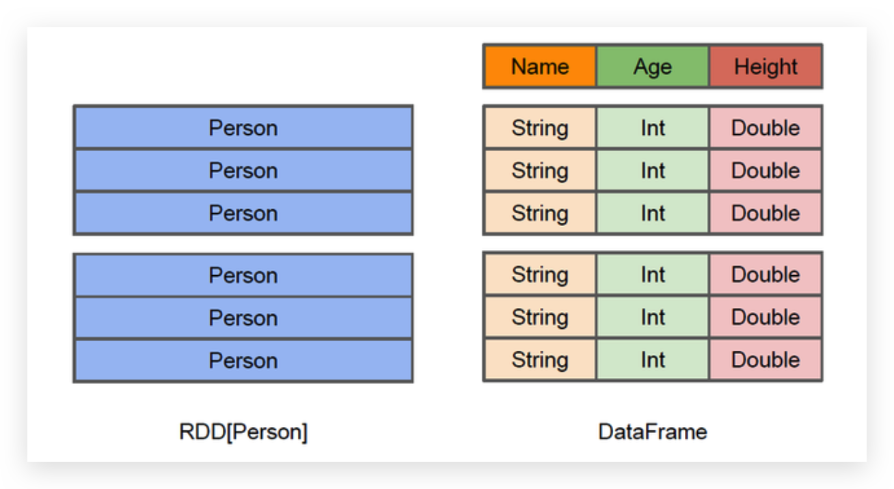
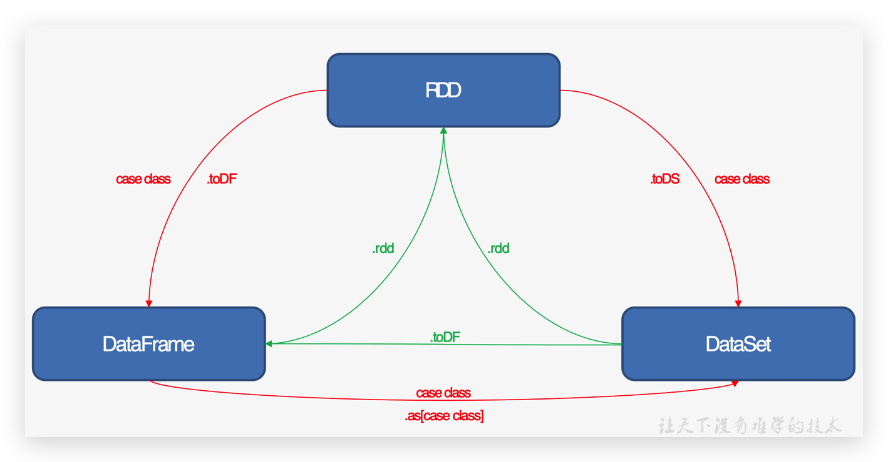

## Spark SQL概述

### 什么是 Spark SQL

Spark SQL是Spark用来处理结构化数据的一个模块，它提供了2个编程抽象：DataFrame和DataSet，并且作为分布式SQL查询引擎的作用

本质:Spark SQL转换成RDD，然后提交到集群执行

### Spark SQL的特点

* 易整合
* 统一的数据访问方式
* 兼容Hive
* 标准的数据连接

### 什么是DataFrame

DataFrame是一种以RDD为基础的分布式数据集，类似于传统数据库中的二维表格



### 什么是DataSet

DataSet是分布式数据集合。DataSet是Spark 1.6中添加的一个新抽象，是DataFrame的一个扩展, 它提供了RDD的优势（强类型，使用强大的lambda函数的能力）以及Spark SQL优化执行引擎的优点。DataSet也可以使用功能性的转换（操作map，flatMap，filter等等）


## Spark SQL编程

### SparkSession新的起始点

SparkSession是Spark最新的SQL查询起始点，实质上是SQLContext和HiveContext的组合, SparkSession内部封装了sparkContext，所以计算实际上是由sparkContext完成的

### DataFrame

### DataSet

### DataFrame与DataSet的互操作

#### DataFrame转DataSet

#### Dataset转DataFrame

### RDD、DataFrame和DataSet

三者的共性

三者相互转化



### IDEA创建SparkSQL程序

```xml
<dependency>
    <groupId>org.apache.spark</groupId>
    <artifactId>spark-sql_2.11</artifactId>
    <version>2.1.1</version>
</dependency>
```

```scala
object SparkSQLDemo {
    def main(args: Array[String]) {
        //创建SparkConf()并设置App名称

        val sparkSession: SparkSession = SparkSession.builder()
            .master("local[*]").appName("HelloWorld")
            .config("spark.some.config.option", "some-value")
            .getOrCreate()    
        //导入隐式转换
        import sparkSession.implicits._
        //读取本地文件，创建DataFrame
        val df = sparkSession.read.json("examples/src/main/resources/people.json")
        //打印
        df.show()
        //DSL风格：查询年龄在21岁以上的
        df.filter($"age" > 21).show()
        //创建临时表
        df.createOrReplaceTempView("persons")
        //SQL风格：查询年龄在21岁以上的
        sparkSession.sql("SELECT * FROM persons where age > 21").show()
        //关闭连接
        sparkSession.stop()
    }
}
```

### 用户自定义函数

#### UDF

```
spark.read.json("examples/src/main/resources/people.json")
spark.udf.register("addName", (x:String)=> "Name:"+x)
df.createOrReplaceTempView("people")
```

#### UDAF(User define aggregate function)


## Spark SQL数据的加载与保存

通用加载/保存方法

JSON文件

MySQL

Hive

## Spark SQL应用

