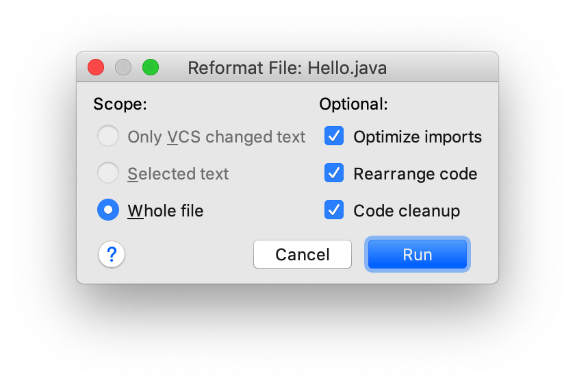

## 高效使用 Idea

1. Idea推荐设置
2. 快捷键
3. Live Template
4. Postfix Completion
5. Ideavim插件


## Idea推荐设置

### 格式化的同时优化导包

show reformat file dialog



### 代码提示取消大小写匹配


### 代码注释的缩进


## 快捷键

* Find **a**ction: Cmd + Shift +A
* File **s**tructure: Cmd + F12(改Cmd + S)
* Complete current statment: Cmd + Shift + Enter
* **N**avigate: Ctrl + Shift + N/Ctrl + Alt + Shift + N 
* 切换文件 Ctrl+Tab/Ctrl+Shift+Tab
* Esc键
* Hide All Windows: Cmd + Shift + F12


## .ideavimrc配置

```shell
"=======================================================================================
"   < 文件配置 >
"=======================================================================================
set nocompatible
set hlsearch                                                   " 搜索高亮显示
set incsearch
set scrolloff=5                                                " 设置滑动时光标位置距离顶部或者底部5行
set ignorecase smartcase                                       " 搜索忽略大小写
set showmode                                                   " 显示当前Mode
set history=1000                                               " 历史记录条数
set autochdir
highlight TabLine term=underline cterm=bold ctermfg=9 ctermbg=4
" "set hi IncSearch      xxx term=standout cterm=standout ctermfg=166 gui=reverse

"=======================================================================================
"   < 快捷键映射 >
"=======================================================================================
" 搜索
" nnoremap / :action Find<cr>
" 输入/
nnoremap g/ /
" 光标移动到下一方法
nnoremap <a-j> :action MethodDown<cr>
" 光标移动到上一方法
nnoremap <a-k> :action MethodUp<cr>
" 向下移动代码
nnoremap <d-s-j> :action MoveLineDown<cr>
" 向上移动代码
nnoremap <d-s-k> :action MoveLineUp<cr>
```


