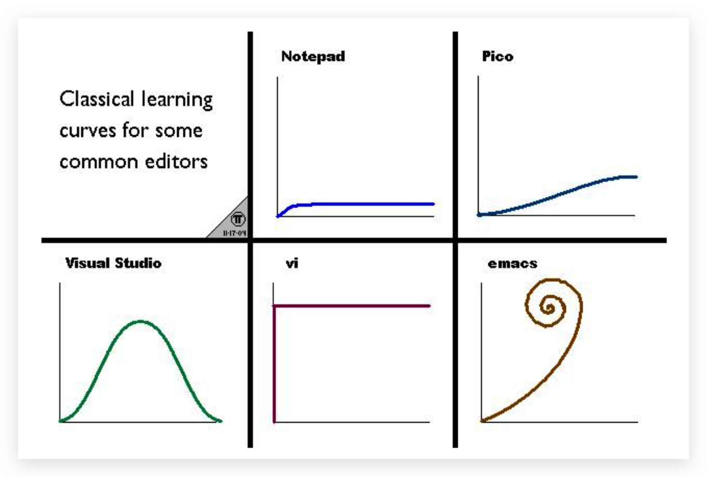

## 介绍

> Vim is **a highly configurable text editor** for efficiently creating and changing any kind of text. It is included as "vi" with most UNIX systems and with Apple OS X.

**Vim编辑器之神, Emacs神的编辑器**

Show me your .vimrc file

改配置 <==> 好好写代码

## 资料

官网:[https://www.vim.org](https://www.vim.org/)
Github:[https://github.com/vim/vim](https://github.com/vim/vim)
书籍:vim 实用技巧
推荐的 vimrc 配置:[https://github.com/amix/vimrc](https://github.com/amix/vimrc)

## 学习曲线

## 模式Mode

- 普通模式 Normal mode
- 插入模式 Insert mode
- 可视模式 Visual mode
- 可视行模式 Visual line mode
- 可视块模式 Visual block mode
- 替换模式 Replace mode

## 模式切换

* —> 普通模式 Esc/Ctrl+[
* 普通模式 —> 插入模式 iIaAoO
* 普通模式 —> 可视模式 v
* 普通模式 —> 可视行模式 V
* 普通模式 —> 可视块模式 Ctrl+v
* 普通模式 —> 替换模式 r/R

## 光标移动 Move

* hjkl
* e/E end
* b/B back
* 0
* $/^
* gg/G
* 10G/10gg
* 10%
* H/M/L
* %
* Ctrl + ]

## 对象 Object

* w
* "
* }
* ]

## 修改Change

* C
* cc/S
* 3dd/d3d
* s

## 删除Delete

* x
* D
* dd
* d + 方向j/k/$/^/gg/G
* d + Object

## 替换 Replace

* r
* R

## 搜索 Search

* /
* ?
* n/N
* #
* *
* f/t
* F/T
* ;

## Other

* .
* u
* Ctrl+W(Insert mode)
* Ctrl+U(insert mode)
* :set relativenumber
* :set norelativenumber
* :set so=8
* :!ps -ef
* gd: goto define

## 标签Mark

* m{a-zA-Z}
* '{a-z} / `{a-z}
* :marks
* :delmarks {a-zA-Z}
* :delmarks!

## 滚动屏幕

- Ctrl + e 向下滚动一行
- Ctrl + y 向上滚动一行
- Ctrl + d 向下滚动半屏 Down
- Ctrl + u 向上滚动半屏 Up
- Ctrl + f 向下滚动一屏 Forward
- Ctrl + b 向上滚动一屏 Back Forward
- zz

## 分屏

* :vs file_name
* :vsplit file_name
* :​vertical split file_name
* :sp file_name
* :splite file_name

## 窗口Move cursor

- Ctrl + W, c - 关闭光标所在的当前窗口 Close
- Ctrl + W, k - 移动到上方窗口
- Ctrl + W, j - 移动到下方窗口
- Ctrl + W, h - 移动到左方窗口
- Ctrl + W, l - 移动到右方窗口

## 代码折叠Fold

- zo - 打开折叠  Open
- zc - 关闭折叠  Close
- zR - 打开所有折叠
- zM - 关闭所有折叠

## 剪切板Copy/Paste

> Vim 有12个粘贴板依次编号为：0、1、2、...、9、a、"、+，其中 + 号为系统粘贴板，” 为临时粘贴板。系统剪切板中的内容可在其他程序中使用。上面的复制指令都可以配合剪切板进行操作。

- "nyw 复制当前单词到 n 号剪切板（双引号开始）
- "np 粘贴 n 号剪切板内容到当前位置后
- "+Y 复制当前行到**系统剪切板**
- "+ny 复制当前行加下面 n 行到**系统剪切板**
- "+p 粘贴**系统剪切板**内容到当前位置后

## 宏Macro

- qa  将后续命令录制在寄存器a中（从a到z有26个可用）
- do something
- q  停止录制
- @a 执行宏a