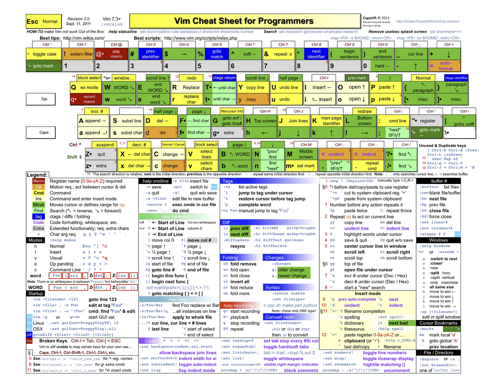
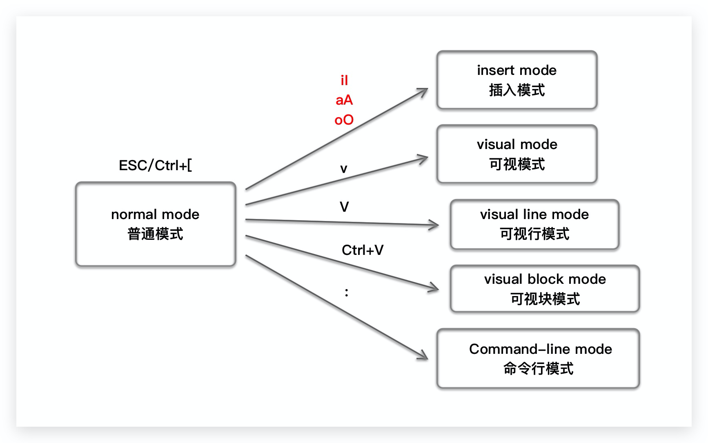

## Vim介绍Overview

https://www.vim.org/

> Vim is **a highly configurable text editor** for efficiently creating and changing any kind of text. It is included as "vi" with most UNIX systems and with Apple OS X.

**Vim 编辑器之神, Emacs 神的编辑器**

Show me your .vimrc file

改配置 <==> 好好写代码

### 资料

官网:[https://www.vim.org](https://www.vim.org/)

Github:[https://github.com/vim/vim](https://github.com/vim/vim)

书籍:vim 实用技巧https://book.douban.com/subject/26967597/

推荐的 vimrc 配置:[https://github.com/amix/vimrc](https://github.com/amix/vimrc)

### 学习曲线


### Vim Cheat Sheet



## Vim模式

### 模式Mode

-   普通模式 Normal mode(default mode):输入的一个或多个按键都会成是命令
-   插入模式 Insert mode:正常输入的编辑模式
-   可视模式 Visual mode:选择模式,类似拖动鼠标左键,选择内容
    -   可视行模式 Visual line mode:以行为单位复制
    -   可视块模式 Visual block mode:选择代码块
-   命令行/末行模式 Command-line command:执行命令
-   替换模式 Replace mode:替换字符

### 模式切换

-   —> 普通模式 Esc/Ctrl+[
-   普通模式 —> 插入模式 iIaAoO
-   普通模式 —> 可视模式 v
-   普通模式 —> 可视行模式 V
-   普通模式 —> 可视块模式 Ctrl+v
-   普通模式 —> 替换模式 r/R



## 转跳Move

### 光标移动 Move

-   hjkl --> 左下上右; [Here is why vim uses hjkl keys as arrow keys](https://catonmat.net/why-vim-uses-hjkl-as-arrow-keys)
-   e/E —> 移动光标到单词的末尾e(end)
-   b/B —> 移动光标到单词的开头b(begin of the world)
-   0 --> 移动光标到行首
-   \$/^ --> 移动光标到行尾/移动光标到**有字符**的行首
-   gg/G --> 移动光标到文件的首行/移动光标到文件的末行
-   10G/10gg --> 移动光标到当前文件的第10行
-   :N --> 移动光标到当前文件的第10行
-   10% --> 移动光标到当前文件行数的10%位置
-   H/M/L —> 移动光标到当前可见页面代码的high/middle/low
-   % --> 匹配()/[]/{}
    -   如果光标在括号上,就会转跳到与之匹配的的括号上
    -   如果光标没有在括号上,就会在当前行, 正向搜索第一个括号,转跳到与这个括号匹配括号的位置
-   Ctrl + ] / Ctrl + O / Ctrl + I—>转跳到代码定义/跳出来(out)/跳回去(in)

### 搜索 Search

-   /words --> 在当前文件中, 向后搜索单词worlds
-   ?words --> 在当前文件中, 向前搜索单词worlds
-   n/N --> 正向/反向的重复上一次搜索
-   `#/*` --> 在当前文件中, 正向/反向搜索光标位置的字符串
-   f{char}/t{char} --> 在当前行,正向搜索字符char,
    -   f{char}:搜索到字符之前,光标转跳到char的位置
    -   t{char}:搜索到字符之后,光标转跳到char的前一个位置
-   F{char}/T{char} --> 在当前行,返回搜索字符char
    -   F{char}:搜索到字符之前,光标转跳到char的位置
    -   T{char}:搜索到字符之后,光标转跳到char的**前**一个位置(搜索路径上的前一个位置,其实是char的后一个位置)
-   ; --> 重复上一次f{char}/t{char}/F{char}/T{char}的查找

## 命令Command

### 修改 Change

-   C --> 修改光标到行尾的字符字符, 然后进入插入模式
-   cc/S --> 修改光标所在行的所有字符, 然后进入插入模式
-   s --> 删除光标位置的字符, 然后进入插入模式

### 删除 Delete

-   x --> 删除光标位置的字符, 模式不变
-   D --> 修改光标到行尾的字符字, 模式不变
-   dd --> 修改光标所在行的所有字符, 模式不变
-   3dd/d3d --> 正向删除3行, 模式不变

### 选择(可视) v/V/Ctrl+V

-   v --> 进入可视模式
-   V --> 进入可视行模式
-		Ctrl + v --> 进入可视块模式
-   o/O --> 转跳光标
    -		可视行模式: 上下转跳
    -		可视块模式: o:转跳到对角位置,O:转跳到同行的另一个角位置
-		`>>`/`<<` --> 对选中的代码,向左/向右移动indent单位, 2/4/8
-		`:sort` --> 对选中的代码,按字母**行**排序

### 复制/粘贴 Copy(yank)

-   yy/Y --> 复制一行
-   选择(可视) + y --> 对选中的代码进行复制

### 替换 Replace

-   r -->  rx替换当前光标位置字母为x
-   R --> 进入替换模式,自动正向替换

## 对象 Object

-   w --> word
-   t --> tag
-   " --> "HelloWorld"
-   ' --> 'HelloWorld'
-   `>` --> ``
-   ) -> ( some code )
-   } --> { some code }
-   ] --> [ some code ]

## 命令组合

`<action>a<object> or <action>i<object> `

action

* c
* d
* v
* y

a = all / i = in

* cw / caw / ciw:


## 主题Subject

### 缓冲区Buffer

> A buffer is the in-memory text of a file.

* :buffers/:ls/:files --> 显示所有的buffer文件
* :bn/:bnext --> 转跳到下一个buffer文件
* :bp/:bprevious --> 转跳到上一个buffer文件
* :b1/:buffer1 --> 转跳到第一个buffer文件

### 标签页Tab page

* 

### 书签 Mark

-   m{a-zA-Z} --> 给光标所在的位置设置一个书签,名为后面所使用的字符
-   '{a-zA-Z} / `{a-zA-Z} --> 转跳到书签名为字符的书签位置
-   :marks --> 查看所有的mark标签
-   :delmarks {a-zA-Z} --> 删除某个mark标签
-   :delmarks! --> 删除当前buffer文件的所有书签 but not marksA-Z or 0-9

### 滚动屏幕 Roll

-   zz --> 把光标所在行,滚动到中间
-   zt --> 把光标所在行,滚动到顶部t(top)
-   zb --> 把光标所在行,滚动到底部b(bottom)
-   Ctrl + e 向下滚动一行
-   Ctrl + y 向上滚动一行
-   Ctrl + d 向下滚动半屏 Down
-   Ctrl + u 向上滚动半屏 Up
-   Ctrl + f 向下滚动一屏 Forward
-   Ctrl + b 向上滚动一屏 Back Forward

### 分屏 Split

-   :vs a.txt --> 竖直分割窗口,并打开a.txt
-   :vsplit a.txt --> 同上
-   :vertical split a.txt --> 同上
-   :sp a.txt --> 水平分割窗口,并打开a.txt
-   :split a.txt --> 同上

### 窗口 Windows

-   Ctrl + W, c - 关闭光标所在的当前窗口 Close
-   Ctrl + W, k - 移动光标到上方窗口
-   Ctrl + W, j - 移动光标到下方窗口
-   Ctrl + W, h - 移动光标到左方窗口
-   Ctrl + W, l - 移动光标到右方窗口

### 代码折叠 Fold

-   zo - 打开折叠 Open
-   zc - 关闭折叠 Close
-   zR - 打开所有折叠
-   zM - 关闭所有折叠

### 替换 Replace


### 宏 Macro

-   qa 将后续命令录制在寄存器 a 中（从 a 到 z 有 26 个可用）
-   do something
-   q 停止录制
-   @a 执行宏 a

### 剪切板 Copy/Paste

> Vim 有 12 个粘贴板依次编号为：0、1、2、...、9、a、"、+，其中 + 号为系统粘贴板，” 为临时粘贴板。系统剪切板中的内容可在其他程序中使用。上面的复制指令都可以配合剪切板进行操作。

-   "nyw 复制当前单词到 n 号剪切板（双引号开始）
-   "np 粘贴 n 号剪切板内容到当前位置后
-   "+Y 复制当前行到**系统剪切板**
-   "+ny 复制当前行加下面 n 行到**系统剪切板**
-   "+p 粘贴**系统剪切板**内容到当前位置后

### 其他常用命令

-   .
-   u/Ctrl+R --> 撤销undo/重做redo
-   Ctrl+W(Insert mode)
-   Ctrl+U(insert mode)
-   :set relativenumber --> 设置相对行号
-   :set norelativenumber --> 取消相对行号
-   :set scrolloff=5 --> 设置光标距离顶部和底部的滚动间距为5行
-   :!cmd --> 在vim中执行一条shell命令
-   gd --> 转跳到变量定义gd(goto Declaration)
-   gf --> 转跳到光标所在的文件(后面插件[open_file_under_cursor.vim](https://github.com/amix/open_file_under_cursor.vim)讲)


## Vim配置

### 软件配置文件的种类

* 自定义: Vim(Vimscript)
* xml: VS, Idea
* json: VS code, Subline text

> Vimscript学习资料:Learn Vimscript the Hard Way [英文版](http://learnvimscriptthehardway.stevelosh.com/) [中文版](http://learnvimscriptthehardway.onefloweroneworld.com/)

### 配置的目录

不同的系统配置文件目录:help vimrc

```shell
Unix            $HOME/.vimrc or $HOME/.vim/vimrc
OS/2            $HOME/.vimrc, $HOME/vimfiles/vimrc or $VIM/.vimrc (or _vimrc)
MS-Windows      $HOME/_vimrc, $HOME/vimfiles/vimrc or $VIM/_vimrc
Amiga           s:.vimrc, home:.vimrc, home:vimfiles:vimrc or $VIM/.vimrc
```

具体系统配置文件目录$ vim --version

```shell
   system vimrc file: "$VIM/vimrc"
     user vimrc file: "$HOME/.vimrc" # 👍
 2nd user vimrc file: "~/.vim/vimrc"
      user exrc file: "$HOME/.exrc"
       defaults file: "$VIMRUNTIME/defaults.vim"
  fall-back for $VIM: "/usr/local/share/vim"
```

### .vimrc配置

> rc --> resource资源, vim启动的时候会去加载的文件

#### 站在巨人的肩膀上

>  https://github.com/amix/vimrc  star:19.5k 👍

#### 安装install

```shell
# 下载
git clone --depth=1 https://github.com/amix/vimrc.git ~/.vim_runtime
# 安装完整版本
sh ~/.vim_runtime/install_awesome_vimrc.sh
# 安装基础版本
sh ~/.vim_runtime/install_basic_vimrc.sh
```

#### 更新update
```shell
cd ~/.vim_runtime && git pull --rebase
```

#### 额外添加自己的配置或插件

```shell
# 添加自定义配置的文件
vim ~/.vim_runtime/my_configs.vim

# 添加自定义配置的目录, 会自动加载这个插件
cd ~/.vim_runtime/my_plugins
git clone git@github.com:neoclide/coc.nvim.git
```

## Vim插件

管理Vim插件的插件

- [ack.vim](https://github.com/mileszs/ack.vim): Vim plugin for `the_silver_searcher` (ag) or ack -- a wicked fast grep
- [bufexplorer.zip](https://github.com/vim-scripts/bufexplorer.zip): Quickly and easily switch between buffers. This plugin can be opened with ``
- [ctrlp.vim](https://github.com/ctrlpvim/ctrlp.vim): Fuzzy file, buffer, mru and tag finder. It's mapped to ``
- [goyo.vim](https://github.com/junegunn/goyo.vim) and [vim-zenroom2](https://github.com/amix/vim-zenroom2):
- [lightline.vim](https://github.com/itchyny/lightline.vim): A light and configurable statusline/tabline for Vim
- [NERD Tree](https://github.com/scrooloose/nerdtree): A tree explorer plugin for vim
- [mru.vim](https://github.com/vim-scripts/mru.vim): Plugin to manage Most Recently Used (MRU) files. This plugin can be opened with ``
- [open_file_under_cursor.vim](https://github.com/amix/open_file_under_cursor.vim): Open file under cursor when pressing `gf`
- [pathogen.vim](https://github.com/tpope/vim-pathogen): Manage your vim runtimepath
- [snipmate.vim](https://github.com/garbas/vim-snipmate): snipmate.vim aims to be a concise vim script that implements some of TextMate's snippets features in Vim
- [ale](https://github.com/w0rp/ale): Syntax and lint checking for vim (async)
- [vim-commentary](https://github.com/tpope/vim-commentary): Comment stuff out. Use `gcc` to comment out a line (takes a count), `gc` to comment out the target of a motion. `gcu` uncomments a set of adjacent commented lines.
- [vim-expand-region](https://github.com/terryma/vim-expand-region): Allows you to visually select increasingly larger regions of text using the same key combination
- [vim-fugitive](https://github.com/tpope/vim-fugitive): A Git wrapper so awesome, it should be illegal
- [vim-indent-object](https://github.com/michaeljsmith/vim-indent-object): Defines a new text object representing lines of code at the same indent level. Useful for python/vim scripts
- [vim-multiple-cursors](https://github.com/terryma/vim-multiple-cursors): Sublime Text style multiple selections for Vim, CTRL+N is remapped to CTRL+S (due to YankRing)
- [vim-yankstack](https://github.com/maxbrunsfeld/vim-yankstack): Maintains a history of previous yanks, changes and deletes
- [vim-zenroom2](https://github.com/amix/vim-zenroom2) Remove all clutter and focus only on the essential. Similar to iA Writer or Write Room


